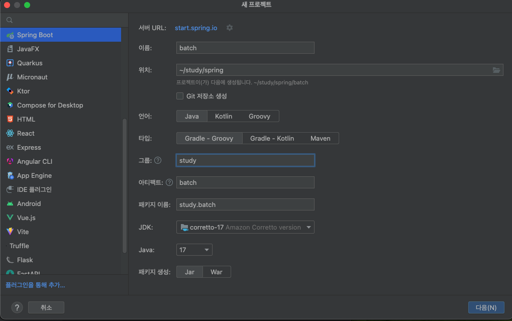
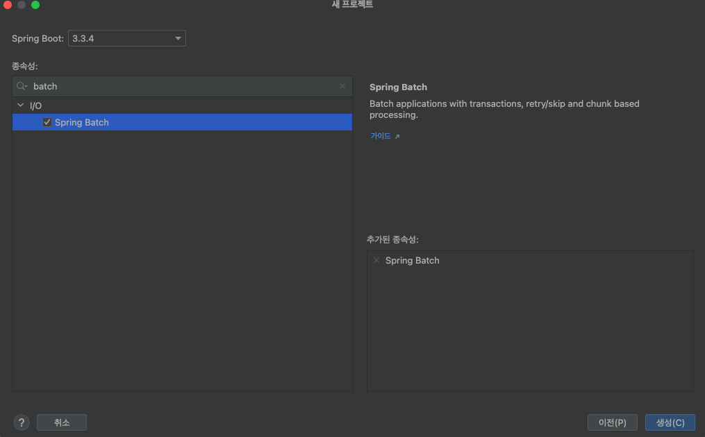
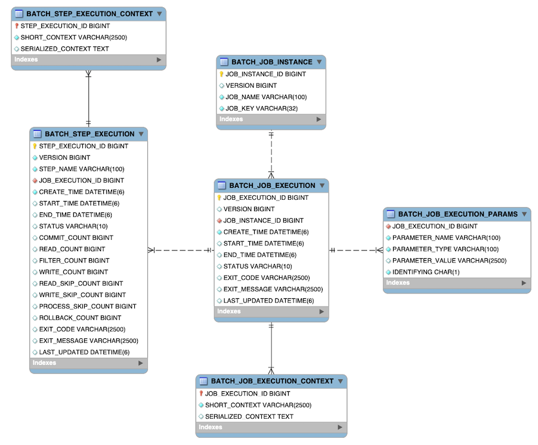
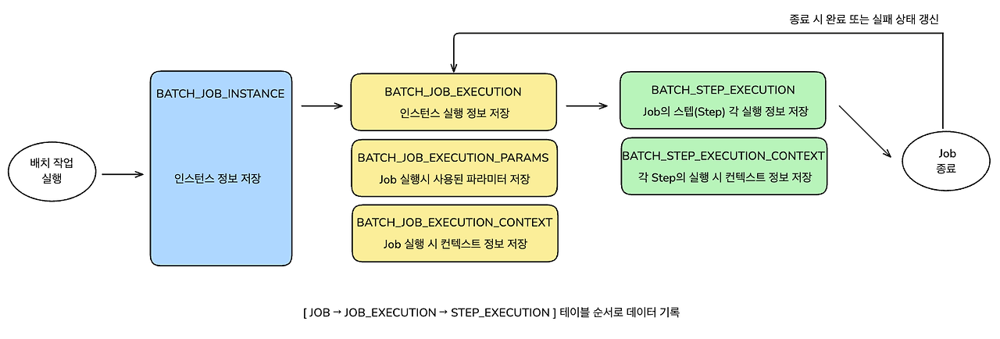

# 1주차 SPRING BATCH STUDY

## Spring Batch 초기화 및 필요정보

---

### 기본 프로젝트 구성하기
Intellij의 기능을 사용하여 스프링 배치를 위한 기본 프로젝트 설정



### 배치를 위한 기본 설정
build.gradle
```
plugins {
    id 'java'
    id 'org.springframework.boot' version '3.3.4'
    id 'io.spring.dependency-management' version '1.1.6'
}

group = 'study'
version = '0.0.1-SNAPSHOT'

java {
    toolchain {
        languageVersion = JavaLanguageVersion.of(17)
    }
}

repositories {
    mavenCentral()
}

dependencies {
    implementation 'org.springframework.boot:spring-boot-starter-batch'
    testImplementation 'org.springframework.boot:spring-boot-starter-test'
    testImplementation 'org.springframework.batch:spring-batch-test'
    testRuntimeOnly 'org.junit.platform:junit-platform-launcher'
}

tasks.named('test') {
    useJUnitPlatform()
}

```

### 배치 기동
```java
package study.batch;

import org.springframework.boot.SpringApplication;
import org.springframework.boot.autoconfigure.SpringBootApplication;

@SpringBootApplication
public class BatchApplication {

    public static void main(String[] args) {
        SpringApplication.run(BatchApplication.class, args);
    }

}
```
**❓의문점❓** <br>
boot starter를 이용하여 배치를 추가하였는데, @EnableBatchProcessing 어노테이션이 기본적으로 달려있지 않은 이유
> - spring boot3 버전은 spring batch 5버전으로 지원하는데 해당 버전에서는 @EnableBatchProcessing을 권장하지 않음
>  - https://github.com/spring-projects/spring-boot/wiki/Spring-Boot-3.0-Migration-Guide#spring-batch-changes
> - 본래 @EnableBatchProcessing 어노테이션을 통해 필수적인 빈을 자동 등록하였는데 spring boot3 (batch 5)가 되면서 자동 설정 기능의 확장으로 인하여 필요하지 않게됨 
>   - spring-boot-starter-batch만 추가하면 배치 관련 기능이 자동으로 활성화됨

### 실행해보기
```
  .   ____          _            __ _ _
 /\\ / ___'_ __ _ _(_)_ __  __ _ \ \ \ \
( ( )\___ | '_ | '_| | '_ \/ _` | \ \ \ \
 \\/  ___)| |_)| | | | | || (_| |  ) ) ) )
  '  |____| .__|_| |_|_| |_\__, | / / / /
 =========|_|==============|___/=/_/_/_/

 :: Spring Boot ::                (v3.3.4)

2024-10-02T12:13:32.462+09:00  INFO 36057 --- [batch] [           main] study.batch.BatchApplication             : Starting BatchApplication using Java 17.0.8.1 with PID 36057 (/Users/1004781/study/spring/batch/build/classes/java/main started by 1004781 in /Users/1004781/study/spring/batch)
2024-10-02T12:13:32.463+09:00  INFO 36057 --- [batch] [           main] study.batch.BatchApplication             : No active profile set, falling back to 1 default profile: "default"
2024-10-02T12:13:32.669+09:00  WARN 36057 --- [batch] [           main] trationDelegate$BeanPostProcessorChecker : Bean 'org.springframework.boot.autoconfigure.jdbc.DataSourceConfiguration$Hikari' of type [org.springframework.boot.autoconfigure.jdbc.DataSourceConfiguration$Hikari] is not eligible for getting processed by all BeanPostProcessors (for example: not eligible for auto-proxying). Is this bean getting eagerly injected into a currently created BeanPostProcessor [jobRegistryBeanPostProcessor]? Check the corresponding BeanPostProcessor declaration and its dependencies.
2024-10-02T12:13:32.680+09:00  WARN 36057 --- [batch] [           main] trationDelegate$BeanPostProcessorChecker : Bean 'spring.datasource-org.springframework.boot.autoconfigure.jdbc.DataSourceProperties' of type [org.springframework.boot.autoconfigure.jdbc.DataSourceProperties] is not eligible for getting processed by all BeanPostProcessors (for example: not eligible for auto-proxying). Is this bean getting eagerly injected into a currently created BeanPostProcessor [jobRegistryBeanPostProcessor]? Check the corresponding BeanPostProcessor declaration and its dependencies.
2024-10-02T12:13:32.681+09:00  WARN 36057 --- [batch] [           main] trationDelegate$BeanPostProcessorChecker : Bean 'org.springframework.boot.autoconfigure.jdbc.DataSourceAutoConfiguration$PooledDataSourceConfiguration' of type [org.springframework.boot.autoconfigure.jdbc.DataSourceAutoConfiguration$PooledDataSourceConfiguration] is not eligible for getting processed by all BeanPostProcessors (for example: not eligible for auto-proxying). Is this bean getting eagerly injected into a currently created BeanPostProcessor [jobRegistryBeanPostProcessor]? Check the corresponding BeanPostProcessor declaration and its dependencies.
2024-10-02T12:13:32.681+09:00  WARN 36057 --- [batch] [           main] trationDelegate$BeanPostProcessorChecker : Bean 'jdbcConnectionDetails' of type [org.springframework.boot.autoconfigure.jdbc.PropertiesJdbcConnectionDetails] is not eligible for getting processed by all BeanPostProcessors (for example: not eligible for auto-proxying). Is this bean getting eagerly injected into a currently created BeanPostProcessor [jobRegistryBeanPostProcessor]? Check the corresponding BeanPostProcessor declaration and its dependencies.
2024-10-02T12:13:32.682+09:00  WARN 36057 --- [batch] [           main] s.c.a.AnnotationConfigApplicationContext : Exception encountered during context initialization - cancelling refresh attempt: org.springframework.beans.factory.UnsatisfiedDependencyException: Error creating bean with name 'org.springframework.boot.autoconfigure.batch.BatchAutoConfiguration$SpringBootBatchConfiguration': Unsatisfied dependency expressed through constructor parameter 0: Error creating bean with name 'dataSource' defined in class path resource [org/springframework/boot/autoconfigure/jdbc/DataSourceConfiguration$Hikari.class]: Failed to instantiate [com.zaxxer.hikari.HikariDataSource]: Factory method 'dataSource' threw exception with message: Failed to determine a suitable driver class
2024-10-02T12:13:32.691+09:00  INFO 36057 --- [batch] [           main] .s.b.a.l.ConditionEvaluationReportLogger : 

Error starting ApplicationContext. To display the condition evaluation report re-run your application with 'debug' enabled.
2024-10-02T12:13:32.698+09:00 ERROR 36057 --- [batch] [           main] o.s.b.d.LoggingFailureAnalysisReporter   : 

***************************
APPLICATION FAILED TO START
***************************

Description:

Failed to configure a DataSource: 'url' attribute is not specified and no embedded datasource could be configured.

Reason: Failed to determine a suitable driver class


Action:

Consider the following:
	If you want an embedded database (H2, HSQL or Derby), please put it on the classpath.
	If you have database settings to be loaded from a particular profile you may need to activate it (no profiles are currently active).


종료 코드 1(으)로 완료된 프로세스
```
블로그에서와 같이 DataSource에 대한 설정이 필요하다고 에러 로그가 발생함 <br>
디버그 모드로 다시 돌려보면?
<details>
<summary>DEBUG LOG</summary>

로그 디버그 설정
application.properties 
```
logging.level.root=debug
```
```
  .   ____          _            __ _ _
 /\\ / ___'_ __ _ _(_)_ __  __ _ \ \ \ \
( ( )\___ | '_ | '_| | '_ \/ _` | \ \ \ \
 \\/  ___)| |_)| | | | | || (_| |  ) ) ) )
  '  |____| .__|_| |_|_| |_\__, | / / / /
 =========|_|==============|___/=/_/_/_/

 :: Spring Boot ::                (v3.3.4)

2024-10-02T12:19:21.110+09:00  INFO 37190 --- [batch] [           main] study.batch.BatchApplication             : Starting BatchApplication using Java 17.0.8.1 with PID 37190 (/Users/1004781/study/spring/batch/build/classes/java/main started by 1004781 in /Users/1004781/study/spring/batch)
2024-10-02T12:19:21.111+09:00 DEBUG 37190 --- [batch] [           main] study.batch.BatchApplication             : Running with Spring Boot v3.3.4, Spring v6.1.13
2024-10-02T12:19:21.112+09:00  INFO 37190 --- [batch] [           main] study.batch.BatchApplication             : No active profile set, falling back to 1 default profile: "default"
2024-10-02T12:19:21.112+09:00 DEBUG 37190 --- [batch] [           main] o.s.boot.SpringApplication               : Loading source class study.batch.BatchApplication
2024-10-02T12:19:21.126+09:00 DEBUG 37190 --- [batch] [           main] s.c.a.AnnotationConfigApplicationContext : Refreshing org.springframework.context.annotation.AnnotationConfigApplicationContext@41294f8
2024-10-02T12:19:21.131+09:00 DEBUG 37190 --- [batch] [           main] o.s.b.f.s.DefaultListableBeanFactory     : Creating shared instance of singleton bean 'org.springframework.context.annotation.internalConfigurationAnnotationProcessor'
2024-10-02T12:19:21.136+09:00 DEBUG 37190 --- [batch] [           main] o.s.b.f.s.DefaultListableBeanFactory     : Creating shared instance of singleton bean 'org.springframework.boot.autoconfigure.internalCachingMetadataReaderFactory'
2024-10-02T12:19:21.302+09:00 DEBUG 37190 --- [batch] [           main] o.s.b.f.s.DefaultListableBeanFactory     : Creating shared instance of singleton bean 'propertySourcesPlaceholderConfigurer'
2024-10-02T12:19:21.304+09:00 DEBUG 37190 --- [batch] [           main] o.s.b.f.s.DefaultListableBeanFactory     : Creating shared instance of singleton bean 'stepScope'
2024-10-02T12:19:21.304+09:00 DEBUG 37190 --- [batch] [           main] o.s.b.f.s.DefaultListableBeanFactory     : Creating shared instance of singleton bean 'jobScope'
2024-10-02T12:19:21.304+09:00 DEBUG 37190 --- [batch] [           main] o.s.b.f.s.DefaultListableBeanFactory     : Creating shared instance of singleton bean 'org.springframework.boot.sql.init.dependency.DatabaseInitializationDependencyConfigurer$DependsOnDatabaseInitializationPostProcessor'
2024-10-02T12:19:21.309+09:00 DEBUG 37190 --- [batch] [           main] o.s.b.f.s.DefaultListableBeanFactory     : Creating shared instance of singleton bean 'org.springframework.context.event.internalEventListenerProcessor'
2024-10-02T12:19:21.310+09:00 DEBUG 37190 --- [batch] [           main] o.s.b.f.s.DefaultListableBeanFactory     : Creating shared instance of singleton bean 'forceAutoProxyCreatorToUseClassProxying'
2024-10-02T12:19:21.311+09:00 DEBUG 37190 --- [batch] [           main] o.s.b.f.s.DefaultListableBeanFactory     : Creating shared instance of singleton bean 'org.springframework.context.event.internalEventListenerFactory'
2024-10-02T12:19:21.311+09:00 DEBUG 37190 --- [batch] [           main] o.s.b.f.s.DefaultListableBeanFactory     : Creating shared instance of singleton bean 'org.springframework.transaction.config.internalTransactionalEventListenerFactory'
2024-10-02T12:19:21.312+09:00 DEBUG 37190 --- [batch] [           main] o.s.b.f.s.DefaultListableBeanFactory     : Creating shared instance of singleton bean 'org.springframework.context.annotation.internalAutowiredAnnotationProcessor'
2024-10-02T12:19:21.312+09:00 DEBUG 37190 --- [batch] [           main] o.s.b.f.s.DefaultListableBeanFactory     : Creating shared instance of singleton bean 'org.springframework.context.annotation.internalCommonAnnotationProcessor'
2024-10-02T12:19:21.314+09:00 DEBUG 37190 --- [batch] [           main] o.s.b.f.s.DefaultListableBeanFactory     : Creating shared instance of singleton bean 'org.springframework.boot.context.properties.ConfigurationPropertiesBindingPostProcessor'
2024-10-02T12:19:21.314+09:00 DEBUG 37190 --- [batch] [           main] o.s.b.f.s.DefaultListableBeanFactory     : Creating shared instance of singleton bean 'org.springframework.boot.context.internalConfigurationPropertiesBinder'
2024-10-02T12:19:21.315+09:00 DEBUG 37190 --- [batch] [           main] o.s.b.f.s.DefaultListableBeanFactory     : Creating shared instance of singleton bean 'jdbcConnectionDetailsHikariBeanPostProcessor'
2024-10-02T12:19:21.316+09:00 DEBUG 37190 --- [batch] [           main] o.s.b.f.s.DefaultListableBeanFactory     : Creating shared instance of singleton bean 'org.springframework.aop.config.internalAutoProxyCreator'
2024-10-02T12:19:21.320+09:00 DEBUG 37190 --- [batch] [           main] o.s.b.f.s.DefaultListableBeanFactory     : Creating shared instance of singleton bean 'persistenceExceptionTranslationPostProcessor'
2024-10-02T12:19:21.321+09:00 DEBUG 37190 --- [batch] [           main] o.s.b.f.s.DefaultListableBeanFactory     : Autowiring by type from bean name 'persistenceExceptionTranslationPostProcessor' via factory method to bean named 'environment'
2024-10-02T12:19:21.323+09:00 DEBUG 37190 --- [batch] [           main] o.s.b.f.s.DefaultListableBeanFactory     : Creating shared instance of singleton bean 'jobRegistryBeanPostProcessor'
2024-10-02T12:19:21.323+09:00 DEBUG 37190 --- [batch] [           main] o.s.b.f.s.DefaultListableBeanFactory     : Creating shared instance of singleton bean 'org.springframework.boot.autoconfigure.batch.BatchAutoConfiguration$SpringBootBatchConfiguration'
2024-10-02T12:19:21.324+09:00 DEBUG 37190 --- [batch] [           main] o.s.b.f.s.DefaultListableBeanFactory     : Creating shared instance of singleton bean 'dataSource'
2024-10-02T12:19:21.324+09:00 DEBUG 37190 --- [batch] [           main] o.s.b.f.s.DefaultListableBeanFactory     : Creating shared instance of singleton bean 'org.springframework.boot.autoconfigure.jdbc.DataSourceConfiguration$Hikari'
2024-10-02T12:19:21.325+09:00  WARN 37190 --- [batch] [           main] trationDelegate$BeanPostProcessorChecker : Bean 'org.springframework.boot.autoconfigure.jdbc.DataSourceConfiguration$Hikari' of type [org.springframework.boot.autoconfigure.jdbc.DataSourceConfiguration$Hikari] is not eligible for getting processed by all BeanPostProcessors (for example: not eligible for auto-proxying). Is this bean getting eagerly injected into a currently created BeanPostProcessor [jobRegistryBeanPostProcessor]? Check the corresponding BeanPostProcessor declaration and its dependencies.
2024-10-02T12:19:21.325+09:00 DEBUG 37190 --- [batch] [           main] o.s.b.f.s.DefaultListableBeanFactory     : Creating shared instance of singleton bean 'org.springframework.transaction.config.internalTransactionAdvisor'
2024-10-02T12:19:21.325+09:00 DEBUG 37190 --- [batch] [           main] o.s.b.f.s.DefaultListableBeanFactory     : Creating shared instance of singleton bean 'org.springframework.transaction.annotation.ProxyTransactionManagementConfiguration'
2024-10-02T12:19:21.327+09:00 DEBUG 37190 --- [batch] [           main] o.s.b.f.s.DefaultListableBeanFactory     : Creating shared instance of singleton bean 'transactionAttributeSource'
2024-10-02T12:19:21.328+09:00 DEBUG 37190 --- [batch] [           main] o.s.b.f.s.DefaultListableBeanFactory     : Creating shared instance of singleton bean 'transactionInterceptor'
2024-10-02T12:19:21.328+09:00 DEBUG 37190 --- [batch] [           main] o.s.b.f.s.DefaultListableBeanFactory     : Autowiring by type from bean name 'transactionInterceptor' via factory method to bean named 'transactionAttributeSource'
2024-10-02T12:19:21.330+09:00 DEBUG 37190 --- [batch] [           main] o.s.b.f.s.DefaultListableBeanFactory     : Autowiring by type from bean name 'org.springframework.transaction.config.internalTransactionAdvisor' via factory method to bean named 'transactionAttributeSource'
2024-10-02T12:19:21.330+09:00 DEBUG 37190 --- [batch] [           main] o.s.b.f.s.DefaultListableBeanFactory     : Autowiring by type from bean name 'org.springframework.transaction.config.internalTransactionAdvisor' via factory method to bean named 'transactionInterceptor'
2024-10-02T12:19:21.331+09:00 DEBUG 37190 --- [batch] [           main] o.s.b.f.s.DefaultListableBeanFactory     : Creating shared instance of singleton bean 'spring.datasource-org.springframework.boot.autoconfigure.jdbc.DataSourceProperties'
2024-10-02T12:19:21.332+09:00 DEBUG 37190 --- [batch] [           main] o.s.b.f.s.DefaultListableBeanFactory     : Creating shared instance of singleton bean 'org.springframework.boot.context.properties.BoundConfigurationProperties'
2024-10-02T12:19:21.337+09:00  WARN 37190 --- [batch] [           main] trationDelegate$BeanPostProcessorChecker : Bean 'spring.datasource-org.springframework.boot.autoconfigure.jdbc.DataSourceProperties' of type [org.springframework.boot.autoconfigure.jdbc.DataSourceProperties] is not eligible for getting processed by all BeanPostProcessors (for example: not eligible for auto-proxying). Is this bean getting eagerly injected into a currently created BeanPostProcessor [jobRegistryBeanPostProcessor]? Check the corresponding BeanPostProcessor declaration and its dependencies.
2024-10-02T12:19:21.338+09:00 DEBUG 37190 --- [batch] [           main] o.s.b.f.s.DefaultListableBeanFactory     : Creating shared instance of singleton bean 'jdbcConnectionDetails'
2024-10-02T12:19:21.338+09:00 DEBUG 37190 --- [batch] [           main] o.s.b.f.s.DefaultListableBeanFactory     : Creating shared instance of singleton bean 'org.springframework.boot.autoconfigure.jdbc.DataSourceAutoConfiguration$PooledDataSourceConfiguration'
2024-10-02T12:19:21.338+09:00  WARN 37190 --- [batch] [           main] trationDelegate$BeanPostProcessorChecker : Bean 'org.springframework.boot.autoconfigure.jdbc.DataSourceAutoConfiguration$PooledDataSourceConfiguration' of type [org.springframework.boot.autoconfigure.jdbc.DataSourceAutoConfiguration$PooledDataSourceConfiguration] is not eligible for getting processed by all BeanPostProcessors (for example: not eligible for auto-proxying). Is this bean getting eagerly injected into a currently created BeanPostProcessor [jobRegistryBeanPostProcessor]? Check the corresponding BeanPostProcessor declaration and its dependencies.
2024-10-02T12:19:21.338+09:00 DEBUG 37190 --- [batch] [           main] o.s.b.f.s.DefaultListableBeanFactory     : Autowiring by type from bean name 'jdbcConnectionDetails' via factory method to bean named 'spring.datasource-org.springframework.boot.autoconfigure.jdbc.DataSourceProperties'
2024-10-02T12:19:21.338+09:00  WARN 37190 --- [batch] [           main] trationDelegate$BeanPostProcessorChecker : Bean 'jdbcConnectionDetails' of type [org.springframework.boot.autoconfigure.jdbc.PropertiesJdbcConnectionDetails] is not eligible for getting processed by all BeanPostProcessors (for example: not eligible for auto-proxying). Is this bean getting eagerly injected into a currently created BeanPostProcessor [jobRegistryBeanPostProcessor]? Check the corresponding BeanPostProcessor declaration and its dependencies.
2024-10-02T12:19:21.339+09:00 DEBUG 37190 --- [batch] [           main] o.s.b.f.s.DefaultListableBeanFactory     : Autowiring by type from bean name 'dataSource' via factory method to bean named 'spring.datasource-org.springframework.boot.autoconfigure.jdbc.DataSourceProperties'
2024-10-02T12:19:21.339+09:00 DEBUG 37190 --- [batch] [           main] o.s.b.f.s.DefaultListableBeanFactory     : Autowiring by type from bean name 'dataSource' via factory method to bean named 'jdbcConnectionDetails'
2024-10-02T12:19:21.340+09:00  WARN 37190 --- [batch] [           main] s.c.a.AnnotationConfigApplicationContext : Exception encountered during context initialization - cancelling refresh attempt: org.springframework.beans.factory.UnsatisfiedDependencyException: Error creating bean with name 'org.springframework.boot.autoconfigure.batch.BatchAutoConfiguration$SpringBootBatchConfiguration': Unsatisfied dependency expressed through constructor parameter 0: Error creating bean with name 'dataSource' defined in class path resource [org/springframework/boot/autoconfigure/jdbc/DataSourceConfiguration$Hikari.class]: Failed to instantiate [com.zaxxer.hikari.HikariDataSource]: Factory method 'dataSource' threw exception with message: Failed to determine a suitable driver class
2024-10-02T12:19:21.351+09:00 DEBUG 37190 --- [batch] [           main] .s.b.a.l.ConditionEvaluationReportLogger : 


============================
CONDITIONS EVALUATION REPORT
============================


Positive matches:
-----------------

   AopAutoConfiguration matched:
      - @ConditionalOnProperty (spring.aop.auto=true) matched (OnPropertyCondition)

   AopAutoConfiguration.ClassProxyingConfiguration matched:
      - @ConditionalOnMissingClass did not find unwanted class 'org.aspectj.weaver.Advice' (OnClassCondition)
      - @ConditionalOnProperty (spring.aop.proxy-target-class=true) matched (OnPropertyCondition)

   ApplicationAvailabilityAutoConfiguration#applicationAvailability matched:
      - @ConditionalOnMissingBean (types: org.springframework.boot.availability.ApplicationAvailability; SearchStrategy: all) did not find any beans (OnBeanCondition)

   BatchAutoConfiguration matched:
      - @ConditionalOnClass found required classes 'org.springframework.batch.core.launch.JobLauncher', 'javax.sql.DataSource', 'org.springframework.jdbc.datasource.init.DatabasePopulator' (OnClassCondition)
      - @ConditionalOnBean (types: javax.sql.DataSource,org.springframework.transaction.PlatformTransactionManager; SearchStrategy: all) found beans 'transactionManager', 'dataSource'; @ConditionalOnMissingBean (types: org.springframework.batch.core.configuration.support.DefaultBatchConfiguration; SearchStrategy: all) did not find any beans (OnBeanCondition)

   BatchAutoConfiguration#jobExecutionExitCodeGenerator matched:
      - @ConditionalOnMissingBean (types: org.springframework.boot.ExitCodeGenerator; SearchStrategy: all) did not find any beans (OnBeanCondition)

   BatchAutoConfiguration#jobLauncherApplicationRunner matched:
      - @ConditionalOnProperty (spring.batch.job.enabled=true) matched (OnPropertyCondition)
      - @ConditionalOnMissingBean (types: org.springframework.boot.autoconfigure.batch.JobLauncherApplicationRunner; SearchStrategy: all) did not find any beans (OnBeanCondition)

   BatchAutoConfiguration.DataSourceInitializerConfiguration matched:
      - BatchDatabase Initialization default value is EMBEDDED (BatchAutoConfiguration.OnBatchDatasourceInitializationCondition)

   BatchAutoConfiguration.DataSourceInitializerConfiguration#batchDataSourceInitializer matched:
      - @ConditionalOnMissingBean (types: org.springframework.boot.autoconfigure.batch.BatchDataSourceScriptDatabaseInitializer; SearchStrategy: all) did not find any beans (OnBeanCondition)

   DataSourceAutoConfiguration matched:
      - @ConditionalOnClass found required classes 'javax.sql.DataSource', 'org.springframework.jdbc.datasource.embedded.EmbeddedDatabaseType' (OnClassCondition)
      - @ConditionalOnMissingBean (types: io.r2dbc.spi.ConnectionFactory; SearchStrategy: all) did not find any beans (OnBeanCondition)

   DataSourceAutoConfiguration.PooledDataSourceConfiguration matched:
      - AnyNestedCondition 1 matched 1 did not; NestedCondition on DataSourceAutoConfiguration.PooledDataSourceCondition.PooledDataSourceAvailable PooledDataSource found supported DataSource; NestedCondition on DataSourceAutoConfiguration.PooledDataSourceCondition.ExplicitType @ConditionalOnProperty (spring.datasource.type) did not find property 'type' (DataSourceAutoConfiguration.PooledDataSourceCondition)
      - @ConditionalOnMissingBean (types: javax.sql.DataSource,javax.sql.XADataSource; SearchStrategy: all) did not find any beans (OnBeanCondition)

   DataSourceAutoConfiguration.PooledDataSourceConfiguration#jdbcConnectionDetails matched:
      - @ConditionalOnMissingBean (types: org.springframework.boot.autoconfigure.jdbc.JdbcConnectionDetails; SearchStrategy: all) did not find any beans (OnBeanCondition)

   DataSourceConfiguration.Hikari matched:
      - @ConditionalOnClass found required class 'com.zaxxer.hikari.HikariDataSource' (OnClassCondition)
      - @ConditionalOnProperty (spring.datasource.type=com.zaxxer.hikari.HikariDataSource) matched (OnPropertyCondition)
      - @ConditionalOnMissingBean (types: javax.sql.DataSource; SearchStrategy: all) did not find any beans (OnBeanCondition)

   DataSourceInitializationConfiguration matched:
      - @ConditionalOnClass found required class 'org.springframework.jdbc.datasource.init.DatabasePopulator' (OnClassCondition)
      - @ConditionalOnSingleCandidate (types: javax.sql.DataSource; SearchStrategy: all) found a single bean 'dataSource'; @ConditionalOnMissingBean (types: org.springframework.boot.autoconfigure.sql.init.SqlDataSourceScriptDatabaseInitializer,org.springframework.boot.autoconfigure.sql.init.SqlR2dbcScriptDatabaseInitializer; SearchStrategy: all) did not find any beans (OnBeanCondition)

   DataSourceJmxConfiguration matched:
      - @ConditionalOnProperty (spring.jmx.enabled=true) matched (OnPropertyCondition)

   DataSourceJmxConfiguration.Hikari matched:
      - @ConditionalOnClass found required class 'com.zaxxer.hikari.HikariDataSource' (OnClassCondition)
      - @ConditionalOnSingleCandidate (types: javax.sql.DataSource; SearchStrategy: all) found a single bean 'dataSource' (OnBeanCondition)

   DataSourcePoolMetadataProvidersConfiguration.HikariPoolDataSourceMetadataProviderConfiguration matched:
      - @ConditionalOnClass found required class 'com.zaxxer.hikari.HikariDataSource' (OnClassCondition)

   DataSourceTransactionManagerAutoConfiguration matched:
      - @ConditionalOnClass found required classes 'javax.sql.DataSource', 'org.springframework.jdbc.core.JdbcTemplate', 'org.springframework.transaction.TransactionManager' (OnClassCondition)

   DataSourceTransactionManagerAutoConfiguration.JdbcTransactionManagerConfiguration matched:
      - @ConditionalOnSingleCandidate (types: javax.sql.DataSource; SearchStrategy: all) found a single bean 'dataSource' (OnBeanCondition)

   DataSourceTransactionManagerAutoConfiguration.JdbcTransactionManagerConfiguration#transactionManager matched:
      - @ConditionalOnMissingBean (types: org.springframework.transaction.TransactionManager; SearchStrategy: all) did not find any beans (OnBeanCondition)

   GenericCacheConfiguration matched:
      - Cache org.springframework.boot.autoconfigure.cache.GenericCacheConfiguration automatic cache type (CacheCondition)

   JdbcClientAutoConfiguration matched:
      - @ConditionalOnSingleCandidate (types: org.springframework.jdbc.core.namedparam.NamedParameterJdbcTemplate; SearchStrategy: all) found a single bean 'namedParameterJdbcTemplate'; @ConditionalOnMissingBean (types: org.springframework.jdbc.core.simple.JdbcClient; SearchStrategy: all) did not find any beans (OnBeanCondition)

   JdbcTemplateAutoConfiguration matched:
      - @ConditionalOnClass found required classes 'javax.sql.DataSource', 'org.springframework.jdbc.core.JdbcTemplate' (OnClassCondition)
      - @ConditionalOnSingleCandidate (types: javax.sql.DataSource; SearchStrategy: all) found a single bean 'dataSource' (OnBeanCondition)

   JdbcTemplateConfiguration matched:
      - @ConditionalOnMissingBean (types: org.springframework.jdbc.core.JdbcOperations; SearchStrategy: all) did not find any beans (OnBeanCondition)

   JmxAutoConfiguration matched:
      - @ConditionalOnClass found required class 'org.springframework.jmx.export.MBeanExporter' (OnClassCondition)
      - @ConditionalOnProperty (spring.jmx.enabled=true) matched (OnPropertyCondition)

   JmxAutoConfiguration#mbeanExporter matched:
      - @ConditionalOnMissingBean (types: org.springframework.jmx.export.MBeanExporter; SearchStrategy: current) did not find any beans (OnBeanCondition)

   JmxAutoConfiguration#mbeanServer matched:
      - @ConditionalOnMissingBean (types: javax.management.MBeanServer; SearchStrategy: all) did not find any beans (OnBeanCondition)

   JmxAutoConfiguration#objectNamingStrategy matched:
      - @ConditionalOnMissingBean (types: org.springframework.jmx.export.naming.ObjectNamingStrategy; SearchStrategy: current) did not find any beans (OnBeanCondition)

   LifecycleAutoConfiguration#defaultLifecycleProcessor matched:
      - @ConditionalOnMissingBean (names: lifecycleProcessor; SearchStrategy: current) did not find any beans (OnBeanCondition)

   NamedParameterJdbcTemplateConfiguration matched:
      - @ConditionalOnSingleCandidate (types: org.springframework.jdbc.core.JdbcTemplate; SearchStrategy: all) found a single bean 'jdbcTemplate'; @ConditionalOnMissingBean (types: org.springframework.jdbc.core.namedparam.NamedParameterJdbcOperations; SearchStrategy: all) did not find any beans (OnBeanCondition)

   NoOpCacheConfiguration matched:
      - Cache org.springframework.boot.autoconfigure.cache.NoOpCacheConfiguration automatic cache type (CacheCondition)

   PersistenceExceptionTranslationAutoConfiguration matched:
      - @ConditionalOnClass found required class 'org.springframework.dao.annotation.PersistenceExceptionTranslationPostProcessor' (OnClassCondition)

   PersistenceExceptionTranslationAutoConfiguration#persistenceExceptionTranslationPostProcessor matched:
      - @ConditionalOnProperty (spring.dao.exceptiontranslation.enabled) matched (OnPropertyCondition)
      - @ConditionalOnMissingBean (types: org.springframework.dao.annotation.PersistenceExceptionTranslationPostProcessor; SearchStrategy: all) did not find any beans (OnBeanCondition)

   PropertyPlaceholderAutoConfiguration#propertySourcesPlaceholderConfigurer matched:
      - @ConditionalOnMissingBean (types: org.springframework.context.support.PropertySourcesPlaceholderConfigurer; SearchStrategy: current) did not find any beans (OnBeanCondition)

   SimpleCacheConfiguration matched:
      - Cache org.springframework.boot.autoconfigure.cache.SimpleCacheConfiguration automatic cache type (CacheCondition)

   SpringApplicationAdminJmxAutoConfiguration matched:
      - @ConditionalOnProperty (spring.application.admin.enabled=true) matched (OnPropertyCondition)

   SpringApplicationAdminJmxAutoConfiguration#springApplicationAdminRegistrar matched:
      - @ConditionalOnMissingBean (types: org.springframework.boot.admin.SpringApplicationAdminMXBeanRegistrar; SearchStrategy: all) did not find any beans (OnBeanCondition)

   SqlInitializationAutoConfiguration matched:
      - @ConditionalOnProperty (spring.sql.init.enabled) matched (OnPropertyCondition)
      - NoneNestedConditions 0 matched 1 did not; NestedCondition on SqlInitializationAutoConfiguration.SqlInitializationModeCondition.ModeIsNever @ConditionalOnProperty (spring.sql.init.mode=never) did not find property 'mode' (SqlInitializationAutoConfiguration.SqlInitializationModeCondition)

   SslAutoConfiguration#sslBundleRegistry matched:
      - @ConditionalOnMissingBean (types: org.springframework.boot.ssl.SslBundleRegistry,org.springframework.boot.ssl.SslBundles; SearchStrategy: all) did not find any beans (OnBeanCondition)

   TaskExecutionAutoConfiguration matched:
      - @ConditionalOnClass found required class 'org.springframework.scheduling.concurrent.ThreadPoolTaskExecutor' (OnClassCondition)

   TaskExecutorConfigurations.SimpleAsyncTaskExecutorBuilderConfiguration#simpleAsyncTaskExecutorBuilder matched:
      - @ConditionalOnMissingBean (types: org.springframework.boot.task.SimpleAsyncTaskExecutorBuilder; SearchStrategy: all) did not find any beans (OnBeanCondition)
      - @ConditionalOnThreading found PLATFORM (OnThreadingCondition)

   TaskExecutorConfigurations.TaskExecutorBuilderConfiguration#taskExecutorBuilder matched:
      - @ConditionalOnMissingBean (types: org.springframework.boot.task.TaskExecutorBuilder; SearchStrategy: all) did not find any beans (OnBeanCondition)

   TaskExecutorConfigurations.TaskExecutorConfiguration matched:
      - @ConditionalOnMissingBean (types: java.util.concurrent.Executor; SearchStrategy: all) did not find any beans (OnBeanCondition)

   TaskExecutorConfigurations.TaskExecutorConfiguration#applicationTaskExecutor matched:
      - @ConditionalOnThreading found PLATFORM (OnThreadingCondition)

   TaskExecutorConfigurations.ThreadPoolTaskExecutorBuilderConfiguration#threadPoolTaskExecutorBuilder matched:
      - @ConditionalOnMissingBean (types: org.springframework.boot.task.TaskExecutorBuilder,org.springframework.boot.task.ThreadPoolTaskExecutorBuilder; SearchStrategy: all) did not find any beans (OnBeanCondition)

   TaskSchedulingAutoConfiguration matched:
      - @ConditionalOnClass found required class 'org.springframework.scheduling.concurrent.ThreadPoolTaskScheduler' (OnClassCondition)

   TaskSchedulingConfigurations.SimpleAsyncTaskSchedulerBuilderConfiguration#simpleAsyncTaskSchedulerBuilder matched:
      - @ConditionalOnMissingBean (types: org.springframework.boot.task.SimpleAsyncTaskSchedulerBuilder; SearchStrategy: all) did not find any beans (OnBeanCondition)
      - @ConditionalOnThreading found PLATFORM (OnThreadingCondition)

   TaskSchedulingConfigurations.TaskSchedulerBuilderConfiguration#taskSchedulerBuilder matched:
      - @ConditionalOnMissingBean (types: org.springframework.boot.task.TaskSchedulerBuilder; SearchStrategy: all) did not find any beans (OnBeanCondition)

   TaskSchedulingConfigurations.ThreadPoolTaskSchedulerBuilderConfiguration#threadPoolTaskSchedulerBuilder matched:
      - @ConditionalOnMissingBean (types: org.springframework.boot.task.TaskSchedulerBuilder,org.springframework.boot.task.ThreadPoolTaskSchedulerBuilder; SearchStrategy: all) did not find any beans (OnBeanCondition)

   TransactionAutoConfiguration matched:
      - @ConditionalOnClass found required class 'org.springframework.transaction.PlatformTransactionManager' (OnClassCondition)

   TransactionAutoConfiguration.EnableTransactionManagementConfiguration matched:
      - @ConditionalOnBean (types: org.springframework.transaction.TransactionManager; SearchStrategy: all) found bean 'transactionManager'; @ConditionalOnMissingBean (types: org.springframework.transaction.annotation.AbstractTransactionManagementConfiguration; SearchStrategy: all) did not find any beans (OnBeanCondition)

   TransactionAutoConfiguration.EnableTransactionManagementConfiguration.CglibAutoProxyConfiguration matched:
      - @ConditionalOnProperty (spring.aop.proxy-target-class=true) matched (OnPropertyCondition)

   TransactionAutoConfiguration.TransactionTemplateConfiguration matched:
      - @ConditionalOnSingleCandidate (types: org.springframework.transaction.PlatformTransactionManager; SearchStrategy: all) found a single bean 'transactionManager' (OnBeanCondition)

   TransactionAutoConfiguration.TransactionTemplateConfiguration#transactionTemplate matched:
      - @ConditionalOnMissingBean (types: org.springframework.transaction.support.TransactionOperations; SearchStrategy: all) did not find any beans (OnBeanCondition)

   TransactionManagerCustomizationAutoConfiguration matched:
      - @ConditionalOnClass found required class 'org.springframework.transaction.PlatformTransactionManager' (OnClassCondition)

   TransactionManagerCustomizationAutoConfiguration#platformTransactionManagerCustomizers matched:
      - @ConditionalOnMissingBean (types: org.springframework.boot.autoconfigure.transaction.TransactionManagerCustomizers; SearchStrategy: all) did not find any beans (OnBeanCondition)


Negative matches:
-----------------

   ActiveMQAutoConfiguration:
      Did not match:
         - @ConditionalOnClass did not find required class 'jakarta.jms.ConnectionFactory' (OnClassCondition)

   AopAutoConfiguration.AspectJAutoProxyingConfiguration:
      Did not match:
         - @ConditionalOnClass did not find required class 'org.aspectj.weaver.Advice' (OnClassCondition)

   ArtemisAutoConfiguration:
      Did not match:
         - @ConditionalOnClass did not find required class 'jakarta.jms.ConnectionFactory' (OnClassCondition)

   Cache2kCacheConfiguration:
      Did not match:
         - @ConditionalOnClass did not find required class 'org.cache2k.Cache2kBuilder' (OnClassCondition)

   CacheAutoConfiguration:
      Did not match:
         - @ConditionalOnBean (types: org.springframework.cache.interceptor.CacheAspectSupport; SearchStrategy: all) did not find any beans of type org.springframework.cache.interceptor.CacheAspectSupport (OnBeanCondition)
      Matched:
         - @ConditionalOnClass found required class 'org.springframework.cache.CacheManager' (OnClassCondition)

   CacheAutoConfiguration.CacheManagerEntityManagerFactoryDependsOnPostProcessor:
      Did not match:
         - @ConditionalOnClass did not find required class 'org.springframework.orm.jpa.LocalContainerEntityManagerFactoryBean' (OnClassCondition)
         - Ancestor org.springframework.boot.autoconfigure.cache.CacheAutoConfiguration did not match (ConditionEvaluationReport.AncestorsMatchedCondition)

   CaffeineCacheConfiguration:
      Did not match:
         - @ConditionalOnClass did not find required class 'com.github.benmanes.caffeine.cache.Caffeine' (OnClassCondition)

   CassandraAutoConfiguration:
      Did not match:
         - @ConditionalOnClass did not find required class 'com.datastax.oss.driver.api.core.CqlSession' (OnClassCondition)

   CassandraDataAutoConfiguration:
      Did not match:
         - @ConditionalOnClass did not find required class 'com.datastax.oss.driver.api.core.CqlSession' (OnClassCondition)

   CassandraReactiveDataAutoConfiguration:
      Did not match:
         - @ConditionalOnClass did not find required class 'com.datastax.oss.driver.api.core.CqlSession' (OnClassCondition)

   CassandraReactiveRepositoriesAutoConfiguration:
      Did not match:
         - @ConditionalOnClass did not find required class 'org.springframework.data.cassandra.ReactiveSession' (OnClassCondition)

   CassandraRepositoriesAutoConfiguration:
      Did not match:
         - @ConditionalOnClass did not find required class 'com.datastax.oss.driver.api.core.CqlSession' (OnClassCondition)

   ClientHttpConnectorAutoConfiguration:
      Did not match:
         - @ConditionalOnClass did not find required class 'org.springframework.web.reactive.function.client.WebClient' (OnClassCondition)

   CodecsAutoConfiguration:
      Did not match:
         - @ConditionalOnClass did not find required class 'org.springframework.http.codec.CodecConfigurer' (OnClassCondition)

   CouchbaseAutoConfiguration:
      Did not match:
         - @ConditionalOnClass did not find required class 'com.couchbase.client.java.Cluster' (OnClassCondition)

   CouchbaseCacheConfiguration:
      Did not match:
         - @ConditionalOnClass did not find required class 'com.couchbase.client.java.Cluster' (OnClassCondition)

   CouchbaseDataAutoConfiguration:
      Did not match:
         - @ConditionalOnClass did not find required class 'com.couchbase.client.java.Bucket' (OnClassCondition)

   CouchbaseReactiveDataAutoConfiguration:
      Did not match:
         - @ConditionalOnClass did not find required class 'com.couchbase.client.java.Cluster' (OnClassCondition)

   CouchbaseReactiveRepositoriesAutoConfiguration:
      Did not match:
         - @ConditionalOnClass did not find required class 'com.couchbase.client.java.Cluster' (OnClassCondition)

   CouchbaseRepositoriesAutoConfiguration:
      Did not match:
         - @ConditionalOnClass did not find required class 'com.couchbase.client.java.Bucket' (OnClassCondition)

   DataSourceAutoConfiguration.EmbeddedDatabaseConfiguration:
      Did not match:
         - EmbeddedDataSource found supported pooled data source (DataSourceAutoConfiguration.EmbeddedDatabaseCondition)

   DataSourceCheckpointRestoreConfiguration:
      Did not match:
         - @ConditionalOnClass did not find required class 'org.crac.Resource' (OnClassCondition)

   DataSourceConfiguration.Dbcp2:
      Did not match:
         - @ConditionalOnClass did not find required class 'org.apache.commons.dbcp2.BasicDataSource' (OnClassCondition)

   DataSourceConfiguration.Generic:
      Did not match:
         - @ConditionalOnProperty (spring.datasource.type) did not find property 'spring.datasource.type' (OnPropertyCondition)

   DataSourceConfiguration.OracleUcp:
      Did not match:
         - @ConditionalOnClass did not find required classes 'oracle.ucp.jdbc.PoolDataSourceImpl', 'oracle.jdbc.OracleConnection' (OnClassCondition)

   DataSourceConfiguration.Tomcat:
      Did not match:
         - @ConditionalOnClass did not find required class 'org.apache.tomcat.jdbc.pool.DataSource' (OnClassCondition)

   DataSourceJmxConfiguration.TomcatDataSourceJmxConfiguration:
      Did not match:
         - @ConditionalOnClass did not find required class 'org.apache.tomcat.jdbc.pool.DataSourceProxy' (OnClassCondition)

   DataSourcePoolMetadataProvidersConfiguration.CommonsDbcp2PoolDataSourceMetadataProviderConfiguration:
      Did not match:
         - @ConditionalOnClass did not find required class 'org.apache.commons.dbcp2.BasicDataSource' (OnClassCondition)

   DataSourcePoolMetadataProvidersConfiguration.OracleUcpPoolDataSourceMetadataProviderConfiguration:
      Did not match:
         - @ConditionalOnClass did not find required classes 'oracle.ucp.jdbc.PoolDataSource', 'oracle.jdbc.OracleConnection' (OnClassCondition)

   DataSourcePoolMetadataProvidersConfiguration.TomcatDataSourcePoolMetadataProviderConfiguration:
      Did not match:
         - @ConditionalOnClass did not find required class 'org.apache.tomcat.jdbc.pool.DataSource' (OnClassCondition)

   DispatcherServletAutoConfiguration:
      Did not match:
         - @ConditionalOnClass did not find required class 'org.springframework.web.servlet.DispatcherServlet' (OnClassCondition)

   ElasticsearchClientAutoConfiguration:
      Did not match:
         - @ConditionalOnClass did not find required class 'co.elastic.clients.elasticsearch.ElasticsearchClient' (OnClassCondition)

   ElasticsearchDataAutoConfiguration:
      Did not match:
         - @ConditionalOnClass did not find required class 'org.springframework.data.elasticsearch.client.elc.ElasticsearchTemplate' (OnClassCondition)

   ElasticsearchRepositoriesAutoConfiguration:
      Did not match:
         - @ConditionalOnClass did not find required class 'org.springframework.data.elasticsearch.repository.ElasticsearchRepository' (OnClassCondition)

   ElasticsearchRestClientAutoConfiguration:
      Did not match:
         - @ConditionalOnClass did not find required class 'org.elasticsearch.client.RestClientBuilder' (OnClassCondition)

   EmbeddedLdapAutoConfiguration:
      Did not match:
         - @ConditionalOnClass did not find required class 'com.unboundid.ldap.listener.InMemoryDirectoryServer' (OnClassCondition)

   EmbeddedWebServerFactoryCustomizerAutoConfiguration:
      Did not match:
         - @ConditionalOnWebApplication did not find reactive or servlet web application classes (OnWebApplicationCondition)

   ErrorMvcAutoConfiguration:
      Did not match:
         - @ConditionalOnClass did not find required class 'jakarta.servlet.Servlet' (OnClassCondition)

   ErrorWebFluxAutoConfiguration:
      Did not match:
         - @ConditionalOnClass did not find required class 'org.springframework.web.reactive.config.WebFluxConfigurer' (OnClassCondition)

   FlywayAutoConfiguration:
      Did not match:
         - @ConditionalOnClass did not find required class 'org.flywaydb.core.Flyway' (OnClassCondition)

   FreeMarkerAutoConfiguration:
      Did not match:
         - @ConditionalOnClass did not find required class 'freemarker.template.Configuration' (OnClassCondition)

   GraphQlAutoConfiguration:
      Did not match:
         - @ConditionalOnClass did not find required class 'graphql.GraphQL' (OnClassCondition)

   GraphQlQueryByExampleAutoConfiguration:
      Did not match:
         - @ConditionalOnClass did not find required class 'graphql.GraphQL' (OnClassCondition)

   GraphQlQuerydslAutoConfiguration:
      Did not match:
         - @ConditionalOnClass did not find required class 'com.querydsl.core.Query' (OnClassCondition)

   GraphQlRSocketAutoConfiguration:
      Did not match:
         - @ConditionalOnClass did not find required class 'graphql.GraphQL' (OnClassCondition)

   GraphQlReactiveQueryByExampleAutoConfiguration:
      Did not match:
         - @ConditionalOnClass did not find required class 'graphql.GraphQL' (OnClassCondition)

   GraphQlReactiveQuerydslAutoConfiguration:
      Did not match:
         - @ConditionalOnClass did not find required class 'com.querydsl.core.Query' (OnClassCondition)

   GraphQlWebFluxAutoConfiguration:
      Did not match:
         - @ConditionalOnClass did not find required class 'graphql.GraphQL' (OnClassCondition)

   GraphQlWebFluxSecurityAutoConfiguration:
      Did not match:
         - @ConditionalOnClass did not find required class 'graphql.GraphQL' (OnClassCondition)

   GraphQlWebMvcAutoConfiguration:
      Did not match:
         - @ConditionalOnClass did not find required class 'graphql.GraphQL' (OnClassCondition)

   GraphQlWebMvcSecurityAutoConfiguration:
      Did not match:
         - @ConditionalOnClass did not find required class 'graphql.GraphQL' (OnClassCondition)

   GroovyTemplateAutoConfiguration:
      Did not match:
         - @ConditionalOnClass did not find required class 'groovy.text.markup.MarkupTemplateEngine' (OnClassCondition)

   GsonAutoConfiguration:
      Did not match:
         - @ConditionalOnClass did not find required class 'com.google.gson.Gson' (OnClassCondition)

   H2ConsoleAutoConfiguration:
      Did not match:
         - @ConditionalOnClass did not find required class 'org.h2.server.web.JakartaWebServlet' (OnClassCondition)

   HazelcastAutoConfiguration:
      Did not match:
         - @ConditionalOnClass did not find required class 'com.hazelcast.core.HazelcastInstance' (OnClassCondition)

   HazelcastCacheConfiguration:
      Did not match:
         - @ConditionalOnClass did not find required class 'com.hazelcast.core.HazelcastInstance' (OnClassCondition)

   HazelcastJpaDependencyAutoConfiguration:
      Did not match:
         - @ConditionalOnClass did not find required class 'com.hazelcast.core.HazelcastInstance' (OnClassCondition)

   HibernateJpaAutoConfiguration:
      Did not match:
         - @ConditionalOnClass did not find required class 'jakarta.persistence.EntityManager' (OnClassCondition)

   HttpEncodingAutoConfiguration:
      Did not match:
         - @ConditionalOnClass did not find required class 'org.springframework.web.filter.CharacterEncodingFilter' (OnClassCondition)

   HttpHandlerAutoConfiguration:
      Did not match:
         - @ConditionalOnClass did not find required class 'org.springframework.http.server.reactive.HttpHandler' (OnClassCondition)

   HttpMessageConvertersAutoConfiguration:
      Did not match:
         - @ConditionalOnClass did not find required class 'org.springframework.http.converter.HttpMessageConverter' (OnClassCondition)

   HypermediaAutoConfiguration:
      Did not match:
         - @ConditionalOnClass did not find required class 'org.springframework.hateoas.EntityModel' (OnClassCondition)

   InfinispanCacheConfiguration:
      Did not match:
         - @ConditionalOnClass did not find required class 'org.infinispan.spring.embedded.provider.SpringEmbeddedCacheManager' (OnClassCondition)

   InfluxDbAutoConfiguration:
      Did not match:
         - @ConditionalOnClass did not find required class 'org.influxdb.InfluxDB' (OnClassCondition)

   IntegrationAutoConfiguration:
      Did not match:
         - @ConditionalOnClass did not find required class 'org.springframework.integration.config.EnableIntegration' (OnClassCondition)

   JCacheCacheConfiguration:
      Did not match:
         - @ConditionalOnClass did not find required class 'javax.cache.Caching' (OnClassCondition)

   JacksonAutoConfiguration:
      Did not match:
         - @ConditionalOnClass did not find required class 'com.fasterxml.jackson.databind.ObjectMapper' (OnClassCondition)

   JdbcRepositoriesAutoConfiguration:
      Did not match:
         - @ConditionalOnClass did not find required class 'org.springframework.data.jdbc.repository.config.AbstractJdbcConfiguration' (OnClassCondition)

   JerseyAutoConfiguration:
      Did not match:
         - @ConditionalOnClass did not find required class 'jakarta.servlet.ServletRegistration' (OnClassCondition)

   JmsAutoConfiguration:
      Did not match:
         - @ConditionalOnClass did not find required class 'jakarta.jms.Message' (OnClassCondition)

   JndiConnectionFactoryAutoConfiguration:
      Did not match:
         - @ConditionalOnClass did not find required class 'org.springframework.jms.core.JmsTemplate' (OnClassCondition)

   JndiDataSourceAutoConfiguration:
      Did not match:
         - @ConditionalOnProperty (spring.datasource.jndi-name) did not find property 'jndi-name' (OnPropertyCondition)
      Matched:
         - @ConditionalOnClass found required classes 'javax.sql.DataSource', 'org.springframework.jdbc.datasource.embedded.EmbeddedDatabaseType' (OnClassCondition)

   JooqAutoConfiguration:
      Did not match:
         - @ConditionalOnClass did not find required class 'org.jooq.DSLContext' (OnClassCondition)

   JpaRepositoriesAutoConfiguration:
      Did not match:
         - @ConditionalOnClass did not find required class 'org.springframework.data.jpa.repository.JpaRepository' (OnClassCondition)

   JsonbAutoConfiguration:
      Did not match:
         - @ConditionalOnClass did not find required class 'jakarta.json.bind.Jsonb' (OnClassCondition)

   JtaAutoConfiguration:
      Did not match:
         - @ConditionalOnClass did not find required class 'jakarta.transaction.Transaction' (OnClassCondition)

   KafkaAutoConfiguration:
      Did not match:
         - @ConditionalOnClass did not find required class 'org.springframework.kafka.core.KafkaTemplate' (OnClassCondition)

   LdapAutoConfiguration:
      Did not match:
         - @ConditionalOnClass did not find required class 'org.springframework.ldap.core.ContextSource' (OnClassCondition)

   LdapRepositoriesAutoConfiguration:
      Did not match:
         - @ConditionalOnClass did not find required class 'org.springframework.data.ldap.repository.LdapRepository' (OnClassCondition)

   LiquibaseAutoConfiguration:
      Did not match:
         - @ConditionalOnClass did not find required class 'liquibase.change.DatabaseChange' (OnClassCondition)

   MailSenderAutoConfiguration:
      Did not match:
         - @ConditionalOnClass did not find required class 'jakarta.activation.MimeType' (OnClassCondition)

   MailSenderValidatorAutoConfiguration:
      Did not match:
         - @ConditionalOnSingleCandidate did not find required type 'org.springframework.mail.javamail.JavaMailSenderImpl' (OnBeanCondition)

   MessageSourceAutoConfiguration:
      Did not match:
         - ResourceBundle did not find bundle with basename messages (MessageSourceAutoConfiguration.ResourceBundleCondition)

   MongoAutoConfiguration:
      Did not match:
         - @ConditionalOnClass did not find required class 'com.mongodb.client.MongoClient' (OnClassCondition)

   MongoDataAutoConfiguration:
      Did not match:
         - @ConditionalOnClass did not find required class 'com.mongodb.client.MongoClient' (OnClassCondition)

   MongoReactiveAutoConfiguration:
      Did not match:
         - @ConditionalOnClass did not find required class 'com.mongodb.reactivestreams.client.MongoClient' (OnClassCondition)

   MongoReactiveDataAutoConfiguration:
      Did not match:
         - @ConditionalOnClass did not find required class 'com.mongodb.reactivestreams.client.MongoClient' (OnClassCondition)

   MongoReactiveRepositoriesAutoConfiguration:
      Did not match:
         - @ConditionalOnClass did not find required class 'com.mongodb.reactivestreams.client.MongoClient' (OnClassCondition)

   MongoRepositoriesAutoConfiguration:
      Did not match:
         - @ConditionalOnClass did not find required class 'com.mongodb.client.MongoClient' (OnClassCondition)

   MultipartAutoConfiguration:
      Did not match:
         - @ConditionalOnClass did not find required class 'jakarta.servlet.MultipartConfigElement' (OnClassCondition)

   MustacheAutoConfiguration:
      Did not match:
         - @ConditionalOnClass did not find required class 'com.samskivert.mustache.Mustache' (OnClassCondition)

   Neo4jAutoConfiguration:
      Did not match:
         - @ConditionalOnClass did not find required class 'org.neo4j.driver.Driver' (OnClassCondition)

   Neo4jDataAutoConfiguration:
      Did not match:
         - @ConditionalOnClass did not find required class 'org.neo4j.driver.Driver' (OnClassCondition)

   Neo4jReactiveDataAutoConfiguration:
      Did not match:
         - @ConditionalOnClass did not find required class 'org.neo4j.driver.Driver' (OnClassCondition)

   Neo4jReactiveRepositoriesAutoConfiguration:
      Did not match:
         - @ConditionalOnClass did not find required class 'org.neo4j.driver.Driver' (OnClassCondition)

   Neo4jRepositoriesAutoConfiguration:
      Did not match:
         - @ConditionalOnClass did not find required class 'org.neo4j.driver.Driver' (OnClassCondition)

   NettyAutoConfiguration:
      Did not match:
         - @ConditionalOnClass did not find required class 'io.netty.util.NettyRuntime' (OnClassCondition)

   OAuth2AuthorizationServerAutoConfiguration:
      Did not match:
         - @ConditionalOnClass did not find required class 'org.springframework.security.oauth2.server.authorization.OAuth2Authorization' (OnClassCondition)

   OAuth2AuthorizationServerJwtAutoConfiguration:
      Did not match:
         - @ConditionalOnClass did not find required class 'org.springframework.security.oauth2.server.authorization.OAuth2Authorization' (OnClassCondition)

   OAuth2ClientAutoConfiguration:
      Did not match:
         - @ConditionalOnClass did not find required class 'org.springframework.security.config.annotation.web.configuration.EnableWebSecurity' (OnClassCondition)

   OAuth2ResourceServerAutoConfiguration:
      Did not match:
         - @ConditionalOnClass did not find required class 'org.springframework.security.oauth2.server.resource.authentication.BearerTokenAuthenticationToken' (OnClassCondition)

   ProjectInfoAutoConfiguration#buildProperties:
      Did not match:
         - @ConditionalOnResource did not find resource '${spring.info.build.location:classpath:META-INF/build-info.properties}' (OnResourceCondition)

   ProjectInfoAutoConfiguration#gitProperties:
      Did not match:
         - GitResource did not find git info at classpath:git.properties (ProjectInfoAutoConfiguration.GitResourceAvailableCondition)

   PulsarAutoConfiguration:
      Did not match:
         - @ConditionalOnClass did not find required class 'org.apache.pulsar.client.api.PulsarClient' (OnClassCondition)

   PulsarReactiveAutoConfiguration:
      Did not match:
         - @ConditionalOnClass did not find required class 'org.apache.pulsar.client.api.PulsarClient' (OnClassCondition)

   QuartzAutoConfiguration:
      Did not match:
         - @ConditionalOnClass did not find required class 'org.quartz.Scheduler' (OnClassCondition)

   R2dbcAutoConfiguration:
      Did not match:
         - @ConditionalOnClass did not find required class 'io.r2dbc.spi.ConnectionFactory' (OnClassCondition)

   R2dbcDataAutoConfiguration:
      Did not match:
         - @ConditionalOnClass did not find required class 'org.springframework.data.r2dbc.core.R2dbcEntityTemplate' (OnClassCondition)

   R2dbcInitializationConfiguration:
      Did not match:
         - @ConditionalOnClass did not find required classes 'io.r2dbc.spi.ConnectionFactory', 'org.springframework.r2dbc.connection.init.DatabasePopulator' (OnClassCondition)

   R2dbcRepositoriesAutoConfiguration:
      Did not match:
         - @ConditionalOnClass did not find required class 'io.r2dbc.spi.ConnectionFactory' (OnClassCondition)

   R2dbcTransactionManagerAutoConfiguration:
      Did not match:
         - @ConditionalOnClass did not find required class 'org.springframework.r2dbc.connection.R2dbcTransactionManager' (OnClassCondition)

   RSocketGraphQlClientAutoConfiguration:
      Did not match:
         - @ConditionalOnClass did not find required class 'graphql.GraphQL' (OnClassCondition)

   RSocketMessagingAutoConfiguration:
      Did not match:
         - @ConditionalOnClass did not find required class 'io.rsocket.RSocket' (OnClassCondition)

   RSocketRequesterAutoConfiguration:
      Did not match:
         - @ConditionalOnClass did not find required class 'io.rsocket.RSocket' (OnClassCondition)

   RSocketSecurityAutoConfiguration:
      Did not match:
         - @ConditionalOnClass did not find required class 'org.springframework.security.rsocket.core.SecuritySocketAcceptorInterceptor' (OnClassCondition)

   RSocketServerAutoConfiguration:
      Did not match:
         - @ConditionalOnClass did not find required class 'io.rsocket.core.RSocketServer' (OnClassCondition)

   RSocketStrategiesAutoConfiguration:
      Did not match:
         - @ConditionalOnClass did not find required class 'io.netty.buffer.PooledByteBufAllocator' (OnClassCondition)

   RabbitAutoConfiguration:
      Did not match:
         - @ConditionalOnClass did not find required class 'com.rabbitmq.client.Channel' (OnClassCondition)

   ReactiveElasticsearchClientAutoConfiguration:
      Did not match:
         - @ConditionalOnClass did not find required class 'co.elastic.clients.transport.ElasticsearchTransport' (OnClassCondition)

   ReactiveElasticsearchRepositoriesAutoConfiguration:
      Did not match:
         - @ConditionalOnClass did not find required class 'reactor.core.publisher.Mono' (OnClassCondition)

   ReactiveMultipartAutoConfiguration:
      Did not match:
         - @ConditionalOnClass did not find required class 'org.springframework.http.codec.multipart.DefaultPartHttpMessageReader' (OnClassCondition)

   ReactiveOAuth2ClientAutoConfiguration:
      Did not match:
         - @ConditionalOnClass did not find required class 'reactor.core.publisher.Flux' (OnClassCondition)

   ReactiveOAuth2ResourceServerAutoConfiguration:
      Did not match:
         - @ConditionalOnClass did not find required class 'org.springframework.security.config.annotation.web.reactive.EnableWebFluxSecurity' (OnClassCondition)

   ReactiveSecurityAutoConfiguration:
      Did not match:
         - @ConditionalOnClass did not find required class 'reactor.core.publisher.Flux' (OnClassCondition)

   ReactiveUserDetailsServiceAutoConfiguration:
      Did not match:
         - @ConditionalOnClass did not find required class 'org.springframework.security.authentication.ReactiveAuthenticationManager' (OnClassCondition)

   ReactiveWebServerFactoryAutoConfiguration:
      Did not match:
         - @ConditionalOnClass did not find required class 'org.springframework.http.ReactiveHttpInputMessage' (OnClassCondition)

   ReactorAutoConfiguration:
      Did not match:
         - @ConditionalOnClass did not find required class 'reactor.core.publisher.Hooks' (OnClassCondition)

   RedisAutoConfiguration:
      Did not match:
         - @ConditionalOnClass did not find required class 'org.springframework.data.redis.core.RedisOperations' (OnClassCondition)

   RedisCacheConfiguration:
      Did not match:
         - @ConditionalOnClass did not find required class 'org.springframework.data.redis.connection.RedisConnectionFactory' (OnClassCondition)

   RedisReactiveAutoConfiguration:
      Did not match:
         - @ConditionalOnClass did not find required class 'reactor.core.publisher.Flux' (OnClassCondition)

   RedisRepositoriesAutoConfiguration:
      Did not match:
         - @ConditionalOnClass did not find required class 'org.springframework.data.redis.repository.configuration.EnableRedisRepositories' (OnClassCondition)

   RepositoryRestMvcAutoConfiguration:
      Did not match:
         - @ConditionalOnClass did not find required class 'org.springframework.data.rest.webmvc.config.RepositoryRestMvcConfiguration' (OnClassCondition)

   RestClientAutoConfiguration:
      Did not match:
         - @ConditionalOnClass did not find required class 'org.springframework.web.client.RestClient' (OnClassCondition)

   RestTemplateAutoConfiguration:
      Did not match:
         - @ConditionalOnClass did not find required class 'org.springframework.web.client.RestTemplate' (OnClassCondition)

   Saml2RelyingPartyAutoConfiguration:
      Did not match:
         - @ConditionalOnClass did not find required class 'org.springframework.security.saml2.provider.service.registration.RelyingPartyRegistrationRepository' (OnClassCondition)

   SecurityAutoConfiguration:
      Did not match:
         - @ConditionalOnClass did not find required class 'org.springframework.security.authentication.DefaultAuthenticationEventPublisher' (OnClassCondition)

   SecurityFilterAutoConfiguration:
      Did not match:
         - @ConditionalOnClass did not find required class 'org.springframework.security.config.http.SessionCreationPolicy' (OnClassCondition)

   SendGridAutoConfiguration:
      Did not match:
         - @ConditionalOnClass did not find required class 'com.sendgrid.SendGrid' (OnClassCondition)

   ServletWebServerFactoryAutoConfiguration:
      Did not match:
         - @ConditionalOnClass did not find required class 'jakarta.servlet.ServletRequest' (OnClassCondition)

   SessionAutoConfiguration:
      Did not match:
         - @ConditionalOnClass did not find required class 'org.springframework.session.Session' (OnClassCondition)

   SpringDataWebAutoConfiguration:
      Did not match:
         - @ConditionalOnClass did not find required class 'org.springframework.data.web.PageableHandlerMethodArgumentResolver' (OnClassCondition)

   TaskExecutorConfigurations.SimpleAsyncTaskExecutorBuilderConfiguration#simpleAsyncTaskExecutorBuilderVirtualThreads:
      Did not match:
         - @ConditionalOnMissingBean (types: org.springframework.boot.task.SimpleAsyncTaskExecutorBuilder; SearchStrategy: all) found beans of type 'org.springframework.boot.task.SimpleAsyncTaskExecutorBuilder' simpleAsyncTaskExecutorBuilder (OnBeanCondition)

   TaskExecutorConfigurations.TaskExecutorConfiguration#applicationTaskExecutorVirtualThreads:
      Did not match:
         - @ConditionalOnThreading did not find VIRTUAL (OnThreadingCondition)

   TaskSchedulingAutoConfiguration#scheduledBeanLazyInitializationExcludeFilter:
      Did not match:
         - @ConditionalOnBean (names: org.springframework.context.annotation.internalScheduledAnnotationProcessor; SearchStrategy: all) did not find any beans named org.springframework.context.annotation.internalScheduledAnnotationProcessor (OnBeanCondition)

   TaskSchedulingConfigurations.SimpleAsyncTaskSchedulerBuilderConfiguration#simpleAsyncTaskSchedulerBuilderVirtualThreads:
      Did not match:
         - @ConditionalOnMissingBean (types: org.springframework.boot.task.SimpleAsyncTaskSchedulerBuilder; SearchStrategy: all) found beans of type 'org.springframework.boot.task.SimpleAsyncTaskSchedulerBuilder' simpleAsyncTaskSchedulerBuilder (OnBeanCondition)

   TaskSchedulingConfigurations.TaskSchedulerConfiguration:
      Did not match:
         - @ConditionalOnBean (names: org.springframework.context.annotation.internalScheduledAnnotationProcessor; SearchStrategy: all) did not find any beans named org.springframework.context.annotation.internalScheduledAnnotationProcessor (OnBeanCondition)

   ThymeleafAutoConfiguration:
      Did not match:
         - @ConditionalOnClass did not find required class 'org.thymeleaf.spring6.SpringTemplateEngine' (OnClassCondition)

   TransactionAutoConfiguration#transactionalOperator:
      Did not match:
         - @ConditionalOnSingleCandidate (types: org.springframework.transaction.ReactiveTransactionManager; SearchStrategy: all) did not find any beans (OnBeanCondition)

   TransactionAutoConfiguration.AspectJTransactionManagementConfiguration:
      Did not match:
         - @ConditionalOnBean did not find required type 'org.springframework.transaction.aspectj.AbstractTransactionAspect' (OnBeanCondition)
         - @ConditionalOnBean (types: org.springframework.transaction.aspectj.AbstractTransactionAspect; SearchStrategy: all) did not find any beans of type org.springframework.transaction.aspectj.AbstractTransactionAspect (OnBeanCondition)

   TransactionAutoConfiguration.EnableTransactionManagementConfiguration.JdkDynamicAutoProxyConfiguration:
      Did not match:
         - @ConditionalOnProperty (spring.aop.proxy-target-class=false) did not find property 'proxy-target-class' (OnPropertyCondition)

   UserDetailsServiceAutoConfiguration:
      Did not match:
         - @ConditionalOnClass did not find required class 'org.springframework.security.authentication.AuthenticationManager' (OnClassCondition)

   ValidationAutoConfiguration:
      Did not match:
         - @ConditionalOnClass did not find required class 'jakarta.validation.executable.ExecutableValidator' (OnClassCondition)

   WebClientAutoConfiguration:
      Did not match:
         - @ConditionalOnClass did not find required class 'org.springframework.web.reactive.function.client.WebClient' (OnClassCondition)

   WebFluxAutoConfiguration:
      Did not match:
         - @ConditionalOnClass did not find required class 'org.springframework.web.reactive.config.WebFluxConfigurer' (OnClassCondition)

   WebMvcAutoConfiguration:
      Did not match:
         - @ConditionalOnClass did not find required class 'jakarta.servlet.Servlet' (OnClassCondition)

   WebServiceTemplateAutoConfiguration:
      Did not match:
         - @ConditionalOnClass did not find required class 'org.springframework.oxm.Marshaller' (OnClassCondition)

   WebServicesAutoConfiguration:
      Did not match:
         - @ConditionalOnClass did not find required class 'org.springframework.ws.transport.http.MessageDispatcherServlet' (OnClassCondition)

   WebSessionIdResolverAutoConfiguration:
      Did not match:
         - @ConditionalOnClass did not find required class 'reactor.core.publisher.Mono' (OnClassCondition)

   WebSocketMessagingAutoConfiguration:
      Did not match:
         - @ConditionalOnClass did not find required class 'org.springframework.web.socket.config.annotation.WebSocketMessageBrokerConfigurer' (OnClassCondition)

   WebSocketReactiveAutoConfiguration:
      Did not match:
         - @ConditionalOnClass did not find required class 'jakarta.servlet.Servlet' (OnClassCondition)

   WebSocketServletAutoConfiguration:
      Did not match:
         - @ConditionalOnClass did not find required class 'jakarta.servlet.Servlet' (OnClassCondition)

   XADataSourceAutoConfiguration:
      Did not match:
         - @ConditionalOnClass did not find required class 'jakarta.transaction.TransactionManager' (OnClassCondition)


Exclusions:
-----------

    None


Unconditional classes:
----------------------

    org.springframework.boot.autoconfigure.context.ConfigurationPropertiesAutoConfiguration

    org.springframework.boot.autoconfigure.ssl.SslAutoConfiguration

    org.springframework.boot.autoconfigure.context.LifecycleAutoConfiguration

    org.springframework.boot.autoconfigure.context.PropertyPlaceholderAutoConfiguration

    org.springframework.boot.autoconfigure.availability.ApplicationAvailabilityAutoConfiguration

    org.springframework.boot.autoconfigure.info.ProjectInfoAutoConfiguration


2024-10-02T12:19:21.359+09:00 DEBUG 37190 --- [batch] [           main] o.s.b.d.LoggingFailureAnalysisReporter   : Application failed to start due to an exception

org.springframework.boot.autoconfigure.jdbc.DataSourceProperties$DataSourceBeanCreationException: Failed to determine a suitable driver class
	at org.springframework.boot.autoconfigure.jdbc.DataSourceProperties.determineDriverClassName(DataSourceProperties.java:186) ~[spring-boot-autoconfigure-3.3.4.jar:3.3.4]
	at org.springframework.boot.autoconfigure.jdbc.PropertiesJdbcConnectionDetails.getDriverClassName(PropertiesJdbcConnectionDetails.java:49) ~[spring-boot-autoconfigure-3.3.4.jar:3.3.4]
	at org.springframework.boot.autoconfigure.jdbc.DataSourceConfiguration.createDataSource(DataSourceConfiguration.java:55) ~[spring-boot-autoconfigure-3.3.4.jar:3.3.4]
	at org.springframework.boot.autoconfigure.jdbc.DataSourceConfiguration$Hikari.dataSource(DataSourceConfiguration.java:117) ~[spring-boot-autoconfigure-3.3.4.jar:3.3.4]
	at java.base/jdk.internal.reflect.NativeMethodAccessorImpl.invoke0(Native Method) ~[na:na]
	at java.base/jdk.internal.reflect.NativeMethodAccessorImpl.invoke(NativeMethodAccessorImpl.java:77) ~[na:na]
	at java.base/jdk.internal.reflect.DelegatingMethodAccessorImpl.invoke(DelegatingMethodAccessorImpl.java:43) ~[na:na]
	at java.base/java.lang.reflect.Method.invoke(Method.java:568) ~[na:na]
	at org.springframework.beans.factory.support.SimpleInstantiationStrategy.instantiate(SimpleInstantiationStrategy.java:146) ~[spring-beans-6.1.13.jar:6.1.13]
	at org.springframework.beans.factory.support.ConstructorResolver.instantiate(ConstructorResolver.java:644) ~[spring-beans-6.1.13.jar:6.1.13]
	at org.springframework.beans.factory.support.ConstructorResolver.instantiateUsingFactoryMethod(ConstructorResolver.java:636) ~[spring-beans-6.1.13.jar:6.1.13]
	at org.springframework.beans.factory.support.AbstractAutowireCapableBeanFactory.instantiateUsingFactoryMethod(AbstractAutowireCapableBeanFactory.java:1355) ~[spring-beans-6.1.13.jar:6.1.13]
	at org.springframework.beans.factory.support.AbstractAutowireCapableBeanFactory.createBeanInstance(AbstractAutowireCapableBeanFactory.java:1185) ~[spring-beans-6.1.13.jar:6.1.13]
	at org.springframework.beans.factory.support.AbstractAutowireCapableBeanFactory.doCreateBean(AbstractAutowireCapableBeanFactory.java:562) ~[spring-beans-6.1.13.jar:6.1.13]
	at org.springframework.beans.factory.support.AbstractAutowireCapableBeanFactory.createBean(AbstractAutowireCapableBeanFactory.java:522) ~[spring-beans-6.1.13.jar:6.1.13]
	at org.springframework.beans.factory.support.AbstractBeanFactory.lambda$doGetBean$0(AbstractBeanFactory.java:337) ~[spring-beans-6.1.13.jar:6.1.13]
	at org.springframework.beans.factory.support.DefaultSingletonBeanRegistry.getSingleton(DefaultSingletonBeanRegistry.java:234) ~[spring-beans-6.1.13.jar:6.1.13]
	at org.springframework.beans.factory.support.AbstractBeanFactory.doGetBean(AbstractBeanFactory.java:335) ~[spring-beans-6.1.13.jar:6.1.13]
	at org.springframework.beans.factory.support.AbstractBeanFactory.getBean(AbstractBeanFactory.java:200) ~[spring-beans-6.1.13.jar:6.1.13]
	at org.springframework.beans.factory.config.DependencyDescriptor.resolveCandidate(DependencyDescriptor.java:254) ~[spring-beans-6.1.13.jar:6.1.13]
	at org.springframework.beans.factory.support.DefaultListableBeanFactory.doResolveDependency(DefaultListableBeanFactory.java:1443) ~[spring-beans-6.1.13.jar:6.1.13]
	at org.springframework.beans.factory.support.DefaultListableBeanFactory.resolveDependency(DefaultListableBeanFactory.java:1353) ~[spring-beans-6.1.13.jar:6.1.13]
	at org.springframework.beans.factory.support.ConstructorResolver.resolveAutowiredArgument(ConstructorResolver.java:904) ~[spring-beans-6.1.13.jar:6.1.13]
	at org.springframework.beans.factory.support.ConstructorResolver.createArgumentArray(ConstructorResolver.java:782) ~[spring-beans-6.1.13.jar:6.1.13]
	at org.springframework.beans.factory.support.ConstructorResolver.autowireConstructor(ConstructorResolver.java:237) ~[spring-beans-6.1.13.jar:6.1.13]
	at org.springframework.beans.factory.support.AbstractAutowireCapableBeanFactory.autowireConstructor(AbstractAutowireCapableBeanFactory.java:1375) ~[spring-beans-6.1.13.jar:6.1.13]
	at org.springframework.beans.factory.support.AbstractAutowireCapableBeanFactory.createBeanInstance(AbstractAutowireCapableBeanFactory.java:1212) ~[spring-beans-6.1.13.jar:6.1.13]
	at org.springframework.beans.factory.support.AbstractAutowireCapableBeanFactory.doCreateBean(AbstractAutowireCapableBeanFactory.java:562) ~[spring-beans-6.1.13.jar:6.1.13]
	at org.springframework.beans.factory.support.AbstractAutowireCapableBeanFactory.createBean(AbstractAutowireCapableBeanFactory.java:522) ~[spring-beans-6.1.13.jar:6.1.13]
	at org.springframework.beans.factory.support.AbstractBeanFactory.lambda$doGetBean$0(AbstractBeanFactory.java:337) ~[spring-beans-6.1.13.jar:6.1.13]
	at org.springframework.beans.factory.support.DefaultSingletonBeanRegistry.getSingleton(DefaultSingletonBeanRegistry.java:234) ~[spring-beans-6.1.13.jar:6.1.13]
	at org.springframework.beans.factory.support.AbstractBeanFactory.doGetBean(AbstractBeanFactory.java:335) ~[spring-beans-6.1.13.jar:6.1.13]
	at org.springframework.beans.factory.support.AbstractBeanFactory.getBean(AbstractBeanFactory.java:200) ~[spring-beans-6.1.13.jar:6.1.13]
	at org.springframework.beans.factory.support.ConstructorResolver.instantiateUsingFactoryMethod(ConstructorResolver.java:409) ~[spring-beans-6.1.13.jar:6.1.13]
	at org.springframework.beans.factory.support.AbstractAutowireCapableBeanFactory.instantiateUsingFactoryMethod(AbstractAutowireCapableBeanFactory.java:1355) ~[spring-beans-6.1.13.jar:6.1.13]
	at org.springframework.beans.factory.support.AbstractAutowireCapableBeanFactory.createBeanInstance(AbstractAutowireCapableBeanFactory.java:1185) ~[spring-beans-6.1.13.jar:6.1.13]
	at org.springframework.beans.factory.support.AbstractAutowireCapableBeanFactory.doCreateBean(AbstractAutowireCapableBeanFactory.java:562) ~[spring-beans-6.1.13.jar:6.1.13]
	at org.springframework.beans.factory.support.AbstractAutowireCapableBeanFactory.createBean(AbstractAutowireCapableBeanFactory.java:522) ~[spring-beans-6.1.13.jar:6.1.13]
	at org.springframework.beans.factory.support.AbstractBeanFactory.lambda$doGetBean$0(AbstractBeanFactory.java:337) ~[spring-beans-6.1.13.jar:6.1.13]
	at org.springframework.beans.factory.support.DefaultSingletonBeanRegistry.getSingleton(DefaultSingletonBeanRegistry.java:234) ~[spring-beans-6.1.13.jar:6.1.13]
	at org.springframework.beans.factory.support.AbstractBeanFactory.doGetBean(AbstractBeanFactory.java:335) ~[spring-beans-6.1.13.jar:6.1.13]
	at org.springframework.beans.factory.support.AbstractBeanFactory.getBean(AbstractBeanFactory.java:205) ~[spring-beans-6.1.13.jar:6.1.13]
	at org.springframework.context.support.PostProcessorRegistrationDelegate.registerBeanPostProcessors(PostProcessorRegistrationDelegate.java:277) ~[spring-context-6.1.13.jar:6.1.13]
	at org.springframework.context.support.AbstractApplicationContext.registerBeanPostProcessors(AbstractApplicationContext.java:806) ~[spring-context-6.1.13.jar:6.1.13]
	at org.springframework.context.support.AbstractApplicationContext.refresh(AbstractApplicationContext.java:609) ~[spring-context-6.1.13.jar:6.1.13]
	at org.springframework.boot.SpringApplication.refresh(SpringApplication.java:754) ~[spring-boot-3.3.4.jar:3.3.4]
	at org.springframework.boot.SpringApplication.refreshContext(SpringApplication.java:456) ~[spring-boot-3.3.4.jar:3.3.4]
	at org.springframework.boot.SpringApplication.run(SpringApplication.java:335) ~[spring-boot-3.3.4.jar:3.3.4]
	at org.springframework.boot.SpringApplication.run(SpringApplication.java:1363) ~[spring-boot-3.3.4.jar:3.3.4]
	at org.springframework.boot.SpringApplication.run(SpringApplication.java:1352) ~[spring-boot-3.3.4.jar:3.3.4]
	at study.batch.BatchApplication.main(BatchApplication.java:10) ~[main/:na]

2024-10-02T12:19:21.361+09:00 ERROR 37190 --- [batch] [           main] o.s.b.d.LoggingFailureAnalysisReporter   : 

***************************
APPLICATION FAILED TO START
***************************

Description:

Failed to configure a DataSource: 'url' attribute is not specified and no embedded datasource could be configured.

Reason: Failed to determine a suitable driver class


Action:

Consider the following:
	If you want an embedded database (H2, HSQL or Derby), please put it on the classpath.
	If you have database settings to be loaded from a particular profile you may need to activate it (no profiles are currently active).


종료 코드 1(으)로 완료된 프로세스
```
org.springframework.boot.autoconfigure.jdbc.DataSourceProperties$DataSourceBeanCreationException: Failed to determine a suitable driver class 에러로 인하여 프로그램이 실행되지 않음
</details>

### DataSource 구성
#### H2 Database
application.yaml
```
# H2 DataBase
spring.datasource.hikari.maximum-pool-size=10
spring.datasource.url=jdbc:h2:mem:testdb
spring.datasource.driver-class-name=org.h2.Driver
spring.datasource.username=sa
spring.datasource.password=password
```
build.gradle 의존성 추가
```
implementation 'com.h2database:h2:2.2.224'
```

블로그 그대로 실행

### MYSQL
테이블이 실제로 생성이 되는지 궁금하여 MYSQL에서 테스트를 진행해보고자 함. <br>

1. **Docker를 활용하여 MYSQL컨테이너 생성**
    ```shell
    #환경 변수 설정
    $ VERSION=8.2
    $ MYSQL_ROOT_PASSWORD=password
    $ CONTAINER_NAME=batch-mysql-container
    
    # 이미지 가져오기
    $ docker pull mysql:${VERSION}
    
    # 컨테이너 생성
    $ docker run --name ${CONTAINER_NAME} -e MYSQL_ROOT_PASSWORD=${MYSQL_ROOT_PASSWORD} -d -p 3306:3306 mysql:${VERSION}
    
    # 생성된 컨테이너 접속
    $ docker exec -it ${CONTAINER_NAME} bash
    ```

2. **mysql 접속**
    ```shell
    mysql -u root -p
    // 패스워드 입력
    ```

3. **database 설정**
    ```shell
    // study 스키마 생성 및 확인
    mysql> CREATE DATABASE study;
    mysql> SHOW DATABASES;
    
    // batch 애플리케이션에서 사용할 유저 생성 및 확인
    mysql> CREATE USER 'batch_user'@'%' IDENTIFIED BY 'password';
    mysql> SELECT user, host FROM user;
    ```

4. **유저만 생성한 후에 mysql 연동을 실행하기**

    application.yaml
    ```
    spring.datasource.driver-class-name=com.mysql.cj.jdbc.Driver
    spring.datasource.url=jdbc:mysql://localhost:3306/study?serverTimezone=UTC&characterEncoding=UTF-8
    spring.datasource.username=batch_user
    spring.datasource.password=password
    ```
    build.gradle 의존성 추가
    ```
    implementation 'org.springframework.boot:spring-boot-starter-jdbc'
    runtimeOnly 'com.mysql:mysql-connector-j'
    ```
    실행 로그
    ``` 
    Error starting ApplicationContext. To display the condition evaluation report re-run your application with 'debug' enabled.
    2024-10-02T16:19:59.469+09:00 ERROR 76483 --- [batch] [           main] o.s.boot.SpringApplication               : Application run failed
    
    org.springframework.beans.factory.BeanCreationException: Error creating bean with name 'batchDataSourceInitializer' defined in class path resource [org/springframework/boot/autoconfigure/batch/BatchAutoConfiguration$DataSourceInitializerConfiguration.class]: Failed to instantiate [org.springframework.boot.autoconfigure.batch.BatchDataSourceScriptDatabaseInitializer]: Factory method 'batchDataSourceInitializer' threw exception with message: Failed to determine DatabaseDriver
        at org.springframework.beans.factory.support.ConstructorResolver.instantiate(ConstructorResolver.java:648) ~[spring-beans-6.1.13.jar:6.1.13]
        at org.springframework.beans.factory.support.ConstructorResolver.instantiateUsingFactoryMethod(ConstructorResolver.java:636) ~[spring-beans-6.1.13.jar:6.1.13]
        at org.springframework.beans.factory.support.AbstractAutowireCapableBeanFactory.instantiateUsingFactoryMethod(AbstractAutowireCapableBeanFactory.java:1355) ~[spring-beans-6.1.13.jar:6.1.13]
        at org.springframework.beans.factory.support.AbstractAutowireCapableBeanFactory.createBeanInstance(AbstractAutowireCapableBeanFactory.java:1185) ~[spring-beans-6.1.13.jar:6.1.13]
        at org.springframework.beans.factory.support.AbstractAutowireCapableBeanFactory.doCreateBean(AbstractAutowireCapableBeanFactory.java:562) ~[spring-beans-6.1.13.jar:6.1.13]
        at org.springframework.beans.factory.support.AbstractAutowireCapableBeanFactory.createBean(AbstractAutowireCapableBeanFactory.java:522) ~[spring-beans-6.1.13.jar:6.1.13]
        at org.springframework.beans.factory.support.AbstractBeanFactory.lambda$doGetBean$0(AbstractBeanFactory.java:337) ~[spring-beans-6.1.13.jar:6.1.13]
        at org.springframework.beans.factory.support.DefaultSingletonBeanRegistry.getSingleton(DefaultSingletonBeanRegistry.java:234) ~[spring-beans-6.1.13.jar:6.1.13]
        at org.springframework.beans.factory.support.AbstractBeanFactory.doGetBean(AbstractBeanFactory.java:335) ~[spring-beans-6.1.13.jar:6.1.13]
        at org.springframework.beans.factory.support.AbstractBeanFactory.getBean(AbstractBeanFactory.java:200) ~[spring-beans-6.1.13.jar:6.1.13]
        at org.springframework.beans.factory.support.DefaultListableBeanFactory.preInstantiateSingletons(DefaultListableBeanFactory.java:975) ~[spring-beans-6.1.13.jar:6.1.13]
        at org.springframework.context.support.AbstractApplicationContext.finishBeanFactoryInitialization(AbstractApplicationContext.java:971) ~[spring-context-6.1.13.jar:6.1.13]
        at org.springframework.context.support.AbstractApplicationContext.refresh(AbstractApplicationContext.java:625) ~[spring-context-6.1.13.jar:6.1.13]
        at org.springframework.boot.SpringApplication.refresh(SpringApplication.java:754) ~[spring-boot-3.3.4.jar:3.3.4]
        at org.springframework.boot.SpringApplication.refreshContext(SpringApplication.java:456) ~[spring-boot-3.3.4.jar:3.3.4]
        at org.springframework.boot.SpringApplication.run(SpringApplication.java:335) ~[spring-boot-3.3.4.jar:3.3.4]
        at org.springframework.boot.SpringApplication.run(SpringApplication.java:1363) ~[spring-boot-3.3.4.jar:3.3.4]
        at org.springframework.boot.SpringApplication.run(SpringApplication.java:1352) ~[spring-boot-3.3.4.jar:3.3.4]
        at study.batch.BatchApplication.main(BatchApplication.java:10) ~[main/:na]
    Caused by: org.springframework.beans.BeanInstantiationException: Failed to instantiate [org.springframework.boot.autoconfigure.batch.BatchDataSourceScriptDatabaseInitializer]: Factory method 'batchDataSourceInitializer' threw exception with message: Failed to determine DatabaseDriver
        at org.springframework.beans.factory.support.SimpleInstantiationStrategy.instantiate(SimpleInstantiationStrategy.java:178) ~[spring-beans-6.1.13.jar:6.1.13]
        at org.springframework.beans.factory.support.ConstructorResolver.instantiate(ConstructorResolver.java:644) ~[spring-beans-6.1.13.jar:6.1.13]
        ... 18 common frames omitted
    Caused by: java.lang.IllegalStateException: Failed to determine DatabaseDriver
        at org.springframework.boot.jdbc.init.PlatformPlaceholderDatabaseDriverResolver.getDatabaseDriver(PlatformPlaceholderDatabaseDriverResolver.java:144) ~[spring-boot-3.3.4.jar:3.3.4]
        at org.springframework.boot.jdbc.init.PlatformPlaceholderDatabaseDriverResolver.determinePlatform(PlatformPlaceholderDatabaseDriverResolver.java:132) ~[spring-boot-3.3.4.jar:3.3.4]
        at org.springframework.boot.jdbc.init.PlatformPlaceholderDatabaseDriverResolver.lambda$resolveAll$0(PlatformPlaceholderDatabaseDriverResolver.java:97) ~[spring-boot-3.3.4.jar:3.3.4]
        at org.springframework.boot.jdbc.init.PlatformPlaceholderDatabaseDriverResolver.resolveAll(PlatformPlaceholderDatabaseDriverResolver.java:122) ~[spring-boot-3.3.4.jar:3.3.4]
        at org.springframework.boot.jdbc.init.PlatformPlaceholderDatabaseDriverResolver.resolveAll(PlatformPlaceholderDatabaseDriverResolver.java:97) ~[spring-boot-3.3.4.jar:3.3.4]
        at org.springframework.boot.autoconfigure.batch.BatchDataSourceScriptDatabaseInitializer.resolveSchemaLocations(BatchDataSourceScriptDatabaseInitializer.java:83) ~[spring-boot-autoconfigure-3.3.4.jar:3.3.4]
        at org.springframework.boot.autoconfigure.batch.BatchDataSourceScriptDatabaseInitializer.getSettings(BatchDataSourceScriptDatabaseInitializer.java:72) ~[spring-boot-autoconfigure-3.3.4.jar:3.3.4]
        at org.springframework.boot.autoconfigure.batch.BatchDataSourceScriptDatabaseInitializer.<init>(BatchDataSourceScriptDatabaseInitializer.java:47) ~[spring-boot-autoconfigure-3.3.4.jar:3.3.4]
        at org.springframework.boot.autoconfigure.batch.BatchAutoConfiguration$DataSourceInitializerConfiguration.batchDataSourceInitializer(BatchAutoConfiguration.java:171) ~[spring-boot-autoconfigure-3.3.4.jar:3.3.4]
        at java.base/jdk.internal.reflect.NativeMethodAccessorImpl.invoke0(Native Method) ~[na:na]
        at java.base/jdk.internal.reflect.NativeMethodAccessorImpl.invoke(NativeMethodAccessorImpl.java:77) ~[na:na]
        at java.base/jdk.internal.reflect.DelegatingMethodAccessorImpl.invoke(DelegatingMethodAccessorImpl.java:43) ~[na:na]
        at java.base/java.lang.reflect.Method.invoke(Method.java:568) ~[na:na]
        at org.springframework.beans.factory.support.SimpleInstantiationStrategy.instantiate(SimpleInstantiationStrategy.java:146) ~[spring-beans-6.1.13.jar:6.1.13]
        ... 19 common frames omitted
    Caused by: org.springframework.jdbc.support.MetaDataAccessException: Could not get Connection for extracting meta-data
        at org.springframework.jdbc.support.JdbcUtils.extractDatabaseMetaData(JdbcUtils.java:357) ~[spring-jdbc-6.1.13.jar:6.1.13]
        at org.springframework.boot.jdbc.init.PlatformPlaceholderDatabaseDriverResolver.getDatabaseDriver(PlatformPlaceholderDatabaseDriverResolver.java:140) ~[spring-boot-3.3.4.jar:3.3.4]
        ... 32 common frames omitted
    Caused by: org.springframework.jdbc.CannotGetJdbcConnectionException: Failed to obtain JDBC Connection
        at org.springframework.jdbc.datasource.DataSourceUtils.getConnection(DataSourceUtils.java:84) ~[spring-jdbc-6.1.13.jar:6.1.13]
        at org.springframework.jdbc.support.JdbcUtils.extractDatabaseMetaData(JdbcUtils.java:331) ~[spring-jdbc-6.1.13.jar:6.1.13]
        ... 33 common frames omitted
    Caused by: java.sql.SQLSyntaxErrorException: Access denied for user 'batch_user'@'%' to database 'study'
        at com.mysql.cj.jdbc.exceptions.SQLError.createSQLException(SQLError.java:121) ~[mysql-connector-j-8.3.0.jar:8.3.0]
        at com.mysql.cj.jdbc.exceptions.SQLExceptionsMapping.translateException(SQLExceptionsMapping.java:122) ~[mysql-connector-j-8.3.0.jar:8.3.0]
        at com.mysql.cj.jdbc.ConnectionImpl.createNewIO(ConnectionImpl.java:815) ~[mysql-connector-j-8.3.0.jar:8.3.0]
        at com.mysql.cj.jdbc.ConnectionImpl.<init>(ConnectionImpl.java:438) ~[mysql-connector-j-8.3.0.jar:8.3.0]
        at com.mysql.cj.jdbc.ConnectionImpl.getInstance(ConnectionImpl.java:241) ~[mysql-connector-j-8.3.0.jar:8.3.0]
        at com.mysql.cj.jdbc.NonRegisteringDriver.connect(NonRegisteringDriver.java:189) ~[mysql-connector-j-8.3.0.jar:8.3.0]
        at com.zaxxer.hikari.util.DriverDataSource.getConnection(DriverDataSource.java:137) ~[HikariCP-5.1.0.jar:na]
        at com.zaxxer.hikari.pool.PoolBase.newConnection(PoolBase.java:360) ~[HikariCP-5.1.0.jar:na]
        at com.zaxxer.hikari.pool.PoolBase.newPoolEntry(PoolBase.java:202) ~[HikariCP-5.1.0.jar:na]
        at com.zaxxer.hikari.pool.HikariPool.createPoolEntry(HikariPool.java:461) ~[HikariCP-5.1.0.jar:na]
        at com.zaxxer.hikari.pool.HikariPool.checkFailFast(HikariPool.java:550) ~[HikariCP-5.1.0.jar:na]
        at com.zaxxer.hikari.pool.HikariPool.<init>(HikariPool.java:98) ~[HikariCP-5.1.0.jar:na]
        at com.zaxxer.hikari.HikariDataSource.getConnection(HikariDataSource.java:111) ~[HikariCP-5.1.0.jar:na]
        at org.springframework.jdbc.datasource.DataSourceUtils.fetchConnection(DataSourceUtils.java:160) ~[spring-jdbc-6.1.13.jar:6.1.13]
        at org.springframework.jdbc.datasource.DataSourceUtils.doGetConnection(DataSourceUtils.java:118) ~[spring-jdbc-6.1.13.jar:6.1.13]
        at org.springframework.jdbc.datasource.DataSourceUtils.getConnection(DataSourceUtils.java:81) ~[spring-jdbc-6.1.13.jar:6.1.13]
        ... 34 common frames omitted
    
    
    종료 코드 1(으)로 완료된 프로세스
    ```
    batch_user가 study db에 접근 권한이 없어서 에러가 발생함
 
5. **권한 부여 및 실행결과 확인**
   
    batch_user가 study 스키마에 있는 모든 테이블에 select할 수 있는 권한 부여
    ```shell
   mysql> grant select on study.* to 'batch_user'@'%';
   mysql> FLUSH PRIVILEGES;
    ```
   배치 애플리케이션 실행
    ```
      .   ____          _            __ _ _
     /\\ / ___'_ __ _ _(_)_ __  __ _ \ \ \ \
    ( ( )\___ | '_ | '_| | '_ \/ _` | \ \ \ \
     \\/  ___)| |_)| | | | | || (_| |  ) ) ) )
      '  |____| .__|_| |_|_| |_\__, | / / / /
     =========|_|==============|___/=/_/_/_/
    
     :: Spring Boot ::                (v3.3.4)
    
    2024-10-02T16:30:21.304+09:00  INFO 78467 --- [batch] [           main] study.batch.BatchApplication             : Starting BatchApplication using Java 17.0.8.1 with PID 78467 (/Users/1004781/study/spring/batch/build/classes/java/main started by 1004781 in /Users/1004781/study/spring/batch)
    2024-10-02T16:30:21.305+09:00  INFO 78467 --- [batch] [           main] study.batch.BatchApplication             : No active profile set, falling back to 1 default profile: "default"
    2024-10-02T16:30:21.524+09:00  WARN 78467 --- [batch] [           main] trationDelegate$BeanPostProcessorChecker : Bean 'org.springframework.boot.autoconfigure.jdbc.DataSourceConfiguration$Hikari' of type [org.springframework.boot.autoconfigure.jdbc.DataSourceConfiguration$Hikari] is not eligible for getting processed by all BeanPostProcessors (for example: not eligible for auto-proxying). Is this bean getting eagerly injected into a currently created BeanPostProcessor [jobRegistryBeanPostProcessor]? Check the corresponding BeanPostProcessor declaration and its dependencies.
    2024-10-02T16:30:21.537+09:00  WARN 78467 --- [batch] [           main] trationDelegate$BeanPostProcessorChecker : Bean 'spring.datasource-org.springframework.boot.autoconfigure.jdbc.DataSourceProperties' of type [org.springframework.boot.autoconfigure.jdbc.DataSourceProperties] is not eligible for getting processed by all BeanPostProcessors (for example: not eligible for auto-proxying). Is this bean getting eagerly injected into a currently created BeanPostProcessor [jobRegistryBeanPostProcessor]? Check the corresponding BeanPostProcessor declaration and its dependencies.
    2024-10-02T16:30:21.537+09:00  WARN 78467 --- [batch] [           main] trationDelegate$BeanPostProcessorChecker : Bean 'org.springframework.boot.autoconfigure.jdbc.DataSourceAutoConfiguration$PooledDataSourceConfiguration' of type [org.springframework.boot.autoconfigure.jdbc.DataSourceAutoConfiguration$PooledDataSourceConfiguration] is not eligible for getting processed by all BeanPostProcessors (for example: not eligible for auto-proxying). Is this bean getting eagerly injected into a currently created BeanPostProcessor [jobRegistryBeanPostProcessor]? Check the corresponding BeanPostProcessor declaration and its dependencies.
    2024-10-02T16:30:21.538+09:00  WARN 78467 --- [batch] [           main] trationDelegate$BeanPostProcessorChecker : Bean 'jdbcConnectionDetails' of type [org.springframework.boot.autoconfigure.jdbc.PropertiesJdbcConnectionDetails] is not eligible for getting processed by all BeanPostProcessors (for example: not eligible for auto-proxying). Is this bean getting eagerly injected into a currently created BeanPostProcessor [jobRegistryBeanPostProcessor]? Check the corresponding BeanPostProcessor declaration and its dependencies.
    2024-10-02T16:30:21.547+09:00  WARN 78467 --- [batch] [           main] trationDelegate$BeanPostProcessorChecker : Bean 'dataSource' of type [com.zaxxer.hikari.HikariDataSource] is not eligible for getting processed by all BeanPostProcessors (for example: not eligible for auto-proxying). Is this bean getting eagerly injected into a currently created BeanPostProcessor [jobRegistryBeanPostProcessor]? Check the corresponding BeanPostProcessor declaration and its dependencies.
    2024-10-02T16:30:21.549+09:00  WARN 78467 --- [batch] [           main] trationDelegate$BeanPostProcessorChecker : Bean 'org.springframework.boot.autoconfigure.jdbc.DataSourceTransactionManagerAutoConfiguration$JdbcTransactionManagerConfiguration' of type [org.springframework.boot.autoconfigure.jdbc.DataSourceTransactionManagerAutoConfiguration$JdbcTransactionManagerConfiguration] is not eligible for getting processed by all BeanPostProcessors (for example: not eligible for auto-proxying). Is this bean getting eagerly injected into a currently created BeanPostProcessor [jobRegistryBeanPostProcessor]? Check the corresponding BeanPostProcessor declaration and its dependencies.
    2024-10-02T16:30:21.551+09:00  WARN 78467 --- [batch] [           main] trationDelegate$BeanPostProcessorChecker : Bean 'org.springframework.boot.autoconfigure.transaction.TransactionManagerCustomizationAutoConfiguration' of type [org.springframework.boot.autoconfigure.transaction.TransactionManagerCustomizationAutoConfiguration] is not eligible for getting processed by all BeanPostProcessors (for example: not eligible for auto-proxying). Is this bean getting eagerly injected into a currently created BeanPostProcessor [jobRegistryBeanPostProcessor]? Check the corresponding BeanPostProcessor declaration and its dependencies.
    2024-10-02T16:30:21.552+09:00  WARN 78467 --- [batch] [           main] trationDelegate$BeanPostProcessorChecker : Bean 'transactionExecutionListeners' of type [org.springframework.boot.autoconfigure.transaction.ExecutionListenersTransactionManagerCustomizer] is not eligible for getting processed by all BeanPostProcessors (for example: not eligible for auto-proxying). Is this bean getting eagerly injected into a currently created BeanPostProcessor [jobRegistryBeanPostProcessor]? Check the corresponding BeanPostProcessor declaration and its dependencies.
    2024-10-02T16:30:21.553+09:00  WARN 78467 --- [batch] [           main] trationDelegate$BeanPostProcessorChecker : Bean 'spring.transaction-org.springframework.boot.autoconfigure.transaction.TransactionProperties' of type [org.springframework.boot.autoconfigure.transaction.TransactionProperties] is not eligible for getting processed by all BeanPostProcessors (for example: not eligible for auto-proxying). Is this bean getting eagerly injected into a currently created BeanPostProcessor [jobRegistryBeanPostProcessor]? Check the corresponding BeanPostProcessor declaration and its dependencies.
    2024-10-02T16:30:21.554+09:00  WARN 78467 --- [batch] [           main] trationDelegate$BeanPostProcessorChecker : Bean 'platformTransactionManagerCustomizers' of type [org.springframework.boot.autoconfigure.transaction.TransactionManagerCustomizers] is not eligible for getting processed by all BeanPostProcessors (for example: not eligible for auto-proxying). Is this bean getting eagerly injected into a currently created BeanPostProcessor [jobRegistryBeanPostProcessor]? Check the corresponding BeanPostProcessor declaration and its dependencies.
    2024-10-02T16:30:21.556+09:00  WARN 78467 --- [batch] [           main] trationDelegate$BeanPostProcessorChecker : Bean 'transactionManager' of type [org.springframework.jdbc.support.JdbcTransactionManager] is not eligible for getting processed by all BeanPostProcessors (for example: not eligible for auto-proxying). Is this bean getting eagerly injected into a currently created BeanPostProcessor [jobRegistryBeanPostProcessor]? Check the corresponding BeanPostProcessor declaration and its dependencies.
    2024-10-02T16:30:21.556+09:00  WARN 78467 --- [batch] [           main] trationDelegate$BeanPostProcessorChecker : Bean 'spring.batch-org.springframework.boot.autoconfigure.batch.BatchProperties' of type [org.springframework.boot.autoconfigure.batch.BatchProperties] is not eligible for getting processed by all BeanPostProcessors (for example: not eligible for auto-proxying). Is this bean getting eagerly injected into a currently created BeanPostProcessor [jobRegistryBeanPostProcessor]? Check the corresponding BeanPostProcessor declaration and its dependencies.
    2024-10-02T16:30:21.559+09:00  WARN 78467 --- [batch] [           main] trationDelegate$BeanPostProcessorChecker : Bean 'org.springframework.boot.autoconfigure.batch.BatchAutoConfiguration$SpringBootBatchConfiguration' of type [org.springframework.boot.autoconfigure.batch.BatchAutoConfiguration$SpringBootBatchConfiguration] is not eligible for getting processed by all BeanPostProcessors (for example: not eligible for auto-proxying). The currently created BeanPostProcessor [jobRegistryBeanPostProcessor] is declared through a non-static factory method on that class; consider declaring it as static instead.
    2024-10-02T16:30:21.576+09:00  INFO 78467 --- [batch] [           main] com.zaxxer.hikari.HikariDataSource       : HikariPool-1 - Starting...
    2024-10-02T16:30:21.729+09:00  INFO 78467 --- [batch] [           main] com.zaxxer.hikari.pool.HikariPool        : HikariPool-1 - Added connection com.mysql.cj.jdbc.ConnectionImpl@546e61d5
    2024-10-02T16:30:21.730+09:00  INFO 78467 --- [batch] [           main] com.zaxxer.hikari.HikariDataSource       : HikariPool-1 - Start completed.
    2024-10-02T16:30:21.799+09:00  INFO 78467 --- [batch] [           main] study.batch.BatchApplication             : Started BatchApplication in 0.635 seconds (process running for 0.88)
    2024-10-02T16:30:21.800+09:00  INFO 78467 --- [batch] [           main] o.s.b.a.b.JobLauncherApplicationRunner   : Running default command line with: []
    2024-10-02T16:30:21.802+09:00  INFO 78467 --- [batch] [ionShutdownHook] com.zaxxer.hikari.HikariDataSource       : HikariPool-1 - Shutdown initiated...
    2024-10-02T16:30:21.804+09:00  INFO 78467 --- [batch] [ionShutdownHook] com.zaxxer.hikari.HikariDataSource       : HikariPool-1 - Shutdown completed.
    
    종료 코드 0(으)로 완료된 프로세스   
    ```
   정상적으로 실행되는 것을 확인

**❓의문점❓** <br>
테이블 생성은 되었을까?
```
mysql> use study;
mysql> show tables;
Empty set (0.00 sec)
```
배치에서 사용하는 테이블은 생성되지 않았다. 그렇다면 왜 H2 같은 메모리 DB는 테이블이 생성되고 지금은 생성되지 않은 것일까?
> spring.batch.jdbc.initialize-schema 설정의 default 값이 EMBEDDED이기 때문에 내장 DB를 사용하는 경우 스키마가 자동으로 생성됩니다. <br>
> ALWAYS, EMBEDDED(default), NEVER로 설정이 가능

6. **배치 스크립트 설정  ALWAYS로 변경 후 실행**
   
    application.yaml
    ```
    spring.batch.jdbc.initialize-schema=always
    ```
    ```
    mysql> show tables;
    Empty set (0.00 sec)
    ```
   애플리케이션이 정상적으로 수행은 되었지만 DB테이블은 여전히 생성되지 않았다. <- 테이블 생성 권한을 부여하지 않았기 때문


7. **권한(CREATE) 부여 및 실행결과 확인**
   ```
   mysql> GRANT ALL PRIVILEGES ON study.* TO 'batch_user'@'%';
   mysql> FLUSH PRIVILEGES;    
   ```
   애플리케이션 실행 한 후 DB 확인
    ```
       mysql> show tables;
    +------------------------------+
    | Tables_in_study              |
    +------------------------------+
    | BATCH_JOB_EXECUTION          |
    | BATCH_JOB_EXECUTION_CONTEXT  |
    | BATCH_JOB_EXECUTION_PARAMS   |
    | BATCH_JOB_EXECUTION_SEQ      |
    | BATCH_JOB_INSTANCE           |
    | BATCH_JOB_SEQ                |
    | BATCH_STEP_EXECUTION         |
    | BATCH_STEP_EXECUTION_CONTEXT |
    | BATCH_STEP_EXECUTION_SEQ     |
    +------------------------------+
    9 rows in set (0.01 sec)
    ```
❗주의❗<br>
CREATE 권한만 부여한 경우 INDEX, 제약 조건 등의 의하여 필수 테이블이 누락되어 생성됨 <br>
실 사용시에는 자동 생성 기능 사용하지 않음 <br>
각 테이블 생성 쿼리는  spring batch 공식 깃허브에 작성되어 있음 <br>
example - https://github.com/spring-projects/spring-batch/blob/main/spring-batch-core/src/main/resources/org/springframework/batch/core/schema-mysql.sql
<br><br>

**☝️내용 추가☝️**<br>

## 목차
- [왜 Spring Batch를 배워야 할까?](#왜-spring-batch를-배워야-할까)
- [스프링 배치 vs 스케줄러](#스프링-배치-vs-스케줄러)
- [테이블이 자동으로 생성되지 않는 문제](#테이블이-자동으로-생성되지-않는-문제)
- [스키마 초기화 설정](#스키마-초기화-설정)
- [Spring Batch 테이블 구조](#spring-batch-테이블-구조)
- [Spring Batch 테이블 역할](#spring-batch-테이블-역할)

## 왜 Spring Batch를 배워야 할까?

스프링 배치는 대용량 배치 처리에 특화된 ‘프레임워크’입니다. 프레임워크의 가장 큰 특징은 누구나 동일한 구조로 코드를 작성할 수 있다는 점이며, 이는 유지보수와 코드 일관성 측면에서 큰 장점임

## 스프링 배치 vs 스케줄러

스케줄러는 시간 변경 시 재배포가 필요하거나, 배포 중 배치 작업이 중단되면 복구에 어려움이 있을 수 있습니다. 반면, 스프링 배치는 이러한 문제를 미리 고려하여 다양한 기능을 제공합니다. 트랜잭션 단위 설정, 작업 처리 시점 등에 대해 고려할 점이 많을 때, Spring Batch는 효과적인 선택이 될 수 있음

- **자동 로깅 기능**: 개발자가 별도로 로깅 로직을 구현하지 않아도, Spring Batch는 자동으로 처리 과정을 기록.
- **Tasklet과 Chunk 처리**: 작업의 규모에 따라 단순한 작업은 `tasklet`으로, 대규모 작업은 `chunk` 단위로 나누어 효율적으로 배치 작업을 관리.
- **다양한 서비스 연동**: 쿠버네티스, AWS Batch, 젠킨스 등 다양한 환경과 연동이 가능.

## 테이블이 자동으로 생성되지 않는 문제

Spring Boot 3.0 이상에서는 `@EnableBatchProcessing` 애노테이션의 역할이 변경됨,

- **Spring Boot 3.0 이전**: 자동 설정을 활성화하는 데 사용.
- **Spring Boot 3.0 이상**: 자동 설정 사용을 위해 애노테이션이 제거.

또한, H2 DB 사용 시 `spring-boot-starter-web` 의존성이 추가되어야 웹 콘솔에 접근할 수 있음

## 스키마 초기화 설정

`application.yml`에서 스키마 초기화 설정을 아래와 같이 권장함.

```yaml
batch:
  jdbc:
    initialize-schema: always # 최초 테이블 생성 후 주석 처리 권장
```

## Spring Batch 테이블 구조


상세 테이블 설명 참고 
메인 교안 : <https://devocean.sk.com/blog/techBoardDetail.do?ID=166164> <br>
스터디 후 추가설명 들어간 잘 정리된 글 : <https://yeseul-dev.tistory.com/38>

## Spring Batch 테이블 구조
👏JOB → JOB_EXECUTION → STEP_EXECUTION👏 테이블 순서로 데이터가 기록


출처 : <https://yeseul-dev.tistory.com/39?category=1246494>

### 1주차 WrapUp

---
스프링 배치를 위한 가장 기본적인 설정 완료 <br>
초기 실행은 DB만 정상적으로 연결되면 정상 동작 <br><br>
스프링 배치는 왜 사용할까? <br>
테이블 구조 및 흐름
