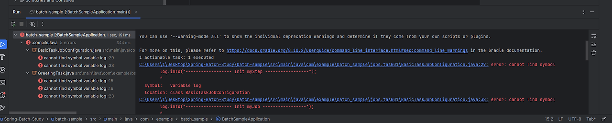
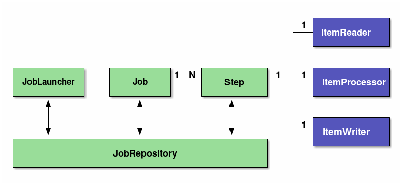
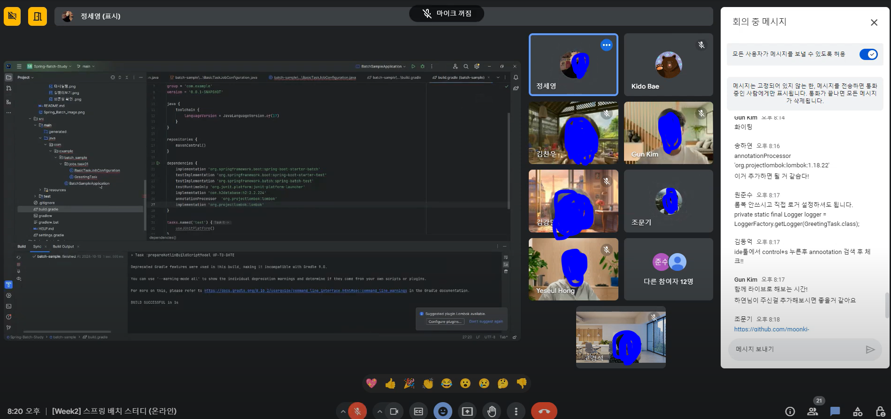
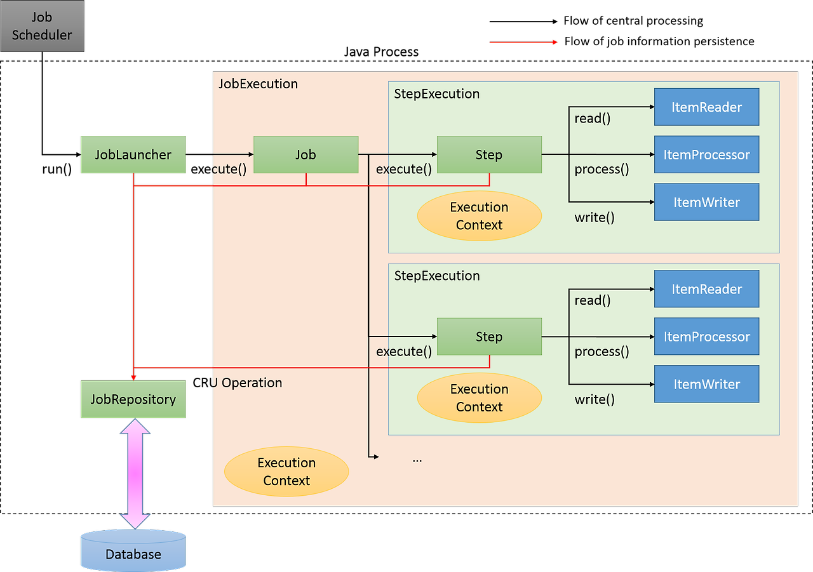
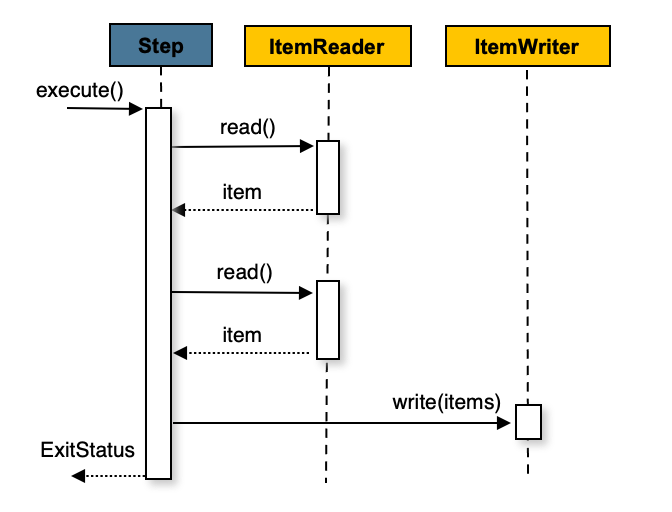

# 2주차 SPRING BATCH STUDY (/written by )

KIDO 님의 SpringBatch 연재 시리즈를 보면서 스터디하는 과정을 진행한다.

2주차 : https://devocean.sk.com/blog/techBoardDetail.do?ID=166690 

이론 보다는 우선적으로 스프링배치를 실행하자!<br>
스프링 배치 중 Tasklet 이라는 것을 만들고 스프링 배치를 수행할 것이다.

## 실습

---

### 프로젝트 준비
이전 week1 에서 만든 스프링 배치를 이용할 것이다.

스프링 배치 3.0이상 버전을 이용하므로 @EnableBatchProcessing 이 필요하지 않다.

다음과 같은 과정을 거친다

> Tasklet 구현체를 생성한다.<br>
> @Configuration을 통해 생성할 배치 빈을 스프링에 등록한다.<br>
> Job, Step 을 생성하고 빈에 등록한다.<br>
> 실행 결과를 확인한다.




### Tasklet 구현체 생성하기
GreetingTasklet.java 파일 생성하고 다음과 같이 작성한다.

GreetingTasklet.java
```java
import lombok.extern.slf4j.Slf4j;
import org.springframework.batch.core.StepContribution;
import org.springframework.batch.core.scope.context.ChunkContext;
import org.springframework.batch.core.step.tasklet.Tasklet;
import org.springframework.batch.repeat.RepeatStatus;
import org.springframework.beans.factory.InitializingBean;

@Slf4j
public class GreetingTask implements Tasklet, InitializingBean {
    @Override
    public RepeatStatus execute(StepContribution contribution,
                                ChunkContext chunkContext) throws Exception {
        log.info("------------------ Task Execute -----------------");
        log.info("GreetingTask: {}, {}", contribution, chunkContext);

        return RepeatStatus.FINISHED;
    }

    @Override
    public void afterPropertiesSet() throws Exception {
        log.info("----------------- After Properites Sets() --------------");
    }
}
```
- Taskle은 excude 메소드를 구현해야한다.
- InitializeBean은 afterPropertiesSet 메소드를 구현해야한다.
  

- excute:
  - excute 메소드는 StepContributioin 과 ChunkContext 를 파라미터로 받는다.
  - 최종적으로 Repeatstatus를 반환하며 이 값은 다음과 같다.
    - FINISHED: 테스크릿이 종료되었음을 나타낸다.
    - CONTINUABLE: 계속해서 테스크를 수행하도록한다.
    - continueIf(condition): 조건에 따라 종료할지 지속할지 결정하는 메소드에 따라 종료/지속을 결정한다.
  

- afterPropertiesSet:
  - 태스크를 수해할때 프로퍼티를 설정하고 난 뒤에 수행되는 메소드이다.
  - 사실상 없어도 된다.

---
### @Configuration을 통해서 생성할 배치 빈을 스프링에 등록
- 스프링부트는 @Configuration을 통해서 빈을 등록할 설정을 할 수 있도로 어노테이션을 제공한다.
- BasicTaskJobConfiguration.java 파일을 다음과 작성한다.

```java
import lombok.extern.slf4j.Slf4j;
import org.springframework.context.annotation.Configuration;

@Slf4j
@Configuration
public class BasicTaskJobConfiguration {

  ... 비워두기
    
}
```
### Job, Step을 생성하고 빈에 등록
- 이제 Job과 Step 생성하고 빈으로 등록해보자
- 다음과 작성한다.

```java
package com.example.batch_sample.jobs.task01;

import lombok.extern.slf4j.Slf4j;
import org.springframework.batch.core.Job;
import org.springframework.batch.core.Step;
import org.springframework.batch.core.job.builder.JobBuilder;
import org.springframework.batch.core.launch.support.RunIdIncrementer;
import org.springframework.batch.core.repository.JobRepository;
import org.springframework.batch.core.step.builder.StepBuilder;
import org.springframework.batch.core.step.tasklet.Tasklet;
import org.springframework.beans.factory.annotation.Autowired;
import org.springframework.context.annotation.Bean;
import org.springframework.context.annotation.Configuration;
import org.springframework.transaction.PlatformTransactionManager;

@Slf4j
@Configuration
public class BasicTaskJobConfiguration {

    @Autowired
    PlatformTransactionManager transactionManager;

    @Bean
    public Tasklet greetingTasklet() {
        return new GreetingTask();
    }
    @Bean
    public Step step(JobRepository jobRepository, PlatformTransactionManager transactionManager) {
        log.info("------------------ Init myStep -----------------");

        return new StepBuilder("myStep", jobRepository)
                .tasklet(greetingTasklet(), transactionManager)
                .build();
    }

    @Bean
    public Job myJob(Step step, JobRepository jobRepository) {
        log.info("------------------ Init myJob -----------------");
        return new JobBuilder("myJob", jobRepository)
                .incrementer(new RunIdIncrementer())
                .start(step)
                .build();
    }

    
}
```

```java
@Bean
public Step step(JobRepository jobRepository, PlatformTransactionManager transactionManager) {
    log.info("------------------ Init myStep -----------------");

    return new StepBuilder("myStep", jobRepository)
            .tasklet(greetingTasklet(), transactionManager)
            .build();
}
```
- 위 코드는 step 빈을 등록했다. JobRepository와 PlatformTransactionManager 를 파라미터로 받는다.
- 스프랭 배치는 보통 데이터소스와 함께 작업하므로 PlatformTransactionManager이 필요하다.
- StepBuilder를 생성하고, 스텝의 이름을 myStep으로 지정했다.
- 그리고 이 스텝은 jobRepository에 등록된다.
- tasklet을 스텝에 추가하고, greetingTasklet() 을 통해서 스탭내 태스크릿을 주입했다.
- build를 통해서 스텝을 생성하고 빈으로 등록하도록 return한다.

```java
@Bean
public Job myJob(Step step, JobRepository jobRepository) {
    log.info("------------------ Init myJob -----------------");
    return new JobBuilder("myJob", jobRepository)
            .incrementer(new RunIdIncrementer())
            .start(step)
            .build();
}
```
- Job을 생성한다. Job은 Step이 필요하며, JobRepository 역시 필요하다.
- Job은 JobRepository에 등록되게 된다.
- JobBuilder를 동해서 이름이 myJob인 잡을 생성했다.
- incrementer은 잡이 지속적으로 실행될때, 잡의 유니크성을 구분할 수 있는 방법을 설정한다.
- RunIdIncrementer는 잡의 아이디를 실행할때 지속적으로 증가시키면서 유니크한 잡을 실행하게 된다.
- start(step) 을 통해서 잡의 시작 포인트를 잡는다. 처음시작하는 스텝은 우리가 파라미터로 받은 step을 등록했다.
- build를 통해서 잡생성하고 빈으로 등록하도록 return한다.

### 실행하기
-  이제 실행을 해봤다<br>


- 에러가 발생했다 원래 Lombok 의존성 문제도 에러가 같이 발생했지만
- Lombok 에러는 의존성 추가함으로 사라졌는데 log 에러(?)가 발생했다.
- 원하는 afterPropertySet(), Job, Step, Tasklet 순으로 실행되는걸 모르겠다.

#### 해결 
  - build.gradle 파일 내 dependencies (의존성) 주입시 아래와 같이 추가해주면 된다.
    - annotaionProcessor 'org.projectlombok:lombok'
    - implementation 'org.projectlombok:lombok'
  - 스터디원 분들이 다같이 집단지성의 힘으로 해결하는 모습이 좋았음.

```properties  
...
중략

dependencies {

 ...
 annotaionProcessor 'org.projectlombok:lombok'
 implementation 'org.projectlombok:lombok'
}
...
```



---
## Spring Batch 아키텍처
### 스프링 배치 모델
- 스프링 배치는 스프링 DI와 AOP를 지원하는 배치 프레임워크이다.
- 스프링 배치 모델은 다음과 같이 2가지 모델을 가진다.
  - Tasklet model
    - 단순한 처리 모델을 가지고 있으며, 로직 자체가 단순한경우에 주로 사용한다.
    - 다양한 데이터소스나 파일을 한번에 처리해야하는 경우 유연함이 있다.
  - Chunk model
    - 데이터량이 매우 큰경우 효과적으로 처리가 가능하다.
    - Reader/Processor/Writer 플로우 방식으로 처리된다.

### 스프링배치의 기본 아키텍처
- 다음그림과 같은 기본 아키텍처를 가진다.


- Job
  - Spring Batch에서 일괄 적용을 위한 일련의 프로세스를 요약하는 단일 실행 단위가 된다.
- Step
  - Job을 구성하는 처리단위이다.
  - 하나의 Job에는 여러 Step이 들어갈 수 있다.
  - 하나의 Job에 여러 Step을 재사용, 병렬화, 조건분기 등을 수행할 수 있다.
  - Step은 tasklet 모델 / chunk 모델의 구현체가 탑재되어 실행된다.
- JobLauncher
  - Job을 수행하기 위한 인터페이스이다.
  - JobLauncher는 사용자에 의해서 직접 수행된다.
  - 자바 커맨드를 통해서 CommandLineJobRunner 를 실행하여 단순하게 배치 프로세스가 수행될 수 있다.
  

- ItemReader
  - 청크단위 모델에서 사용하며, 소스 데이터를 읽어 들이는 역할을 수행한다.
- ItemProcessor
  - 읽어들인 청크 데이터를 처리한다.
  - 데이터 변환을 수행하거나, 데이터를 정제하는 등의 역할을 담당한다.
  - 옵션으로 필요없다면 사용하지 않아도 된다.
- ItemWriter
  - 청크 데이터를 읽어들였거나, 처리된 데이터를 실제 쓰기작업을 담당한다.
  - 데이터베이스로 저장하거나, 수정하는 역할을 할 수 있고, 파일로 처리결과를 출력할 수도 있다.
  

- Tasklet
  - 단순하고 유연하게 배치 처리를 수행하는 태스크를 수행한다.
- JobRepository
  - Job과 Step의 상태를 관리하는 시스템이다.
  - 스프링배치에서 사용하는 테이블 스키마를 기반으로 상태정보를 저장하고 관리한다

---
### 스프링배치 흐름
- 스프링 배치의 기본 흐름을 이해하는 것은 매우 중요하다.
- 기본 아키텍처에서 설명한 구조가 어떻게 흘러가는지 다음 그림을 통해 확인하자.



#### 처리흐름 관점
1. JobScheduler 가 배치를 트리거링 하면 JobLauncher 를 실행한다.
2. JobLauncher 는 Job을 실행한다. 이때 JobExecution 을 수행하고, Execution Context 정보를 이용한다.
3. Job은 자신에게 정으된 Step을 실행한다. 이때 StepExecution을 수행하고, Execution Context 정보가 전달되어 수행된다.
4. Step은 Tasklet과 Chunk모델을 가지고 있으며 위 그림에서는 Chunk 모델로 수행되게 된다.
5. Chunk 모델은 ItemReader를 통해서 소스 데이터를 읽어 들인다.
6. ItemProcessor를 통해서 읽어들인 청크단위 데이터를 처리한다. 처리는 데이터를 변환하거나 가공하는 역할을 하게 된다.
7. ItemWriter는 처리된 청크 데이터를 쓰기작업한다. 다양한 Writer를 통해 데이터베이스에 저장하거나, 파일로 쓰는 역할을 하게 된다.

#### Job 정보의 흐름 관점
1. JobLauncher는 JobRepository를 통해서 JobInstance정보를 데이터베이스에 등록한다.
2. JobLauncher는 JobRepository를 통해서 Job Execution 을 통해 Job 수행하고 실행 정보를 데이터베이스에 저장한다.
3. JobStep은 JobRepository를 통해서 I/O 레코드와 상태정보를 저장한다.
4. 잡이 완료되면 JobRepository를 통해서 데이터베이스에 완료 정보를 저장한다.

#### 스프링배치 저장 정보
- JobInstance
  - JobInstance는 잡 이름과 전달 파라미터를 정의한다.
  - Job이 중단되는 경우 다음 실행할때 중단 이후부터 실행하도록 지원한다.
  - Job이 재실행을 지원하지 않는경우, 혹은 성공적으로 처리된 경우 배치를 재실행 한다면 중복 수행되지 않도록 종료한다.  
  
  
- JobExecution / ExecutionContext
  - JobExecution
    - JobExecution은 잡의 물리적인 실행을 나타낸다.
    - JobInstance와 달리 동일한 Job이 여러번 수행될 수 있다.
    - 그러므로 JobInstance 와 JobExecution은 1:N 관계가 된다.
  - ExecutionContext
    - ExecutionContext는 각각의 JobExecution 에서 처리 단계와 같은 메타 정보들을 공유하는 영역이다.
    - ExecutionContext는 주로 스프링배치가 프레임워크 상태를 기록하는데 사용하며, 또한 애플리케이션에서 ExecutionContext에 액세스 하는 수단도 제공된다.
    - ExecutionContext에 저장되는 객체는 java.io.Serialized를 구현하는 클래스이어야 한다.
  

- StepExecution / ExecutionContext
  - StepExecution
    - StepExecution은 Step을 물리적인 실행을 나타낸다.
    - Job은 여러 Step을 수행하므로 1:N 관계가 된다.
  - ExecutionContext
    - Step내부에 데이터를 공유해야하는 공유 영역이다.
    - 데이터의 지역화 관점에서 여러 단계에 공유 할 필요가 없는 정보는 Job내 ExecutionContext를 이용하는 대신에, Step 단계 내의 ExecutionContext를 사용해야한다.
    - StepExecutionContext에 저장되는 데이터는 반드시 java.io.Serializable 를 구현해야한다.
  - JobRepository
    - JobExecution과 StepExecution등과 같이 배치 실행정보나 상태, 결과정보들이 데이터베이스에 저장될 필요가 있으며 이를 처리하는 것이 JobRepository이다.
    - 즉 스프링배치를 수행하기 위해서 이를 저장할 데이터베이스가 필요하다.
    - 이렇게 저장된 정보를 활용하여 스프링배치는 배치 잡을 재실행 하거나, 정지된 상태 후부터 수행할 수 있는 수단을 제공하게 된다.

--- 
### Chunk
청크 지향 처리는 데이터를 한 번에 하나씩 읽고 트랜잭션 경계 내에 기록되는 '청크'를 생성하는 것을 말합니다. 읽은 항목의 수가 커밋 간격과 같으면 ItemWriter가 전체 청크를 쓰고 트랜잭션이 커밋됩니다. 다음 이미지는 이 과정을 보여줍니다:



### Tasklet
스텝이 저장 프로시저 호출로 구성되어야 한다면 어떻게 해야 할까요? 호출을 ItemReader로 구현하고 프로시저가 완료된 후 null을 반환할 수 있습니다. 하지만 그렇게 하면 작동하지 않는 ItemWriter가 필요하기 때문에 약간 부자연스럽습니다. Spring Batch는 이 시나리오를 위한 TaskletStep을 제공합니다

--- 
### 참고자료
https://velog.io/@gkskaks1004/%EC%8A%A4%ED%94%84%EB%A7%81-%EB%B0%B0%EC%B9%98%EC%9D%98-Tasklet-%EB%B0%A9%EC%8B%9D%EA%B3%BC-Chunk-Tasklet-%EB%B0%A9%EC%8B%9D <br>
https://docs.spring.io/spring-batch/reference/step/tasklet.html#page-title <br>
https://docs.spring.io/spring-batch/reference/step/chunk-oriented-processing.html <br>
https://techblog.woowahan.com/2662/

--- 
#### 발표자 업로드 블로그
<https://one-pic.tistory.com/21>

#### 스터디원 정리 블로그
<https://yeseul-dev.tistory.com/42>
  

<https://j0free.tistory.com/8>
  

<https://velog.io/@hanni/Spring-Boot-EZ%ED%95%98%EA%B2%8C-SpringBatch-%EC%8B%9C%EC%9E%91%ED%95%98%EA%B8%B02>
  

<https://cafecortado.tistory.com/1>
  

<https://youngkim90.github.io/posts/spring-batch-02/>
  

<https://more-n.tistory.com/52>
  
<https://1nmybrain.tistory.com/58>


