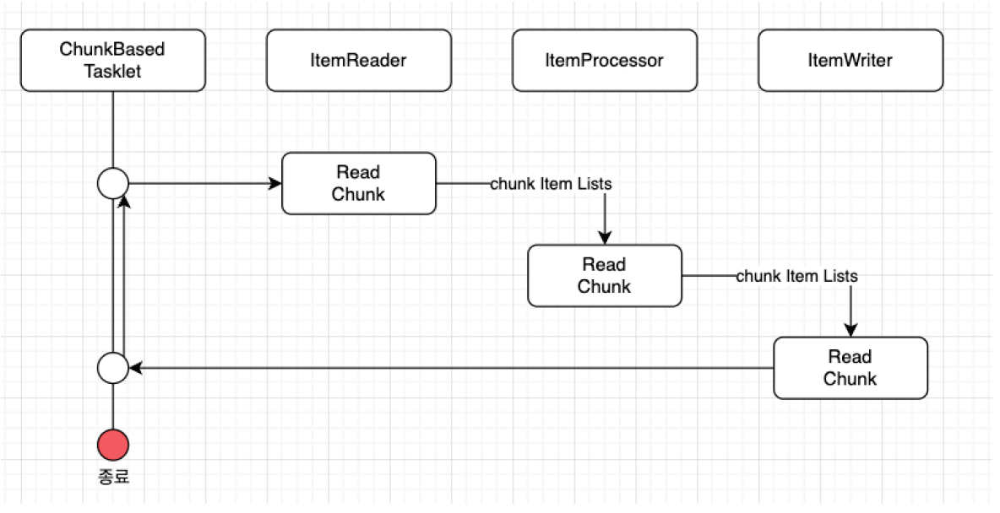

# 3주차 SPRING BATCH STUDY (/w @ch200203)

KIDO 님의 SpringBatch 연재 시리즈를 보면서 스터디하는 과정을 진행한다.

3주차 : https://devocean.sk.com/blog/techBoardDetail.do?ID=166694

[참고] 코들린으로 프로젝트를 진행

## 정리

---

### Chunk Model 알아보기
- Chunk Model은 처리할 데이터를 일정단위(청크) 로 처리하는 방식이다.
- ChunkOrientedTasklet 은 청크 처리를 지원하는 Tasklet의 구체적인 클래스 역할을 수행한다.
- 청크에 포함될 데이터의 최대 레코드 수(청크 Size), 는 본 클래스의 commit-interval이라는 설정값을 이용하여 조정이 가능하다.
  - chunk size = commit interval → write를 쓸때 마 건마다 commit을 날림(auto-commit 옵션 false 필요)
- ItemReader, ItemProcessor, ItemWriter 는 청크 단위를 처리하기 위한 인터페이스이다.


- 위 시퀀스 다이어그램과 같이 ChunkOrientedTasklet 은 ItemReader, ItemProcessor, ItemWriter 구현체를 각각 호출한다.
- 이때 ChunkOrientedTasklet 은 청크 단위에 따라 ItemReader, ItemProcessor, ItemWriter 를 반복실행한다.
- 청크 크기만큼 ItemReader가 데이터를 읽어 들인다.
- 청크 단위를 ItemProcessor로 전달하고, 데이터를 처리한다.
- ItemProcessor를 처리하고난 청크 단위가 ItemWriter로 전달되어 데이터를 저장하거나, 파일처리를 수행한다.

### Chunk Model 알아보기
- ItemProcessor은 구체적인 구현체를 구현하여 스프링배치에 전달한다.
- ItemProcessor은 Reader로 읽어들인 청크 데이터들을 처리한다. 처리라고 하면, 데이터를 변환하거나, 데이터에 변경 혹은 외부 인터페이스 호출등을 수행하는 역할을 한다.
- ItemProcessor은 chunk model에서 없어도 되는 옵션이다.

```kotlin
class MyItemProcessor: ItemProcessor<MyInputObject, MyOutputObject> { // 1.
    override fun process(item: MyInputObject): MyOutputObject { // 2.
        val processedObject: MyOutputObject = MyOutputObject() // 3.
        // Coding business logic for item of input data
        return processedObject; // 4.
    }
}
```
- (1): ItemProcessor 인터페이스를 구현하게 된다. 이때 입력, 출력 데이터 타입을 제네릭 타입으로 받는다.
- (2): process메소드 구현체를 구현하며, 입력 아규먼트로 받아 들인다.
- (3): ItemProcessor 처리 결과로 반환할 출력 객체를 생성한다. 즉, 변환된 데이터 등이 올 수 있다.
- (4): 출력 객체를 반환한다.

### Chunk Model 알아보기
- ItemReader는 직접 커스텀 구현을 할 수 있지만 스프링배치에서는 이미 구현된 다양한 ItemReader구현체를 제공한다.

### Chunk Model 알아보기
- FlatFileItemReader:
  - 플랫파일 (즉 구조화 되지 않은파일을 플랫파일이라고한다.)을 읽어 들인다.
  - 대표적인 것이 CSV파일 등이 있다.
  - 읽어들인 데이터를 객체로 매핑하기 위해서 delimeter를 기준으로 매핑 룰을 이용하여 객체로 매핑한다.
  - 혹은 입력에 대해서 Resource object를 이용하여 커스텀하게 매핑할 수도 있다.
- StaxEventItemReader:
  - XML파일을 읽어 들인다.
  - 이름이 함축하듯이 XML파일을 StAX기반으로 읽어 들인다.
- JdbcPagingItemReader / JdbcCursorItemReader:
  - JDBC를 사용하여 SQL을 실행하고 데이터베이스의 레코드를 읽는다.
  - 데이터베이스에서 많은 양의 데이터를 처리해야 하는 경우에는 메모리에 있는 모든 레코드를 읽는 것을 피하고, 한 번의 처리에 필요한 데이터만 읽고 폐기하는 것이 필요하다.
  - JdbcPagingItemReader는 JdbcTemplate을 이용하여 각 페이지에 대한 SELECT SQL을 나누어 처리하는 방식으로 구현된다.
  - 반면 JdbcCursorItemReader는 JDBC 커서를 이용하여 하나의 SELECT SQL을 발행하여 구현된다.
- MyBatisCursorItemReader / MyBatisPagingItemReader:
  - MyBatis를 사용하여 데이터베이스의 레코드를 읽는다.
  - MyBatis가 제공하는 Spring 조정 라이브러리는 MyBatis-Spring에서 제공된다.
  - Paging과 Cursor의 차이점은 MyBatis를 구현방법이 다를뿐이지 JdbcXXXItemReader과 동일하다
  - 또한 ItemReaderJPA구현이나 Hibernate와 연동하여 데이터베이스의 레코드를 읽어오는 JpaPagingItemReader, HibernatePagingItemReader, HibernateCursor를 제공한다.
- JmsItemReader / AmqpItemReader:
  - 메시지를 JMS혹은 AMQP에서 읽어들인다.
  
### ItemProcessor
- ItemReader와 마찬가지로 Spring Batch에는 다양한 ItemProcessor 구현체도 제공한다.

#### 제공하는 다양한 구현체
- PassThroughItemProcessor:
  - 아무 작업도 수행하지 않는다.
  - 입력된 데이터의 변경이나 처리가 필요하지 않는경우 사용된다.
- ValidatingItemProcessor:
  - 입력된 데이터를 체크한다.
  - 입력 확인 규칙을 구현하려면 Spring Batch 전용 org.springframework.batch.item.validator.Validator를 구현해야한다.
  - 그러나 일반적인 org.springframework.validation.Validator 의 어댑터인 SpringValidator와 org.springframework.validation의 규칙을 제공한다.
- CompositeItemProcessor:
  - 동일한 입력 데이터에 대해 여러 ItemProcessor를 순차적으로 실행한다.
  - ValidatingItemProcessor를 사용하여 입력 확인을 수행한 후 비즈니스 로직을 실행하려는 경우 활성화 된다.

### ItemWriter
- 역시 ItemWriter의 다양한 구현체를 제공한다.

#### 제공하는 다양한 구현체
- FlatFileItemWriter:
  - 처리된 Java객체를 CSV 파일과 같은 플랫 파일로 작성한다.
  - 파일 라인에 대한 매핑 규칙은 구분 기호 및 개체에서 사용자 정의로 사용할수도 있다.
- StaxEventItemWriter:
  - XML파일로 자바 객체를 쓰기할 수 있다.
- JdbcBatchItemWriter:
  - JDBC를 사용하여 SQL을 수행하고 자바 객체를 데이터베이스에 쓰기한다.
  - 내부적으로 JdbcTemplate를 사용하게 된다.
- MyBatisBatchItemWriter:
  - Mybatis를 사용하여 자바 객체를 데이터베이스로 쓰기한다.
  - MyBatis-Spring 는 MyBatis에 의해서 제공되는 라이브러리를 이용한다.
- JmsItemWriter / AmqpItemWriter:
  - JMS혹은 AMQP로 자바 객체의 메시지를 전송한다.

### Tasklet Model
- chunk model은 큰 데이터를 분할해서 ItemReader --> ItemProcessor --> ItemWriter 순으로 처리가 필요한경우 매우 유용하다.
- 반면 청크 단위의 처리가 딱 맞지 않을경우 Tasklet Model이 유용하다.
- 예를들어 한번에 하나의 레코드만 읽어서 쓰기해야하는 경우 Tasklet Model이 적합하다.
- 사용자는 Tasklet 모델을 사용하면서 Spring Batch에서 제공하는 Tasklet 인터페이스를 구현해야한다.

### WrapUp
- Chunk Model은 큰 데이터를 부분(청크)로 쪼개어 조금씩 처리하는 방식이다.
- 처리해야할 데이터가 많은경우 Chunk Model을 사용하여 분할로 전체를 처리하면 메모리도 적게 사용하고, 안정적으로 배치를 수행할 수 있다.
- Tasklet Model은 작은 데이터를 한번에 처리하거나, 한번의 태스크로 배치를 수행해야하는 경우 이용하는 방식이다.
- 처리해야할 데이터가 작은경우 Tasklet Model을 이용하면 쉬운 방법으로 배치를 개발할 수 있다.
- Chunk나 Tasklet은 처리해야할 데이터의 양, 처리 방식에 따라 선택할 필요가 있다.

---
### Note : 추가로 더 궁금했던거
코틀린으로 구성을 하다보니 Spring Batch Plus 라는 라이브러리도 존재하였다.
Spring Batch 를 좀 더 코틀린스럽게 사용할 수 있게 도와주는 듯

<https://d2.naver.com/helloworld/9879422>

--- 
### Note : 추가로 더 궁금했던거 2
STEP 은 아이템을 읽고 쓰는 동안 설정되어있는 `PlatformTransactionManager` 를 사용해 주기적으로 commit 합니다.

`commit-interval` 이 1이면 각 Item 을 write 할 때 마다 commit 을 진행합니다.

→ 하지만 트랜잭션을 실행하고 commit 하는 것은 소모적이기 때문에 보통 이렇게 사용하지는 않음.

보통 한 트랜잭션에서 가능한 많은 아이템을 처리하는데, 처리하는 데이터 유형과 STEP 이 상호작용하는 리소스에 따라 달라진다. 그렇기 때문에 한 커밋에서 처리할 아이템 수를 직접 설정해준다.

```kotlin
@Bean
fun sampleJob(jobRepository: JobRepository): Job { 
    return JobBuilder("sampleJob", jobRepository)
        .start(step1(jobRepository))
        .build()
}

@Bean
fun step1(jobRepository: JobRepository): Step { 
    return StepBuilder("step1", jobRepository)
        .chunk<String, String>(10)
        .reader(itemReader())
        .writer(itemWriter())
        .build()
}


```
> - 트랜잭션에서 10개씩 처리.<br>
> - 데이터를 카운트 하기전에 트랜잭션을 시작하고 `ItemReader` 가 `read` 메서드를 호출 할 때 마다 카운터가 증가하고, 카운터가 10이 되면
합쳐진 아이템 리스트는 `ItemWriter` 로 넘겨지고 트랜잭션이 커밋된다.<br>

---
### Note : 추가로 더 궁금했던거 3

재시도와 스킵처리

#### 1.재시도(Retry)
**재시도** 는 배치 작업 중 예외가 발생했을 때, **지정된 횟수만큼 해당 아이템의 처리를 재시도**

- 동작 방식:
  - 특정 예외가 발생하면, 해당 아이템에 대해 설정된 재시도 횟수만큼 처리를 다시 시도
  - 재시도 중에도 계속해서 예외가 발생하면, 최종적으로 해당 아이템 처리를 실패
  - 재시도는 ItemReader, ItemProcessor, ItemWriter에서 발생하는 예외에 대해 설정
- 사용 방법:
  - `faultTolerant()` : 재시도와 스킵 기능 사용하겠다고 선언
  - `retry(Exception.class)` : 재시도할 예외 타입을 지정
  - `retryLimit(3)` : 최대 재시도 횟수를 지정

```kotlin
@Component
class RetryTesttasklet : Tasklet {
    override fun execute(contribution: StepContribution, chunkContext: ChunkContext): RepeatStat
        val retryTemplate = RetryTemplate.builder()
            .maxAttempts(3) // 재시도 횟수
            .fixedBackoff(1000) // 1초 쉬고 재시도
            .retryOn(Exception::class.java) // () 예외 발생시 재시도
            .build()
  
        try {
            retryTemplate.execute {
                println("재시도 필요")
            }
        } catch (e: Exception) {
            println("배치 작업 중 에러발생 ${e.message}")
            throw e
        }

        return RepeatStatus.FINISHED
    }
}
```

#### 2. 스킵(Skip)
**스킵**은 예외가 발생한 아이템을 **지정된 스킵 한도(skip limit)** 내에서 건너뛰고, 다음 아이템으로 처리를 진행하는 기능.데이터의 일부에 문제
가 있더라도 전체 배치 작업이 중단되지 않도록 한다.

- 동작 방식:
  - 특정 예외가 발생하면, 해당 아이템을 스킵하고 다음 아이템 처리를 진행
  - 스킵 한도를 초과하면, 배치 작업이 실패
  - 스킵은 ItemReader, ItemProcessor, ItemWriter에서 발생하는 예외에 대해 설정
- 사용 방법:
  - `skip(Exception.class)` : 스킵할 예외 타입을 지정
  - `skipLimit(5)` : 최대 스킵 허용 횟수를 지정

--- 
### Note : 추가로 더 궁금했던거 4
Tasklet 의 트랜잭션 처리?

먼저 Spring Batch은 JobLauncher의 run 메서드를 통해 통해 Job을 실행한다. <u>***Tasklet 기반의 경우 Job은 여러 개의 Step을 가지고, 각
Step은 하나의 Tasklet을 가지며 트랜잭션을 각각 관리한다.***</u>

```kotlin
// JobLauncher
@Override
public JobExecution run(final Job job, final JobParameters jobParameters) throws ...
{
    // ...
    try {
        taskExecutor.execute(new Runnable() {
            @Override
            public void run() {
                // jobRepository에서 jobExecution 생성 후 job 실행
                job.execute(jobExcution);
            }
        });
    } catch(TaskRejectedException e) {
        // JobExecution 실패 업데이트
    }
}
```
execute 메서드는 내부적으로 doExecute 메서드를 호출하며 doExecute 메서드는 아래와 같이 <u>***Job에 등록된 Step을 Loop돌면서
StepHandler의 handleStep 메서드를 호출하고 있었다.***</u>

```kotlin
// Job 구현체
@Override
protected void doExecute(JobExecution execution) throws ... {
        // ... 생략
        StepExecution stepExecution = null;
    for(Step step: steps) {
        stepExecution = handleStep(step, execution);
    }
        // ...
}
```
```kotlin
// StepHandler 구현체
@Override
public StepExecution handleStep(Step step, JobExecution execution) throws ... {
        // 생략..
    
    step.execute(currentStepExecution);// JobExecution에서 StepExecution 생성
        // 생략..
}
```
<u>***TransactionTemplate의 execute 를 호출하는 부분이다. 여기서 transactionManager를 전달하는데 transactionManager는 Step
을 생성할 때 주입해주고 있다.***</u>

```kotlin
// TaskletStep.class
@Override
protected void doExecute(StepExecution stepExecution) throws Exception {
    // Shared semaphore per step execution, so other step executions can run
    // in parallel without needing the lock
    final Semaphore semaphore = createSemaphore();
  
    stepOperations.iterate(new StepContextRepeatCallback(stepExecution) {
        @Override
        public RepeatStatus doInChunckContext(RepeatContext repeatContext, ChunkContext chunckCo
            throws Exception {
            // 생략...
            RepeatStatus result = new TransactionTemplate(transactionManager, transactionAttibut
                .execute(new ChunkTransactionCallback(chunkContext, semaphore));
          
            // 생략...
        }
    })
}
```
TransactionTemplate의 execute 메서드를 살펴보자. <u>***트랜잭션 매니저로부터 트랜잭션을 얻은 후 TransactionCallback 클래스의
doInTransaction() 메서드를 호출하고 있다.***</u> 여기서 TransactionCallback 클래스는 TaskletStep에 정의된 내부 클래스이다. 이 때 정상
적으로 처리되면 commit, 예외가 발생하면 rollback 처리를 한다.


참고 : <https://lazy-man.tistory.com/85>

---

여러개의 아이템을 연결해서 배치를 생성하면 어떨까?
#### 예시 프로젝트 작성해보기.
```kotlin
// 1. 엔티티 정의하기
@Entity
class PaymentRecord( // 결재 내역
        @Id @GeneratedValue(strategy = GenerationType.IDENTITY)
        val id: Long = 0,
        val amount: Double // 결재금액
)

@Entity
class Settlement( // 정산 데이터 저장
    @Id @GeneratedValue(strategy = GenerationType.IDENTITY)
    val id: Long = 0,
    val paymentId: Long,
    val amount: Double, // 전체금액
    val fee: Double, // 수수료
    val netAmount: Double // 수수료를 제외한 실제 금액
)

@Entity
class ProcessedSettlement( // 최종 정산데이터 저장
    @Id @GeneratedValue(strategy = GenerationType.IDENTITY)
    val id: Long = 0,
    val settlementId: Long,
    val processedAmount: Double, // 할인, 추가 처리 등이 된 금액
    val tax: Double // 세금
)

// 2. Reader, Processor, Writer 구현
@Component
class JpaPaymentRecordReader(
    private val entityManagerFactory: EntityManagerFactory
) : ItemReader<PaymentRecord> {
    
    private val reader: JpaPagingItemReader<PaymentRecord>

    init {
        reader = JpaPagingItemReader<PaymentRecord>().apply {
            setEntityManagerFactory(entityManagerFactory)
            setQueryString("SELECT p FROM PaymentRecord p WHERE p.amount > 0")
            pageSize = 100
            name = "jpaPaymentRecordReader"
        }
    }
  
    override fun read(): PaymentRecord? = reader.read()
}

@Component
class DefaultSettlementProcessor : ItemProcessor<PaymentRecord, Settlement> {
    override fun process(paymentRecord: PaymentRecord): Settlement {
        // 결제 데이터를 정산 데이터로 변환
        return Settlement(
            paymentId = paymentRecord.id,
            amount = paymentRecord.amount,
            fee = paymentRecord.amount * 0.2,// 수수료 20퍼
            netAmount = paymentRecord.amount * 0.8 // 실제정산금액
        )
    }
}

@Component
class JpaProcessedDataWriter(
    private val SettlementRepository: SettlementRepository
) : ItemWriter<Settlement> {
    
    override fun write(items: MutableList<out Settlement>) {
        // 정산 데이터 저장
        SettlementRepository.saveAll(items)
        println("Size : ${items.size} 데이터가 저장되었습니다.")
}
  
// Step 구현
@Configuration
class SettlementBatchConfig(
    private val paymentRecordReader: JpaPaymentRecordReader,
    private val settlementProcessor: DefaultSettlementProcessor,
    private val settlementWriter: JpaSettlementWriter,
    private val processedSettlementWriter: ProcessedDataWriter
) {
    
    @Bean
    fun settlementJob(jobRepository: JobRepository): Job {
        return JobBuilder("settlementJob", jobRepository)
            .start(paymentCollectionStep(jobRepository))
            .next(settlementProcessingStep(jobRepository))
            .next(validationTaskletStep(jobRepository))
            .next(resultSavingTaskletStep(jobRepository))
            .build()
    }
  
    @Bean
    fun paymentCollectionStep(jobRepository: JobRepository): Step {
        return StepBuilder("paymentCollectionStep", jobRepository)
            .chunk<PaymentRecord, Settlement>(100, jobRepository)
            .reader(paymentRecordReader)
            .processor(settlementProcessor)
            .writer(settlementWriter)
            .build()
    }
  
    @Bean
    fun settlementProcessingStep(jobRepository: JobRepository): Step {
        return StepBuilder("settlementProcessingStep", jobRepository)
            .chunk<Settlement, ProcessedSettlement>(100, jobRepository)
            .reader(ListItemReader(listOf()))
            .processor(object : ItemProcessor<Settlement, ProcessedSettlement> {
                override fun process(item: Settlement): ProcessedSettlement {
                    return ProcessedSettlement(
                        settlementId = item.paymentId,
                        processedAmount = item.netAmount - item.fee,
                        tax = item.netAmount * 0.1
                    )
                }
            })
            .writer(object : ItemWriter<ProcessedSettlement> {
                override fun write(items: MutableList<ProcessedSettlement>) {
                    // 콘솔에서 확인해보기
                    println("${items.size} 개 항목 처리완료.")
                }
            })
            .build()
    }
  
    @Bean
    fun validationTaskletStep(jobRepository: JobRepository): Step {
            // 검증로직 실행 -> 간단한 작업이라 Tasklet 선택
        return StepBuilder("validationStep", jobRepository)
            .tasklet(ValidationTasklet(), jobRepository)
            .build()
    }
  
    @Bean
    fun resultSavingTaskletStep(jobRepository: JobRepository): Step {
        return StepBuilder("resultSavingStep", jobRepository)
            .tasklet(ResultTasklet(), jobRepository)
            .build()
        }
    }
  
// 4. 트리거 정의
@RestController
@RequstMapping("/api/job")
class JobController(
    private val jobLauncher: JobLauncher,
    private val settlementJob: Job
) {
    @PostMapping("/shoot")
    fun runJob(): ResponseEntity<String> {
        val jobParameters = JobParametersBuilder()
            .addLong("time", System.currentTimeMillis())
            .toJobParameters()
      
        jobLauncher.run(settlementJob, jobParameters)
        return ResponseEntity.ok("실 행 완 료")
    }
}

```
**결제 데이터 → 정산 데이터 → 최종 처리된 데이터** 로 단계별로 데이터가 실행됨
  
실행가능한 YAML 파일(구성중)
```yaml
version: '3.8'

services:
  app:
    image: openjdk:17-jdk-alpine
    container_name: settlement-app
    volumes:
    - .:/app
    working_dir: /app
    ports:
      - "8080:8080"
    environment:
      SPRING_DATASOURCE_URL: jdbc:h2:mem:testdb;MODE=MySQL;DB_CLOSE_DELAY=-1;DB_CLOSE_ON_EXIT=FA
      SPRING_DATASOURCE_DRIVER_CLASS_NAME: org.h2.Driver
      SPRING_DATASOURCE_USERNAME: sa
      SPRING_DATASOURCE_PASSWORD: ""
      SPRING_JPA_HIBERNATE_DDL_AUTO: update
      SPRING_JPA_SHOW_SQL: "true"
      SPRING_H2_CONSOLE_ENABLED: "true"

    command: ["./gradlew", "bootRun"]
    depends_on:
      - db
      
  db:
    image: oscarfonts/h2
    container_name: h2-database
    ports:
      - "9092:9092"
    environment:
      H2_OPTIONS: "-tcp -tcpAllowOthers -tcpPort 9092"
    volumes:
      - h2-data:/opt/h2-data

volumes:
  h2-data:
```

--- 
#### 발표자 업로드 참고 소스
<https://github.com/ch200203/kotlin-lab/tree/master/kopring-batch>

#### 스터디원 정리 블로그
<https://yeseul-dev.tistory.com/44>

<https://j0free.tistory.com/9>

<https://github.com/mardi2020/Spring-batch-study/blob/main/docs/3%EC%A3%BC%EC%B0%A8.md>

<https://quiver-chess-96a.notion.site/3-1270c0aec17880598477e41ecc30e324?pvs=4>

<https://github.com/won-js/spring-batch-study/tree/main/docs/week3>

<https://velog.io/@hanni/Spring-Batch-3%ED%8E%B8-ChunkModel%EA%B3%BC-TaskletModel%EA%B0%80-%EB%AC%B4%EC%97%87%EC%9D%BC%EA%B9%8C>
  
<https://cafecortado.tistory.com/2>

<https://github.com/connieya/spring-batch-study/blob/main/docs/week3/chunk%EB%AA%A8%EB%8D%B8_tasklet%EB%AA%A8%EB%8D%B8.md>

<https://github.com/chanwoo040531/batch-study/tree/master/assignment03>

<https://youngkim90.github.io/posts/spring-batch-03/>

<https://more-n.tistory.com/54>

<https://github.com/sajacaros/spring-batch-tutorial/blob/main/docs/03_chunk_tasklet_model.md>

<https://github.com/gunkim/hellospringbatch/blob/main/docs/step3.md>

<https://1nmybrain.tistory.com/60>


