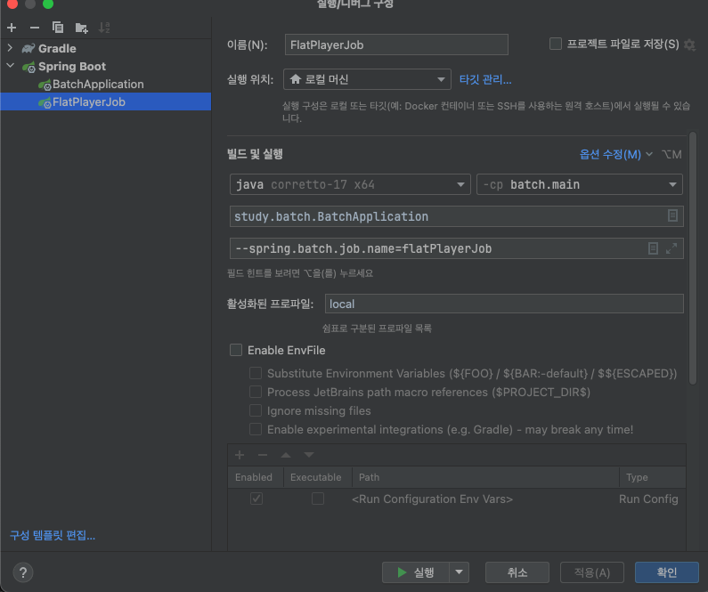

# 4주차 SPRING BATCH STUDY (written by @wonjs)

KIDO 님의 SpringBatch 연재 시리즈를 보면서 스터디하는 과정을 진행한다.

4주차 : https://devocean.sk.com/blog/techBoardDetail.do?ID=166828

## 정리

---

### FlatFileItemReader 개요
- FlatFileItemReader는 Spring Batch에서 제공하는 기본적인 ItemReader로, 텍스트 파일로부터 데이터를 읽습니다.
- 고정 길이, 구분자 기반, 멀티라인 등 다양한 형식의 텍스트 파일을 지원하며, 다음과 같은 장점을 갖고 있음
    - 간단하고 효율적 구현: 설정 및 사용이 간편하며, 대규모 데이터 처리에도 효율적
    - 다양한 텍스트 파일 형식 지원: 고정 길이, 구분자 기반, 멀티라인 등 다양한 형식의 텍스트 파일을 읽을 수 있음
    - 확장 가능성: 토크나이저, 필터 등을 통해 기능을 확장할 수 있음
    - 사용처: 고정 길이, 구분자 기반, 멀티라인 등 다양한 형식의 텍스트 파일 데이터 처리

### FlatFileItemReader 주요 구성 요소
- Resource: 읽을 텍스트 파일을 지정
- LineMapper: 텍스트 파일의 각 라인을 Item으로 변환하는 역할
- LineTokenizer: 텍스트 파일의 각 라인을 토큰으로 분리
- FieldSetMapper: 토큰을 Item의 속성에 매핑하는 역할
- SkippableLineMapper: 오류 발생 시 해당 라인을 건너뛸 수 있도록 설정
- LineCallbackHandler: 라인별로 처리를 수행할 수 있도록 작업
- ReadListener: 읽기 시작, 종료, 오류 발생 등의 이벤트를 처리

### FlatFileItemWriter 개요
- FlatFileItemWriter는 Spring Batch에서 제공하는 ItemWriter 인터페이스를 구현하는 클래스
- 데이터를 텍스트 파일로 출력하는데 사용됨

### FlatFileItemWriter 구성요소
- Resource: 출력 파일 경로 지정
- LineAggregator: Item을 문자열로 변환하는 역할
- HeaderCallback: 출력 파일 헤더를 작성하는 역할
- FooterCallback: 출력 파일 풋터를 작성하는 역할
- Delimiter: 항복 사이 구분자 지정
- AppendMode: 기존 파일에 추가할지 여부를 지정

## FlatItemReader / ItemProcessor / FlatItemWriter 테스트 해보기

---
### 예시 파일
- 아래와 같이 레알 마드리드 선수진의 목록이 있다.
  ```
  No,Name,Age
  1,Thibaut Courtois,32
  2,Dani Carvajal,32
  3,Fran García,25
  4,David Alaba,32
  5,Jude Bellingham,21
  6,Nacho Fernández,34
  7,Vinícius Júnior,24
  8,Toni Kroos,34
  9,Joselu,34
  10,Luka Modrić,39
  11,Rodrygo,23
  12,Eduardo Camavinga,21
  13,Andriy Lunin,25
  14,Aurélien Tchouaméni,24
  15,Ferland Mendy,29
  16,Antonio Rüdiger,31
  17,Brahim Díaz,25
  18,Álvaro Odriozola,28
  19,Dani Ceballos,28
  20,Fran García,25
  21,Borja Mayoral,27
  22,Kepa Arrizabalaga,30
  ```
  1년이 지나 Age에 1을 준다고 가정 (한국나이로 계산)

### Player Class 정의
```java
import lombok.Getter;
import lombok.Setter;
import lombok.ToString;

import java.io.Serializable;

@Getter
@Setter
@ToString
public class Player implements Serializable {
    private long no;
    private String name;
    private int age;

}
```
* Record를 사용하여도 가능하다

### FieldSetMapper 설정
- CSV의 레코드를 Player Class에 넣어주기 위해서는 FieldSetMapper를 사용해야 하는데 2가지 방법이 존재
  - 1번째 레코드의 순서대로 정의하는 방법
      ```java
      import org.springframework.batch.item.file.mapping.FieldSetMapper;
      import org.springframework.batch.item.file.transform.FieldSet;
    
      public class PlayerFieldSetMapper implements FieldSetMapper<Player> {
      public Player mapFieldSet(FieldSet fs) {
        if (fs == null) return null;
  
            Player player = new Player();
  
            player.setNo(fs.readLong(0));
            player.setName(fs.readString(1));
            player.setAge(fs.readInt(2));
  
            return player;
        }
      }
      ```
  - 2번째 레코드의 title을 보고 정의하는 방법
    ```java 
      import org.springframework.batch.item.file.mapping.FieldSetMapper;
      import org.springframework.batch.item.file.transform.FieldSet;
  
      public class PlayerMapper implements FieldSetMapper<Player> {
      public Player mapFieldSet(FieldSet fs) {
      if (fs == null) return null;
  
              Player player = new Player();
              player.setNo(fs.readLong("No"));
              player.setName(fs.readString("Name"));
              player.setAge(fs.readInt("Age"));
  
              return player;
          }
      }
      ```
    해당 방법의 경우 delimitedLineTokenizer 추가 설정 반드시 필요

### 관련된 Bean 등록
```java
import lombok.extern.java.Log;
import org.springframework.batch.core.Job;
import org.springframework.batch.core.Step;
import org.springframework.batch.core.job.builder.JobBuilder;
import org.springframework.batch.core.launch.support.RunIdIncrementer;
import org.springframework.batch.core.repository.JobRepository;
import org.springframework.batch.core.step.builder.StepBuilder;
import org.springframework.batch.item.file.FlatFileItemReader;
import org.springframework.batch.item.file.FlatFileItemWriter;
import org.springframework.batch.item.file.builder.FlatFileItemReaderBuilder;
import org.springframework.batch.item.file.builder.FlatFileItemWriterBuilder;
import org.springframework.batch.item.file.mapping.DefaultLineMapper;
import org.springframework.batch.item.file.mapping.FieldSetMapper;
import org.springframework.batch.item.file.transform.DelimitedLineTokenizer;
import org.springframework.context.annotation.Bean;
import org.springframework.context.annotation.Configuration;
import org.springframework.core.io.FileSystemResource;
import org.springframework.transaction.PlatformTransactionManager;

import java.util.concurrent.ConcurrentHashMap;


@Log
@Configuration
public class PlayerJobConfiguration {
    public static final String ENCODING = "UTF-8";
    public static final String TOTAL_PLAYERS = "TOTAL_PLAYERS";
    public static final String TOTAL_AGES = "TOTAL_AGES";

    private final ConcurrentHashMap<String, Integer> aggregateInfos = new ConcurrentHashMap<>();

    @Bean
    public FieldSetMapper<Player> playerFieldSetMapper() {
//        return new PlayerFieldSetMapper();
        return new PlayerMapper();
    }

    @Bean
    public DelimitedLineTokenizer delimitedLineTokenizer() {
        DelimitedLineTokenizer delimitedLineTokenizer = new DelimitedLineTokenizer();
        delimitedLineTokenizer.setNames("No", "Name", "Age");
        return delimitedLineTokenizer;
    }

    @Bean
    public DefaultLineMapper<Player> playerLineMapper() {
        DefaultLineMapper<Player> lineMapper = new DefaultLineMapper<> ();
        lineMapper.setLineTokenizer(delimitedLineTokenizer());
        lineMapper.setFieldSetMapper(playerFieldSetMapper());

        return lineMapper;
    }

    @Bean
    public FlatFileItemReader<Player> playerFlatFileItemReader() {
        return new FlatFileItemReaderBuilder<Player>()
                .name("playerFlatFileItemReader")
                .resource(new FileSystemResource("src/main/resources/week4/players.csv"))
                .linesToSkip(1) // 표의 title skip
                .lineMapper(playerLineMapper())
                .build();
    }

    @Bean
    public FlatFileItemWriter<Player> playerFlatFileItemWriter() {
        return new FlatFileItemWriterBuilder<Player>()
                .name("customerFlatFileItemWriter")
                .resource(new FileSystemResource("./output/week4/player_new.csv"))
                .encoding(ENCODING)
                .delimited()
                .names("No", "Name", "Age")
                .append(false)
                .headerCallback(writer -> writer.write("No,Name,Age"))
                .footerCallback(writer -> {
                    writer.write("총 플레이어 수: " + aggregateInfos.get(TOTAL_PLAYERS));
                    writer.write(System.lineSeparator());
                    writer.write("총 나이: " + aggregateInfos.get(TOTAL_AGES));
                })
                .build();
    }

    @Bean
    public Step playerStep(JobRepository jobRepository, PlatformTransactionManager transactionManager) {
        log.info("------------------ Init PlayerStep -----------------");
        return new StepBuilder("flatPlayerStep", jobRepository)
                .<Player, Player>chunk(10, transactionManager)
                .reader(playerFlatFileItemReader())
                .processor(player -> {
                    log.info("------------------ Processor Execute ------------------");
                    player.setAge(player.getAge()+1);
                    aggregateInfos.putIfAbsent(TOTAL_PLAYERS, 0);
                    aggregateInfos.putIfAbsent(TOTAL_AGES, 0);

                    aggregateInfos.put(TOTAL_PLAYERS, aggregateInfos.get(TOTAL_PLAYERS) + 1);
                    aggregateInfos.put(TOTAL_AGES, aggregateInfos.get(TOTAL_AGES) + player.getAge());
                    return player;
                })
                .writer(playerFlatFileItemWriter())
                .build();
    }

    @Bean
    public Job playerJob(Step playerStep, JobRepository jobRepository) {
        log.info("------------------ Init PlayerJob -----------------");
        return new JobBuilder("flatPlayerJob", jobRepository)
                .incrementer(new RunIdIncrementer())
                .start(playerStep)
                .build();
    }
}
```
- chunk size는 10
- ItemReader: 레알마드리드 선수진의 데이터를 불러옴
- ItemProcessor: 각 선수의 나이를 1 더하고 (전체 플레이어 수 / 나이를 갱신)
- ItemWriter: 선수들의 데이터를 모아서 파일을 만듦


**❗결과 확인❗** <br>
```
  .   ____          _            __ _ _
 /\\ / ___'_ __ _ _(_)_ __  __ _ \ \ \ \
( ( )\___ | '_ | '_| | '_ \/ _` | \ \ \ \
 \\/  ___)| |_)| | | | | || (_| |  ) ) ) )
  '  |____| .__|_| |_|_| |_\__, | / / / /
 =========|_|==============|___/=/_/_/_/

 :: Spring Boot ::                (v3.3.4)

2024-11-01T18:38:35.406+09:00  INFO 22051 --- [batch] [           main] study.batch.BatchApplication             : Starting BatchApplication using Java 17.0.9 with PID 22051 (/Users/1004781/study/spring/batch/build/classes/java/main started by 1004781 in /Users/1004781/study/spring/batch)
2024-11-01T18:38:35.411+09:00  INFO 22051 --- [batch] [           main] study.batch.BatchApplication             : The following 1 profile is active: "local"
2024-11-01T18:38:36.131+09:00  WARN 22051 --- [batch] [           main] trationDelegate$BeanPostProcessorChecker : Bean 'org.springframework.boot.autoconfigure.jdbc.DataSourceConfiguration$Hikari' of type [org.springframework.boot.autoconfigure.jdbc.DataSourceConfiguration$Hikari] is not eligible for getting processed by all BeanPostProcessors (for example: not eligible for auto-proxying). Is this bean getting eagerly injected into a currently created BeanPostProcessor [jobRegistryBeanPostProcessor]? Check the corresponding BeanPostProcessor declaration and its dependencies.
2024-11-01T18:38:36.162+09:00  WARN 22051 --- [batch] [           main] trationDelegate$BeanPostProcessorChecker : Bean 'spring.datasource-org.springframework.boot.autoconfigure.jdbc.DataSourceProperties' of type [org.springframework.boot.autoconfigure.jdbc.DataSourceProperties] is not eligible for getting processed by all BeanPostProcessors (for example: not eligible for auto-proxying). Is this bean getting eagerly injected into a currently created BeanPostProcessor [jobRegistryBeanPostProcessor]? Check the corresponding BeanPostProcessor declaration and its dependencies.
2024-11-01T18:38:36.163+09:00  WARN 22051 --- [batch] [           main] trationDelegate$BeanPostProcessorChecker : Bean 'org.springframework.boot.autoconfigure.jdbc.DataSourceAutoConfiguration$PooledDataSourceConfiguration' of type [org.springframework.boot.autoconfigure.jdbc.DataSourceAutoConfiguration$PooledDataSourceConfiguration] is not eligible for getting processed by all BeanPostProcessors (for example: not eligible for auto-proxying). Is this bean getting eagerly injected into a currently created BeanPostProcessor [jobRegistryBeanPostProcessor]? Check the corresponding BeanPostProcessor declaration and its dependencies.
2024-11-01T18:38:36.165+09:00  WARN 22051 --- [batch] [           main] trationDelegate$BeanPostProcessorChecker : Bean 'jdbcConnectionDetails' of type [org.springframework.boot.autoconfigure.jdbc.PropertiesJdbcConnectionDetails] is not eligible for getting processed by all BeanPostProcessors (for example: not eligible for auto-proxying). Is this bean getting eagerly injected into a currently created BeanPostProcessor [jobRegistryBeanPostProcessor]? Check the corresponding BeanPostProcessor declaration and its dependencies.
2024-11-01T18:38:36.189+09:00  WARN 22051 --- [batch] [           main] trationDelegate$BeanPostProcessorChecker : Bean 'dataSource' of type [com.zaxxer.hikari.HikariDataSource] is not eligible for getting processed by all BeanPostProcessors (for example: not eligible for auto-proxying). Is this bean getting eagerly injected into a currently created BeanPostProcessor [jobRegistryBeanPostProcessor]? Check the corresponding BeanPostProcessor declaration and its dependencies.
2024-11-01T18:38:36.204+09:00  WARN 22051 --- [batch] [           main] trationDelegate$BeanPostProcessorChecker : Bean 'basicTaskJobConfiguration' of type [study.batch.week2.BasicTaskJobConfiguration$$SpringCGLIB$$0] is not eligible for getting processed by all BeanPostProcessors (for example: not eligible for auto-proxying). Is this bean getting eagerly injected into a currently created BeanPostProcessor [jobRegistryBeanPostProcessor]? Check the corresponding BeanPostProcessor declaration and its dependencies.
2024-11-01T18:38:36.209+09:00  WARN 22051 --- [batch] [           main] trationDelegate$BeanPostProcessorChecker : Bean 'transactionManager' of type [org.springframework.jdbc.datasource.DataSourceTransactionManager] is not eligible for getting processed by all BeanPostProcessors (for example: not eligible for auto-proxying). Is this bean getting eagerly injected into a currently created BeanPostProcessor [jobRegistryBeanPostProcessor]? Check the corresponding BeanPostProcessor declaration and its dependencies.
2024-11-01T18:38:36.214+09:00  WARN 22051 --- [batch] [           main] trationDelegate$BeanPostProcessorChecker : Bean 'spring.batch-org.springframework.boot.autoconfigure.batch.BatchProperties' of type [org.springframework.boot.autoconfigure.batch.BatchProperties] is not eligible for getting processed by all BeanPostProcessors (for example: not eligible for auto-proxying). Is this bean getting eagerly injected into a currently created BeanPostProcessor [jobRegistryBeanPostProcessor]? Check the corresponding BeanPostProcessor declaration and its dependencies.
2024-11-01T18:38:36.221+09:00  WARN 22051 --- [batch] [           main] trationDelegate$BeanPostProcessorChecker : Bean 'org.springframework.boot.autoconfigure.batch.BatchAutoConfiguration$SpringBootBatchConfiguration' of type [org.springframework.boot.autoconfigure.batch.BatchAutoConfiguration$SpringBootBatchConfiguration] is not eligible for getting processed by all BeanPostProcessors (for example: not eligible for auto-proxying). The currently created BeanPostProcessor [jobRegistryBeanPostProcessor] is declared through a non-static factory method on that class; consider declaring it as static instead.
2024-11-01T18:38:36.236+09:00  INFO 22051 --- [batch] [           main] study.batch.week2.GreetingTask           : ----------------------- After Properties Set() -----------------------
2024-11-01T18:38:36.255+09:00  INFO 22051 --- [batch] [           main] com.zaxxer.hikari.HikariDataSource       : HikariPool-1 - Starting...
2024-11-01T18:38:36.712+09:00  INFO 22051 --- [batch] [           main] com.zaxxer.hikari.pool.HikariPool        : HikariPool-1 - Added connection com.mysql.cj.jdbc.ConnectionImpl@4b6d92e
2024-11-01T18:38:36.716+09:00  INFO 22051 --- [batch] [           main] com.zaxxer.hikari.HikariDataSource       : HikariPool-1 - Start completed.
2024-11-01T18:38:36.777+09:00  INFO 22051 --- [batch] [           main] s.batch.week2.BasicTaskJobConfiguration  : ------------------ Init myStep -----------------
2024-11-01T18:38:36.797+09:00  INFO 22051 --- [batch] [           main] s.batch.week2.BasicTaskJobConfiguration  : ------------------ Init myJob -----------------
2024-11-01T18:38:36.817+09:00  INFO 22051 --- [batch] [           main] s.batch.week3.PlayerJobConfiguration     : ------------------ Init PlayerStep -----------------
2024-11-01T18:38:36.837+09:00  INFO 22051 --- [batch] [           main] s.batch.week3.PlayerJobConfiguration     : ------------------ Init PlayerJob -----------------
2024-11-01T18:38:36.843+09:00  INFO 22051 --- [batch] [           main] s.batch.week4.CustomerJobConfiguration   : ------------------ Init flatFileStep -----------------
2024-11-01T18:38:36.846+09:00  INFO 22051 --- [batch] [           main] s.batch.week4.CustomerJobConfiguration   : ------------------ Init flatFileJob -----------------
2024-11-01T18:38:36.951+09:00  WARN 22051 --- [batch] [           main] s.c.a.AnnotationConfigApplicationContext : Exception encountered during context initialization - cancelling refresh attempt: org.springframework.beans.factory.BeanCreationException: Error creating bean with name 'jobLauncherApplicationRunner' defined in class path resource [org/springframework/boot/autoconfigure/batch/BatchAutoConfiguration.class]: Job name must be specified in case of multiple jobs
2024-11-01T18:38:36.954+09:00  INFO 22051 --- [batch] [           main] com.zaxxer.hikari.HikariDataSource       : HikariPool-1 - Shutdown initiated...
2024-11-01T18:38:36.971+09:00  INFO 22051 --- [batch] [           main] com.zaxxer.hikari.HikariDataSource       : HikariPool-1 - Shutdown completed.
2024-11-01T18:38:36.982+09:00  INFO 22051 --- [batch] [           main] .s.b.a.l.ConditionEvaluationReportLogger : 

Error starting ApplicationContext. To display the condition evaluation report re-run your application with 'debug' enabled.
2024-11-01T18:38:36.996+09:00 ERROR 22051 --- [batch] [           main] o.s.boot.SpringApplication               : Application run failed

org.springframework.beans.factory.BeanCreationException: Error creating bean with name 'jobLauncherApplicationRunner' defined in class path resource [org/springframework/boot/autoconfigure/batch/BatchAutoConfiguration.class]: Job name must be specified in case of multiple jobs
	at org.springframework.beans.factory.support.AbstractAutowireCapableBeanFactory.initializeBean(AbstractAutowireCapableBeanFactory.java:1806) ~[spring-beans-6.1.13.jar:6.1.13]
	at org.springframework.beans.factory.support.AbstractAutowireCapableBeanFactory.doCreateBean(AbstractAutowireCapableBeanFactory.java:600) ~[spring-beans-6.1.13.jar:6.1.13]
	at org.springframework.beans.factory.support.AbstractAutowireCapableBeanFactory.createBean(AbstractAutowireCapableBeanFactory.java:522) ~[spring-beans-6.1.13.jar:6.1.13]
	at org.springframework.beans.factory.support.AbstractBeanFactory.lambda$doGetBean$0(AbstractBeanFactory.java:337) ~[spring-beans-6.1.13.jar:6.1.13]
	at org.springframework.beans.factory.support.DefaultSingletonBeanRegistry.getSingleton(DefaultSingletonBeanRegistry.java:234) ~[spring-beans-6.1.13.jar:6.1.13]
	at org.springframework.beans.factory.support.AbstractBeanFactory.doGetBean(AbstractBeanFactory.java:335) ~[spring-beans-6.1.13.jar:6.1.13]
	at org.springframework.beans.factory.support.AbstractBeanFactory.getBean(AbstractBeanFactory.java:200) ~[spring-beans-6.1.13.jar:6.1.13]
	at org.springframework.beans.factory.support.DefaultListableBeanFactory.preInstantiateSingletons(DefaultListableBeanFactory.java:975) ~[spring-beans-6.1.13.jar:6.1.13]
	at org.springframework.context.support.AbstractApplicationContext.finishBeanFactoryInitialization(AbstractApplicationContext.java:971) ~[spring-context-6.1.13.jar:6.1.13]
	at org.springframework.context.support.AbstractApplicationContext.refresh(AbstractApplicationContext.java:625) ~[spring-context-6.1.13.jar:6.1.13]
	at org.springframework.boot.SpringApplication.refresh(SpringApplication.java:754) ~[spring-boot-3.3.4.jar:3.3.4]
	at org.springframework.boot.SpringApplication.refreshContext(SpringApplication.java:456) ~[spring-boot-3.3.4.jar:3.3.4]
	at org.springframework.boot.SpringApplication.run(SpringApplication.java:335) ~[spring-boot-3.3.4.jar:3.3.4]
	at org.springframework.boot.SpringApplication.run(SpringApplication.java:1363) ~[spring-boot-3.3.4.jar:3.3.4]
	at org.springframework.boot.SpringApplication.run(SpringApplication.java:1352) ~[spring-boot-3.3.4.jar:3.3.4]
	at study.batch.BatchApplication.main(BatchApplication.java:10) ~[main/:na]
Caused by: java.lang.IllegalArgumentException: Job name must be specified in case of multiple jobs
	at org.springframework.util.Assert.isTrue(Assert.java:111) ~[spring-core-6.1.13.jar:6.1.13]
	at org.springframework.boot.autoconfigure.batch.JobLauncherApplicationRunner.afterPropertiesSet(JobLauncherApplicationRunner.java:115) ~[spring-boot-autoconfigure-3.3.4.jar:3.3.4]
	at org.springframework.beans.factory.support.AbstractAutowireCapableBeanFactory.invokeInitMethods(AbstractAutowireCapableBeanFactory.java:1853) ~[spring-beans-6.1.13.jar:6.1.13]
	at org.springframework.beans.factory.support.AbstractAutowireCapableBeanFactory.initializeBean(AbstractAutowireCapableBeanFactory.java:1802) ~[spring-beans-6.1.13.jar:6.1.13]
	... 15 common frames omitted


종료 코드 1(으)로 완료된 프로세스
```
**❗아래 에러로 인하여 실행 불가능❗** <br>
```
org.springframework.beans.factory.BeanCreationException: Error creating bean with name 'jobLauncherApplicationRunner' defined in class path resource [org/springframework/boot/autoconfigure/batch/BatchAutoConfiguration.class]: Job name must be specified in case of multiple jobs
```
**❓원인이 무엇일까❓** <br>
- Spring Batch 5는 엄격한 설정과 명시적인 구성 방식을 요구
- 이전 버전에서는 여러 Job이 컨텍스트에 등록되어 있어도, 특정 Job을 지정하지 않으면 첫 번째 등록된 Job이 자동으로 실행되었음 (5버전도 하나의 Job이 등록된 상황이면 바로 실행)
- Spring Batch 5에서는 자동 실행 방지 및 명확한 Job 선택을 강제하여 실수와 혼란을 줄이고, 더 나은 확장성과 관리성을 제공
- | **기능**                       | **Spring Batch 4.x 이하**                | **Spring Batch 5.x**                        |
    |--------------------------------|------------------------------------------|---------------------------------------------|
  | 여러 Job 등록 시 실행 방식     | 첫 번째 등록된 Job이 자동 실행됨        | 명시적으로 실행할 Job을 지정해야 함        |
  | 실행 시 Job 이름 명시 여부     | 선택 사항 (지정 안 해도 기본 실행 가능) | 필수 (여러 Job 등록 시 반드시 지정해야 함) |
  | Strictness 강화                | 자동 실행으로 유연성 제공                | 명확성, 일관성을 위한 엄격한 제약 추가     |
- 결론 : 전에 Tasklet 테스트로 만들어 놨던 Job과 새로 만든 Job이 컨텍스트에 등록되어 있지만 어떤 Job을 실행할지 명시하지 않았기 때문에 발생

**❗해결법❗** <br>
- 어떤 Job을 실행하고 싶은지 명시해주면 됨
- 예시)
  - 

**❗다시 결과 확인❗** <br>
```
  .   ____          _            __ _ _
 /\\ / ___'_ __ _ _(_)_ __  __ _ \ \ \ \
( ( )\___ | '_ | '_| | '_ \/ _` | \ \ \ \
 \\/  ___)| |_)| | | | | || (_| |  ) ) ) )
  '  |____| .__|_| |_|_| |_\__, | / / / /
 =========|_|==============|___/=/_/_/_/

 :: Spring Boot ::                (v3.3.4)

2024-11-01T18:41:28.019+09:00  INFO 22536 --- [batch] [           main] study.batch.BatchApplication             : Starting BatchApplication using Java 17.0.9 with PID 22536 (/Users/1004781/study/spring/batch/build/classes/java/main started by 1004781 in /Users/1004781/study/spring/batch)
2024-11-01T18:41:28.023+09:00  INFO 22536 --- [batch] [           main] study.batch.BatchApplication             : The following 1 profile is active: "local"
2024-11-01T18:41:28.813+09:00  WARN 22536 --- [batch] [           main] trationDelegate$BeanPostProcessorChecker : Bean 'org.springframework.boot.autoconfigure.jdbc.DataSourceConfiguration$Hikari' of type [org.springframework.boot.autoconfigure.jdbc.DataSourceConfiguration$Hikari] is not eligible for getting processed by all BeanPostProcessors (for example: not eligible for auto-proxying). Is this bean getting eagerly injected into a currently created BeanPostProcessor [jobRegistryBeanPostProcessor]? Check the corresponding BeanPostProcessor declaration and its dependencies.
2024-11-01T18:41:28.846+09:00  WARN 22536 --- [batch] [           main] trationDelegate$BeanPostProcessorChecker : Bean 'spring.datasource-org.springframework.boot.autoconfigure.jdbc.DataSourceProperties' of type [org.springframework.boot.autoconfigure.jdbc.DataSourceProperties] is not eligible for getting processed by all BeanPostProcessors (for example: not eligible for auto-proxying). Is this bean getting eagerly injected into a currently created BeanPostProcessor [jobRegistryBeanPostProcessor]? Check the corresponding BeanPostProcessor declaration and its dependencies.
2024-11-01T18:41:28.848+09:00  WARN 22536 --- [batch] [           main] trationDelegate$BeanPostProcessorChecker : Bean 'org.springframework.boot.autoconfigure.jdbc.DataSourceAutoConfiguration$PooledDataSourceConfiguration' of type [org.springframework.boot.autoconfigure.jdbc.DataSourceAutoConfiguration$PooledDataSourceConfiguration] is not eligible for getting processed by all BeanPostProcessors (for example: not eligible for auto-proxying). Is this bean getting eagerly injected into a currently created BeanPostProcessor [jobRegistryBeanPostProcessor]? Check the corresponding BeanPostProcessor declaration and its dependencies.
2024-11-01T18:41:28.849+09:00  WARN 22536 --- [batch] [           main] trationDelegate$BeanPostProcessorChecker : Bean 'jdbcConnectionDetails' of type [org.springframework.boot.autoconfigure.jdbc.PropertiesJdbcConnectionDetails] is not eligible for getting processed by all BeanPostProcessors (for example: not eligible for auto-proxying). Is this bean getting eagerly injected into a currently created BeanPostProcessor [jobRegistryBeanPostProcessor]? Check the corresponding BeanPostProcessor declaration and its dependencies.
2024-11-01T18:41:28.875+09:00  WARN 22536 --- [batch] [           main] trationDelegate$BeanPostProcessorChecker : Bean 'dataSource' of type [com.zaxxer.hikari.HikariDataSource] is not eligible for getting processed by all BeanPostProcessors (for example: not eligible for auto-proxying). Is this bean getting eagerly injected into a currently created BeanPostProcessor [jobRegistryBeanPostProcessor]? Check the corresponding BeanPostProcessor declaration and its dependencies.
2024-11-01T18:41:28.891+09:00  WARN 22536 --- [batch] [           main] trationDelegate$BeanPostProcessorChecker : Bean 'basicTaskJobConfiguration' of type [study.batch.week2.BasicTaskJobConfiguration$$SpringCGLIB$$0] is not eligible for getting processed by all BeanPostProcessors (for example: not eligible for auto-proxying). Is this bean getting eagerly injected into a currently created BeanPostProcessor [jobRegistryBeanPostProcessor]? Check the corresponding BeanPostProcessor declaration and its dependencies.
2024-11-01T18:41:28.896+09:00  WARN 22536 --- [batch] [           main] trationDelegate$BeanPostProcessorChecker : Bean 'transactionManager' of type [org.springframework.jdbc.datasource.DataSourceTransactionManager] is not eligible for getting processed by all BeanPostProcessors (for example: not eligible for auto-proxying). Is this bean getting eagerly injected into a currently created BeanPostProcessor [jobRegistryBeanPostProcessor]? Check the corresponding BeanPostProcessor declaration and its dependencies.
2024-11-01T18:41:28.901+09:00  WARN 22536 --- [batch] [           main] trationDelegate$BeanPostProcessorChecker : Bean 'spring.batch-org.springframework.boot.autoconfigure.batch.BatchProperties' of type [org.springframework.boot.autoconfigure.batch.BatchProperties] is not eligible for getting processed by all BeanPostProcessors (for example: not eligible for auto-proxying). Is this bean getting eagerly injected into a currently created BeanPostProcessor [jobRegistryBeanPostProcessor]? Check the corresponding BeanPostProcessor declaration and its dependencies.
2024-11-01T18:41:28.909+09:00  WARN 22536 --- [batch] [           main] trationDelegate$BeanPostProcessorChecker : Bean 'org.springframework.boot.autoconfigure.batch.BatchAutoConfiguration$SpringBootBatchConfiguration' of type [org.springframework.boot.autoconfigure.batch.BatchAutoConfiguration$SpringBootBatchConfiguration] is not eligible for getting processed by all BeanPostProcessors (for example: not eligible for auto-proxying). The currently created BeanPostProcessor [jobRegistryBeanPostProcessor] is declared through a non-static factory method on that class; consider declaring it as static instead.
2024-11-01T18:41:28.920+09:00  INFO 22536 --- [batch] [           main] study.batch.week2.GreetingTask           : ----------------------- After Properties Set() -----------------------
2024-11-01T18:41:28.938+09:00  INFO 22536 --- [batch] [           main] com.zaxxer.hikari.HikariDataSource       : HikariPool-1 - Starting...
2024-11-01T18:41:29.359+09:00  INFO 22536 --- [batch] [           main] com.zaxxer.hikari.pool.HikariPool        : HikariPool-1 - Added connection com.mysql.cj.jdbc.ConnectionImpl@30e9ca13
2024-11-01T18:41:29.362+09:00  INFO 22536 --- [batch] [           main] com.zaxxer.hikari.HikariDataSource       : HikariPool-1 - Start completed.
2024-11-01T18:41:29.419+09:00  INFO 22536 --- [batch] [           main] s.batch.week2.BasicTaskJobConfiguration  : ------------------ Init myStep -----------------
2024-11-01T18:41:29.438+09:00  INFO 22536 --- [batch] [           main] s.batch.week2.BasicTaskJobConfiguration  : ------------------ Init myJob -----------------
2024-11-01T18:41:29.468+09:00  INFO 22536 --- [batch] [           main] s.batch.week3.PlayerJobConfiguration     : ------------------ Init PlayerStep -----------------
2024-11-01T18:41:29.484+09:00  INFO 22536 --- [batch] [           main] s.batch.week3.PlayerJobConfiguration     : ------------------ Init PlayerJob -----------------
2024-11-01T18:41:29.490+09:00  INFO 22536 --- [batch] [           main] s.batch.week4.CustomerJobConfiguration   : ------------------ Init flatFileStep -----------------
2024-11-01T18:41:29.492+09:00  INFO 22536 --- [batch] [           main] s.batch.week4.CustomerJobConfiguration   : ------------------ Init flatFileJob -----------------
2024-11-01T18:41:29.704+09:00  INFO 22536 --- [batch] [           main] study.batch.BatchApplication             : Started BatchApplication in 2.127 seconds (process running for 2.835)
2024-11-01T18:41:29.707+09:00  INFO 22536 --- [batch] [           main] o.s.b.a.b.JobLauncherApplicationRunner   : Running default command line with: []
2024-11-01T18:41:30.183+09:00  INFO 22536 --- [batch] [           main] o.s.b.c.l.support.SimpleJobLauncher      : Job: [SimpleJob: [name=flatPlayerJob]] launched with the following parameters: [{'run.id':'{value=44, type=class java.lang.Long, identifying=true}'}]
2024-11-01T18:41:30.411+09:00  INFO 22536 --- [batch] [           main] o.s.batch.core.job.SimpleStepHandler     : Executing step: [flatPlayerStep]
2024-11-01T18:41:30.518+09:00  INFO 22536 --- [batch] [           main] study.batch.week3.PlayerMapper           : ------------------ Reader Execute ------------------
2024-11-01T18:41:30.536+09:00  INFO 22536 --- [batch] [           main] study.batch.week3.PlayerMapper           : ------------------ Reader Execute ------------------
2024-11-01T18:41:30.537+09:00  INFO 22536 --- [batch] [           main] study.batch.week3.PlayerMapper           : ------------------ Reader Execute ------------------
2024-11-01T18:41:30.537+09:00  INFO 22536 --- [batch] [           main] study.batch.week3.PlayerMapper           : ------------------ Reader Execute ------------------
2024-11-01T18:41:30.537+09:00  INFO 22536 --- [batch] [           main] study.batch.week3.PlayerMapper           : ------------------ Reader Execute ------------------
2024-11-01T18:41:30.538+09:00  INFO 22536 --- [batch] [           main] study.batch.week3.PlayerMapper           : ------------------ Reader Execute ------------------
2024-11-01T18:41:30.538+09:00  INFO 22536 --- [batch] [           main] study.batch.week3.PlayerMapper           : ------------------ Reader Execute ------------------
2024-11-01T18:41:30.538+09:00  INFO 22536 --- [batch] [           main] study.batch.week3.PlayerMapper           : ------------------ Reader Execute ------------------
2024-11-01T18:41:30.539+09:00  INFO 22536 --- [batch] [           main] study.batch.week3.PlayerMapper           : ------------------ Reader Execute ------------------
2024-11-01T18:41:30.542+09:00  INFO 22536 --- [batch] [           main] study.batch.week3.PlayerMapper           : ------------------ Reader Execute ------------------
2024-11-01T18:41:30.543+09:00  INFO 22536 --- [batch] [           main] s.batch.week3.PlayerJobConfiguration     : ------------------ Processor Execute ------------------
2024-11-01T18:41:30.543+09:00  INFO 22536 --- [batch] [           main] s.batch.week3.PlayerJobConfiguration     : ------------------ Processor Execute ------------------
2024-11-01T18:41:30.543+09:00  INFO 22536 --- [batch] [           main] s.batch.week3.PlayerJobConfiguration     : ------------------ Processor Execute ------------------
2024-11-01T18:41:30.543+09:00  INFO 22536 --- [batch] [           main] s.batch.week3.PlayerJobConfiguration     : ------------------ Processor Execute ------------------
2024-11-01T18:41:30.543+09:00  INFO 22536 --- [batch] [           main] s.batch.week3.PlayerJobConfiguration     : ------------------ Processor Execute ------------------
2024-11-01T18:41:30.543+09:00  INFO 22536 --- [batch] [           main] s.batch.week3.PlayerJobConfiguration     : ------------------ Processor Execute ------------------
2024-11-01T18:41:30.543+09:00  INFO 22536 --- [batch] [           main] s.batch.week3.PlayerJobConfiguration     : ------------------ Processor Execute ------------------
2024-11-01T18:41:30.543+09:00  INFO 22536 --- [batch] [           main] s.batch.week3.PlayerJobConfiguration     : ------------------ Processor Execute ------------------
2024-11-01T18:41:30.543+09:00  INFO 22536 --- [batch] [           main] s.batch.week3.PlayerJobConfiguration     : ------------------ Processor Execute ------------------
2024-11-01T18:41:30.544+09:00  INFO 22536 --- [batch] [           main] s.batch.week3.PlayerJobConfiguration     : ------------------ Processor Execute ------------------
2024-11-01T18:41:30.624+09:00  INFO 22536 --- [batch] [           main] study.batch.week3.PlayerMapper           : ------------------ Reader Execute ------------------
2024-11-01T18:41:30.625+09:00  INFO 22536 --- [batch] [           main] study.batch.week3.PlayerMapper           : ------------------ Reader Execute ------------------
2024-11-01T18:41:30.625+09:00  INFO 22536 --- [batch] [           main] study.batch.week3.PlayerMapper           : ------------------ Reader Execute ------------------
2024-11-01T18:41:30.625+09:00  INFO 22536 --- [batch] [           main] study.batch.week3.PlayerMapper           : ------------------ Reader Execute ------------------
2024-11-01T18:41:30.625+09:00  INFO 22536 --- [batch] [           main] study.batch.week3.PlayerMapper           : ------------------ Reader Execute ------------------
2024-11-01T18:41:30.626+09:00  INFO 22536 --- [batch] [           main] study.batch.week3.PlayerMapper           : ------------------ Reader Execute ------------------
2024-11-01T18:41:30.626+09:00  INFO 22536 --- [batch] [           main] study.batch.week3.PlayerMapper           : ------------------ Reader Execute ------------------
2024-11-01T18:41:30.626+09:00  INFO 22536 --- [batch] [           main] study.batch.week3.PlayerMapper           : ------------------ Reader Execute ------------------
2024-11-01T18:41:30.627+09:00  INFO 22536 --- [batch] [           main] study.batch.week3.PlayerMapper           : ------------------ Reader Execute ------------------
2024-11-01T18:41:30.627+09:00  INFO 22536 --- [batch] [           main] study.batch.week3.PlayerMapper           : ------------------ Reader Execute ------------------
2024-11-01T18:41:30.627+09:00  INFO 22536 --- [batch] [           main] s.batch.week3.PlayerJobConfiguration     : ------------------ Processor Execute ------------------
2024-11-01T18:41:30.627+09:00  INFO 22536 --- [batch] [           main] s.batch.week3.PlayerJobConfiguration     : ------------------ Processor Execute ------------------
2024-11-01T18:41:30.627+09:00  INFO 22536 --- [batch] [           main] s.batch.week3.PlayerJobConfiguration     : ------------------ Processor Execute ------------------
2024-11-01T18:41:30.627+09:00  INFO 22536 --- [batch] [           main] s.batch.week3.PlayerJobConfiguration     : ------------------ Processor Execute ------------------
2024-11-01T18:41:30.627+09:00  INFO 22536 --- [batch] [           main] s.batch.week3.PlayerJobConfiguration     : ------------------ Processor Execute ------------------
2024-11-01T18:41:30.627+09:00  INFO 22536 --- [batch] [           main] s.batch.week3.PlayerJobConfiguration     : ------------------ Processor Execute ------------------
2024-11-01T18:41:30.627+09:00  INFO 22536 --- [batch] [           main] s.batch.week3.PlayerJobConfiguration     : ------------------ Processor Execute ------------------
2024-11-01T18:41:30.627+09:00  INFO 22536 --- [batch] [           main] s.batch.week3.PlayerJobConfiguration     : ------------------ Processor Execute ------------------
2024-11-01T18:41:30.627+09:00  INFO 22536 --- [batch] [           main] s.batch.week3.PlayerJobConfiguration     : ------------------ Processor Execute ------------------
2024-11-01T18:41:30.627+09:00  INFO 22536 --- [batch] [           main] s.batch.week3.PlayerJobConfiguration     : ------------------ Processor Execute ------------------
2024-11-01T18:41:30.683+09:00  INFO 22536 --- [batch] [           main] study.batch.week3.PlayerMapper           : ------------------ Reader Execute ------------------
2024-11-01T18:41:30.684+09:00  INFO 22536 --- [batch] [           main] study.batch.week3.PlayerMapper           : ------------------ Reader Execute ------------------
2024-11-01T18:41:30.685+09:00  INFO 22536 --- [batch] [           main] s.batch.week3.PlayerJobConfiguration     : ------------------ Processor Execute ------------------
2024-11-01T18:41:30.685+09:00  INFO 22536 --- [batch] [           main] s.batch.week3.PlayerJobConfiguration     : ------------------ Processor Execute ------------------
2024-11-01T18:41:30.777+09:00  INFO 22536 --- [batch] [           main] o.s.batch.core.step.AbstractStep         : Step: [flatPlayerStep] executed in 365ms
2024-11-01T18:41:30.916+09:00  INFO 22536 --- [batch] [           main] o.s.b.c.l.support.SimpleJobLauncher      : Job: [SimpleJob: [name=flatPlayerJob]] completed with the following parameters: [{'run.id':'{value=44, type=class java.lang.Long, identifying=true}'}] and the following status: [COMPLETED] in 670ms
2024-11-01T18:41:30.924+09:00  INFO 22536 --- [batch] [ionShutdownHook] com.zaxxer.hikari.HikariDataSource       : HikariPool-1 - Shutdown initiated...
2024-11-01T18:41:31.013+09:00  INFO 22536 --- [batch] [ionShutdownHook] com.zaxxer.hikari.HikariDataSource       : HikariPool-1 - Shutdown completed.

종료 코드 0(으)로 완료된 프로세스

```
- ItemReader는 한번에 10개씩 읽어옴
- ItemProcessor는 읽어온 데이터를 각 10번 실행함
- ItemWriter는 10개의 데이터를 한번에 처리

### 결과로 나온 CSV 파일 확인
```
No,Name,Age
1,Thibaut Courtois,33
2,Dani Carvajal,33
3,Fran García,26
4,David Alaba,33
5,Jude Bellingham,22
6,Nacho Fernández,35
7,Vinícius Júnior,25
8,Toni Kroos,35
9,Joselu,35
10,Luka Modrić,40
11,Rodrygo,24
12,Eduardo Camavinga,22
13,Andriy Lunin,26
14,Aurélien Tchouaméni,25
15,Ferland Mendy,30
16,Antonio Rüdiger,32
17,Brahim Díaz,26
18,Álvaro Odriozola,29
19,Dani Ceballos,29
20,Fran García,26
21,Borja Mayoral,28
22,Kepa Arrizabalaga,31
총 플레이어 수: 22
총 나이: 645
```
- Age가 1씩 추가된 것과 총 플레이 수, 나이가 찍혀 있는 것을 확인할 수 있다.
