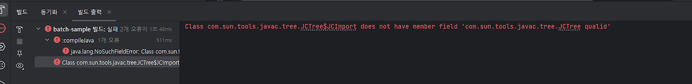
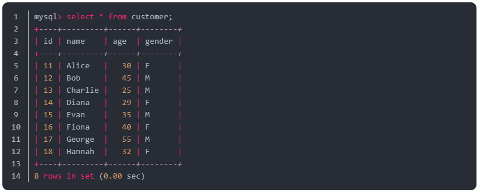

# 5주차 SPRING BATCH STUDY (written by @ksko1)

KIDO 님의 SpringBatch 연재 시리즈를 보면서 스터디하는 과정을 진행한다.

5주차 : https://devocean.sk.com/blog/techBoardDetail.do?ID=166867

## 정리

시작전 프로젝트 구조를 어떻게 만들어서 진행해야 할지 잘 모르겠어서,
메인테이너 기도님 github을 참고하여 실습해 나갈 수 있었음.

https://github.com/schooldevops/spring-batch-tutorials/tree/main

### JdbcPagingItemReader
JdbcPagingItemReader는 Spring Batch에서 제공하는 ItemReader 로, 데이터베이스에서 데이터를 페이징 처리하며 읽어오는 역할을 합니다. 대량의 데이터를 메모리에 한꺼번에 로드하는 것이 비효율적이거나 메모리 부족 문제가 발생할 수 있는 상황에서 유용하게 사용됩니다.

#### 특징
- **페이징(Paging)**: 데이터를 한꺼번에 로드하지 않고, 설정된 페이지 크기만큼 데이터를 나누어 읽습니다. 이를 통해 데이터베이스로부터 필요한 만큼의 데이터를 효율적으로 가져올 수 있습니다.
- **JDBC 기반**: JDBC를 사용하여 데이터베이스에 쿼리를 실행하고 데이터를 가져옵니다. 따라서, 데이터베이스에서 데이터를 읽어와야 하는 배치 작업에 적합합니다.
- **상태 저장**: JdbcPagingItemReader는 Spring Batch가 제공하는 리더로서, 배치 작업 중 재시작이 발생할 경우에도 이전에 읽은 데이터를 기억하고 다시 읽지 않도록 상태를 관리할 수 있습니다.

#### 주요 구성요소
- DataSource: 데이터베이스 연결정보 설정
- SqlQuery: 데이터를 읽을 SQL 쿼리를 설정
- RowMapper: 읽은 데이터를 도메인 객체로 변환 (SQL 쿼리 결과를 Item으로 변환)
- PageSize: 한 번에 읽어올 페이지 크기 설정


- QueryProvider: 페이징 SQL 쿼리 제공
- SortKeys: 페이징 시 정렬 기준
- FetchSize: JDBC 드라이버에서 한 번에 읽어올 데이터 수
- SaveState: 배치 중 상태 저장 여부


#### Customer 클래스 생성 (models 패키지)
JdbcPagingReaderJobConfig 생성 (쿼리 Provider 생성 --> JdbcPagingItemReader)<br>
(소스 보면서 해당 기능들 설명)

```java JdbcPagingReaderJobConfig.java
package com.ksko.spring_batch.batch_sample.jobs.jdbc;

import com.ksko.spring_batch.batch_sample.jobs.models.Customer;
import lombok.extern.slf4j.Slf4j;
import org.springframework.batch.core.Job;
import org.springframework.batch.core.Step;
import org.springframework.batch.core.job.builder.JobBuilder;
import org.springframework.batch.core.launch.support.RunIdIncrementer;
import org.springframework.batch.core.repository.JobRepository;
import org.springframework.batch.core.step.builder.StepBuilder;
import org.springframework.batch.item.database.JdbcPagingItemReader;
import org.springframework.batch.item.database.Order;
import org.springframework.batch.item.database.PagingQueryProvider;
import org.springframework.batch.item.database.builder.JdbcPagingItemReaderBuilder;
import org.springframework.batch.item.database.support.SqlPagingQueryProviderFactoryBean;
import org.springframework.batch.item.file.FlatFileItemWriter;
import org.springframework.batch.item.file.builder.FlatFileItemWriterBuilder;
import org.springframework.beans.factory.annotation.Autowired;
import org.springframework.context.annotation.Bean;
import org.springframework.context.annotation.Configuration;
import org.springframework.core.io.FileSystemResource;
import org.springframework.jdbc.core.BeanPropertyRowMapper;
import org.springframework.transaction.PlatformTransactionManager;

import javax.sql.DataSource;
import java.util.HashMap;
import java.util.Map;

@Slf4j
@Configuration
public class JdbcPagingReaderJobConfig {

    /**
     * CHUNK 크기를 지정한다.
     */
    public static final int CHUNK_SIZE = 2;
    public static final String ENCODING = "UTF-8";
    public static final String JDBC_PAGING_CHUNK_JOB = "JDBC_PAGING_CHUNK_JOB";

    @Autowired
    DataSource dataSource;

    @Bean
    public PagingQueryProvider queryProvider() throws Exception { // PagingQueryProvider : 데이터베이스에서 페이징 처리된 쿼리를 생성하는 역할
        //SqlPagingQueryProviderFactoryBean : 일반적인 팩토리 클래스로, 데이터베이스 타입에 따라 적절한 PagingQueryProvider 구현체를 생성해
        SqlPagingQueryProviderFactoryBean queryProvider = new SqlPagingQueryProviderFactoryBean();
        queryProvider.setDataSource(dataSource); //데이터 소스 설정
        queryProvider.setSelectClause("id, name, age, gender"); //select 할 컬럼명 지정
        queryProvider.setFromClause("from customer"); //테이블 조회
        queryProvider.setWhereClause("where age >= :age"); //조건절

        Map<String, Order> sortKeys = new HashMap<>(1);
        sortKeys.put("id", Order.DESCENDING);

        queryProvider.setSortKeys(sortKeys);

        return queryProvider.getObject();
    }

    @Bean
    public JdbcPagingItemReader<Customer> jdbcPagingItemReader() throws Exception {
        Map<String, Object> parameterValue = new HashMap<>(); //파라미터로 사용할 값을 저장할 맵 생성
        parameterValue.put("age", 20); //age 컬럼에 20 셋팅

        return new JdbcPagingItemReaderBuilder<Customer>()
                .name("jdbcPagingItemReader") //아이템리더 이름 설정
                .fetchSize(CHUNK_SIZE) //한번에 읽어올 데이터 사이즈 설정
                .dataSource(dataSource) // db와 연결 정보 셋팅
                .rowMapper(new BeanPropertyRowMapper<>(Customer.class)) //DB에서 읽어온 ResultSet을 Customer 객케로 변환할때 사용할 맵퍼 설정
                .queryProvider(queryProvider()) //db별 적합한 페이징 쿼리 생성
                .parameterValues(parameterValue) //쿼리에서 사용할 파라미터 전달 (조건 age=20 적용)
                .build();
    }


    @Bean
    public FlatFileItemWriter<Customer> customerFlatFileItemWriter() {
        return new FlatFileItemWriterBuilder<Customer>()
                .name("customerFlatFileItemWriter")
                .resource(new FileSystemResource("./output/customer_new_v1.csv"))
                .encoding(ENCODING)
                .delimited().delimiter("\t")
                .names("Name", "Age", "Gender")
                .build();
    }


    @Bean
    public Step customerJdbcPagingStep(JobRepository jobRepository, PlatformTransactionManager transactionManager) throws Exception {
        log.info("------------------ Init customerJdbcPagingStep -----------------");

        return new StepBuilder("customerJdbcPagingStep", jobRepository)
                .<Customer, Customer>chunk(CHUNK_SIZE, transactionManager)
                .reader(jdbcPagingItemReader())
                .writer(customerFlatFileItemWriter())
                .build();
    }

    @Bean
    public Job customerJdbcPagingJob(Step customerJdbcPagingStep, JobRepository jobRepository) {
        log.info("------------------ Init customerJdbcPagingJob -----------------");
        return new JobBuilder(JDBC_PAGING_CHUNK_JOB, jobRepository)
                .incrementer(new RunIdIncrementer())
                .start(customerJdbcPagingStep)
                .build();
    }


}
```

#### 결과 (ksko1 발표자 기준)


**❗TODO❗** <br>
단순 JDK 버전이 맞지 않아서 생기는 현상으로 생각했는데, 스터디 후 로컬 JDK 버전을 21로 바꾸고 실행해도, 동일한 에러가 났음. 상세 원인 파악 후 추후 결과 업데이트 예정

**❗다른분 성공결과❗**<br>
해당 로그와 함께 실행이 완료되며 output/customer_new_v1.csv 파일이 생성됩니다.
참고 : https://yeseul-dev.tistory.com/56 <br>


### JdbcBatchItemWriter
Spring Batch에서 제공하는 **JDBC 기반의 ItemWriter 구현체**로, 데이터를 일괄적으로 데이터베이스에 삽입하거나 업데이트하는 데 사용됩니다. 이 클래스는 ItemWriter 인터페이스를 구현하며, **대량의 데이터를 모아서 한 번에 처리**함으로써 데이터베이스 연산의 성능을 최적화합니다.

#### 주요 특징
- **JDBC 사용**: JDBC를 사용해 데이터베이스에 직접적으로 접근하여 데이터를 처리합니다.
- **일괄 처리 (Batch Processing)**: 한 번에 한 개의 레코드가 아닌, 일정량의 레코드를 모아 한 번에 삽입, 업데이트, 또는 삭제 작업을 수행하여 성능을 향상시킵니다.
- **SQL 쿼리 설정 가능**: 직접 SQL 쿼리를 정의할 수 있어, INSERT, UPDATE, DELETE 등의 다양한 작업을 지원합니다.
- **PreparedStatement**: PreparedStatement를 사용하여 데이터의 안전한 삽입을 도와주고, SQL 주입 공격을 방지할 수 있습니다.

#### JdbcBatchItemWriter 구성 요소
- **DataSource**: JDBC 연결을 위해 DataSource를 설정해야 합니다. 이 데이터 소스를 통해 데이터베이스와 연결.
- **SqlStatementCreator**: INSERT 쿼리를 생성하는 역할을 한다.
- **PreparedStatementSetter**: INSERT 쿼리의 파라미터 값을 설정하는 역할을 한다.
- **ItemSqlParameterSourceProvider**: Item 객체를 기반으로 PreparedStatementSetter에 전달할 파라미터 값을 생성하는 역할을 한다.


실습예제<br>
JdbcBatchItemJobConfig.java
```java
package com.ksko.spring_batch.batch_sample.jobs.flatfilereader;

import com.ksko.spring_batch.batch_sample.jobs.models.Customer;
import lombok.extern.slf4j.Slf4j;
import org.springframework.batch.core.Job;
import org.springframework.batch.core.Step;
import org.springframework.batch.core.job.builder.JobBuilder;
import org.springframework.batch.core.launch.support.RunIdIncrementer;
import org.springframework.batch.core.repository.JobRepository;
import org.springframework.batch.core.step.builder.StepBuilder;
import org.springframework.batch.item.database.JdbcBatchItemWriter;
import org.springframework.batch.item.database.builder.JdbcBatchItemWriterBuilder;
import org.springframework.batch.item.file.FlatFileItemReader;
import org.springframework.batch.item.file.builder.FlatFileItemReaderBuilder;
import org.springframework.beans.factory.annotation.Autowired;
import org.springframework.context.annotation.Bean;
import org.springframework.context.annotation.Configuration;
import org.springframework.core.io.ClassPathResource;
import org.springframework.transaction.PlatformTransactionManager;

import javax.sql.DataSource;

@Slf4j
@Configuration
public class JdbcBatchItemJobConfig {

    /**
     * CHUNK 크기를 지정한다.
     */
    public static final int CHUNK_SIZE = 100;
    public static final String ENCODING = "UTF-8";
    public static final String JDBC_BATCH_WRITER_CHUNK_JOB = "JDBC_BATCH_WRITER_CHUNK_JOB";

    @Autowired
    DataSource dataSource;

    @Bean
    public FlatFileItemReader<Customer> flatFileItemReader() {
        return new FlatFileItemReaderBuilder<Customer>()
                .name("FlatFileItemReader")
                .resource(new ClassPathResource("./customer.csv")) //github 통한 파일 다운로드
                .encoding(ENCODING)
                .delimited().delimiter(",")
                .names("name", "age", "gender")
                .targetType(Customer.class)
                .build();
    }

    @Bean
    public JdbcBatchItemWriter<Customer> flatFileItemWriter() {
        return new JdbcBatchItemWriterBuilder<Customer>()
                .dataSource(dataSource) // // 1. 사용할 데이터소스를 설정 (DB 연결 정보)
                .sql("INSERT INTO customer (name, age, gender) VALUES (:name, :age, :gender)") // 2. 실행할 SQL 쿼리를 설정 (Customer 객체의 필드를 삽입하는 INSERT 쿼리)
                .itemSqlParameterSourceProvider(new CustomerItemSqlParameterSourceProvider()) // 3. SQL 파라미터 소스를 제공하는 클래스를 설정 (Customer 객체의 속성을 SQL 파라미터로 변환)
                .build();
    }

    @Bean
    public Step flatFileStep(JobRepository jobRepository, PlatformTransactionManager transactionManager) {
        log.info("------------------ Init flatFileStep -----------------");

        return new StepBuilder("flatFileStep", jobRepository)
                .<Customer, Customer>chunk(CHUNK_SIZE, transactionManager)
                .reader(flatFileItemReader())
                .writer(flatFileItemWriter())
                .build();
    }

    @Bean
    public Job flatFileJob(Step flatFileStep, JobRepository jobRepository) {
        log.info("------------------ Init flatFileJob -----------------");
        return new JobBuilder(JDBC_BATCH_WRITER_CHUNK_JOB, jobRepository)
                .incrementer(new RunIdIncrementer())
                .start(flatFileStep)
                .build();
    }

}
```

CustomerItemSqlParameterSourceProvider.java
```java
package com.ksko.spring_batch.batch_sample.jobs.flatfilereader;

import com.ksko.spring_batch.batch_sample.jobs.models.Customer;
import org.springframework.batch.item.database.ItemSqlParameterSourceProvider;
import org.springframework.jdbc.core.namedparam.BeanPropertySqlParameterSource;
import org.springframework.jdbc.core.namedparam.SqlParameterSource;

// Customer 객체를 SQL 파라미터로 변환하는 ItemSqlParameterSourceProvider 구현 클래스
public class CustomerItemSqlParameterSourceProvider implements ItemSqlParameterSourceProvider<Customer> {
    // SQL 파라미터를 생성하는 메서드의 구현
    @Override
    public SqlParameterSource createSqlParameterSource(Customer item) {
        // 주어진 Customer 객체의 속성을 SQL 파라미터로 변환하기 위해 BeanPropertySqlParameterSource 사용
        return new BeanPropertySqlParameterSource(item);
    }
}
```

#### 결과 (ksko1 발표자 기준)


**❗다른분 성공결과❗**<br>
새로운 데이터가 생성된 것을 볼 수 있습니다.


--- 
#### 발표자 업로드 참고 소스
<https://github.com/ksko1>

#### 스터디원 정리 블로그
<https://yeseul-dev.tistory.com/56>

<https://j0free.tistory.com/11>

<https://github.com/mardi2020/Spring-batch-study/blob/main/docs/5%EC%A3%BC%EC%B0%A8.md>

<https://github.com/won-js/spring-batch-study/tree/main/docs/week5>

<https://velog.io/@hanni/Spring-Batch-5%ED%8E%B8-JdbcPagingItemReader-JdbcBatchItemWriter%EB%A1%9C-%ED%8C%8C%EC%9D%BC-%EC%9D%BD%EA%B3%A0-%EC%8D%A8%EB%B3%B4%EA%B8%B0>
  
<https://cafecortado.tistory.com/4>

<https://github.com/connieya/spring-batch-study/blob/main/docs/week5/JdbcPagingItem.md>

<https://github.com/chanwoo040531/batch-study/tree/master/assignment05>

<https://github.com/youngkim90/spring-batch-study/blob/main/study/5_week/5_week.study.md>

<https://more-n.tistory.com/56>

<https://github.com/sajacaros/spring-batch-tutorial/blob/main/docs/05_JdbcPaging.md>

<https://github.com/gunkim/hellospringbatch/tree/main/study/src/main/java/io/github/gunkim/study/jobs/task05https://github.com/gunkim/hellospringbatch/tree/main/study/src/main/java/io/github/gunkim/study/jobs/task05>

<https://1nmybrain.tistory.com/64>

<https://ksko1.tistory.com/73>
