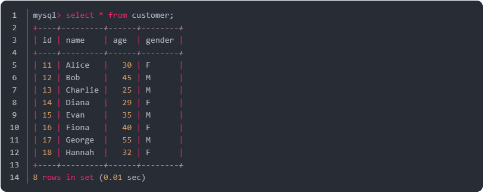
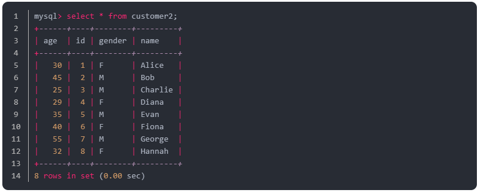
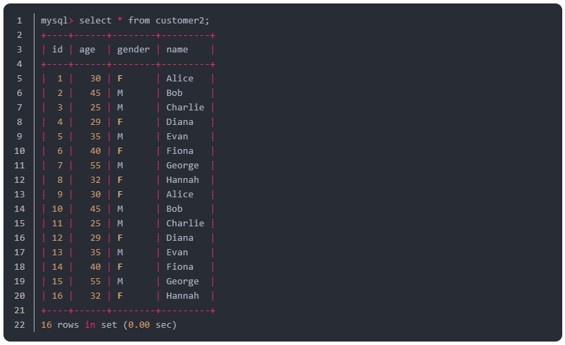

# 6주차 SPRING BATCH STUDY (written by @chanwoo040531, @HongYeseul)

KIDO 님의 SpringBatch 연재 시리즈를 보면서 스터디하는 과정을 진행한다.

6주차 : https://devocean.sk.com/blog/techBoardDetail.do?ID=166867

## 정리

### JpaPagingItemReader
JPA를 사용하여 DB에서 Page 단위로 데이터를 읽어오는 Reader

#### 주요 구성요소
- **pageSize**: 페이지 크기
- **SkippableItemReader**: 오류 발생 시 해당 Item을 건너뛸 수 있도록 함
- **ReadListener**: 읽기 시작, 종료, 오류 발생 등의 이벤트 처리

### JpaPagingItemReader

#### 장점
- JPA를 사용하여 DB에 데이터를 저장할 수 있음
- 객체 매핑 가능
- 높은 유연성
#### 단점
- 설정 복잡성
- 오류 가능성

소스 중심의 설명 방식으로 발표 진행

---
## 정리 2

> 아래 글은 한국 스프링 사용자 모임(KSUG)에서 진행된 스프링 배치 스터디 내용을 정리한 게시글입니다. DEVOCEAN에 연재 중인 KIDO님의 글을 참고하여 실습한 내용을 기록했습니다.


원본: [[SpringBatch 연재 06] JpaPagingItemReader로 DB내용을 읽고, JpaItemWriter로 DB에 쓰기](https://devocean.sk.com/blog/techBoardDetail.do?ID=166902)

지난 시간에는 JdbcPagingItemReader/Writer에 대해 배웠습니다.

본격적으로 공부하기 전, 두 클래스가 조금 헷갈려서 정리를 먼저 하고 진행하였습니다.

--- 

JdbcPagingItemReader<T>와 JpaPagingItemReader<T>는 둘 다 AbstractPagingItemReader<T>를 상속받고, InitializingBean 인터페이스를 구현하고 있습니다.

 

JdbcPagingItemReader와 JpaPagingItemReader는 모두 페이징 방식으로 대량의 데이터를 읽기 위한 기능을 제공하지만, JdbcPagingItemReader가 좀 더 로우 레벨에 가까운 방식으로 동작합니다.

 

둘의 차이는 Jdbc와 Jpa를 사용한다는 메서드 명에서부터 알 수 있습니다.

#### JdbcPagingItemReader와 JpaPagingItemReader의 주요 차이점
1. 데이터 접근 방식
   - **JdbcPagingItemReader**: JDBC(Java Database Connectivity)를 사용하여 SQL 쿼리를 직접 실행하므로, SQL을 직접 작성하고 실행해야 합니다.
   - **JpaPagingItemReader**: JPA(Java Persistence API)를 통해 데이터베이스에 접근하며, 엔터티 매핑을 활용하여 객체와 테이블 간의 관계를 자동으로 관리합니다.
2. 사용 목적
   - JdbcPagingItemReader는 SQL 쿼리 최적화가 필요하거나, JPA로 처리하기 어려운 복잡한 쿼리를 실행할 때 적합합니다. 데이터베이스의 특성을 최대한 활용해 성능을 세밀하게 조정하고자 할 때 유리합니다.
   - JpaPagingItemReader는 객체 지향적인 데이터 접근 방식이 필요한 경우에 적합하며, 엔터티 매핑과 관계 관리를 통해 개발자가 직접 SQL을 작성하지 않아도 되는 편리함을 제공합니다.
 

**JpaItemReader/Writer**는 다음과 같은 장단점을 가지고 있습니다.

#### 장점
1. **ORM 연동**: JPA를 사용하여 다양한 데이터베이스에 데이터를 저장할 수 있습니다.
2. **객체 매핑**: 엔터티 객체를 직접 저장함으로써 코드가 간결해집니다.
3. **유연성**: 다양한 설정을 통해 원하는 방식으로 데이터를 저장할 수 있습니다. 또한 데이터베이스 종류 선택에 자유롭습니다.

#### 단점
1. **설정 복잡성**: JPA 설정 및 쿼리 작성이 복잡할 수 있습니다.
2. **오류 가능성**: 설정 오류가 발생할 경우 데이터 손상의 위험이 있습니다.

#### JpaPagingItemReader 개요
- JPA를 사용하여 데이터베이스로부터 데이터를 Page 단위로 읽습니다.
- **JPA 기능 활용**: JPA 엔티티와 자동 객체 매핑을 통해 효율적으로 데이터를 처리할 수 있습니다.
- **쿼리 최적화**: JPA 쿼리 기능을 사용해 성능을 최적화하여 데이터를 읽어올 수 있습니다.
- **커서 제어**: JPA Criteria API로 데이터 순회 방식을 제어할 수 있습니다.

#### JpaPagingItemReader 주요 구성 요소
- **EntityManagerFactory**: JPA 엔티티 매니저 팩토리를 설정합니다.
- **JpaQueryProvider**: 데이터를 읽기 위한 JPA 쿼리를 제공합니다.
- **PageSize**: 페이지 크기를 설정합니다.
- **SkippableItemReader**: 오류 발생 시 해당 아이템을 건너뛸 수 있도록 합니다.
- **ReadListener**: 읽기 시작, 종료, 오류 발생 시 이벤트를 처리할 수 있도록 합니다.
- **SaveStateCallback**: 잡 중단 시 현재 상태를 저장하여 재시작 시 이어서 처리할 수 있도록 합니다.

> 실습 하기<br>
DB에 저장 되어있는 customer 중 20살 이상인 사람들을 추출 하는 예제를 실습해보겠습니다.
사용한 테이블 내용은 다음을 참고해주세요.



Cusomer 엔티티 클래스를 생성합니다.

Customer.java
```java
@Entity
@Table(name = "customer")
@NoArgsConstructor
@AllArgsConstructor
@Data
public class Customer {
 
    @Id
    @GeneratedValue(strategy = GenerationType.IDENTITY) // MySQL 실습 환경에서 진행하고 있습니다.
    private int id;
 
    private String name;
    private Integer age;
    private String gender;
}
```

작동 순서를 보기 위해 로그만 출력하는 프로세서를 만들었습니다.

CustomerItemProcessor.java
```java
/**
 * 작동 순서를 보기 위해 전달 받은 Customer 객체에 대한 로그만 출력한다.
 */
@Slf4j
public class CustomerItemProcessor implements ItemProcessor<Customer, Customer> {
    @Override
    public Customer process(Customer item) throws Exception {
        log.info("Item Processor ------------------- {}", item);
        return item;
    }
}
```

전체 코드

JpaPagingItemConfig.java
```java
@Slf4j
@Configuration
public class JpaPagingItemConfig {
 
    public static final int CHUNK_SIZE = 2;
    public static final String ENCODING = "UTF-8";
    public static final String JPA_PAGING_CHUNK_JOB = "JPA_PAGING_CHUNK_JOB";
 
    @Autowired
    DataSource dataSource;
 
    @Autowired
    EntityManagerFactory entityManagerFactory;
 
    @Bean
    public JpaPagingItemReader<Customer> task06CustomerJpaPagingItemReader() throws Exception {
        JpaPagingItemReader<Customer> jpaPagingItemReader = new JpaPagingItemReader<>();
 
        // JPQL 쿼리를 이용하여 20살 이상을 가져오도록 한다.
        jpaPagingItemReader.setQueryString(
                "SELECT c FROM Customer c WHERE c.age > :age order by id desc"
        );
 
        // 엔티티 매니저 지정
        jpaPagingItemReader.setEntityManagerFactory(entityManagerFactory);
 
        // 한 번에 읽어올 Page 크기 지정. 보통 청크 크기와 맞춰준다.
        jpaPagingItemReader.setPageSize(CHUNK_SIZE);
 
        // JPQL 쿼리에 전달할 파라미터 지정
        jpaPagingItemReader.setParameterValues(Collections.singletonMap("age", 20));
 
        return jpaPagingItemReader;
    }
 
    /**
     * Builder를 이용하는 방법
     * 일반 방식과 동일하다.
     */
    @Bean
    public JpaPagingItemReader<Customer> task06CustomerJpaPagingItemReaderBuilder() throws Exception {
 
        return new JpaPagingItemReaderBuilder<Customer>()
                .name("customerJpaPagingItemReader")
                .queryString("SELECT c FROM Customer c WHERE c.age > :age order by id desc")
                .pageSize(CHUNK_SIZE)
                .entityManagerFactory(entityManagerFactory)
                .parameterValues(Collections.singletonMap("age", 20))
                .build();
    }
 
    @Bean
    public FlatFileItemWriter<Customer> task06CustomerJpaFlatFileItemWriter() {
    	log.info("------------------ task06CustomerJpaFlatFileItemWriter -----------------");
    
        return new FlatFileItemWriterBuilder<Customer>()
                .name("task06CustomerJpaFlatFileItemWriter")
                .resource(new FileSystemResource("./output/task_06_customer_with_jpa.csv"))
                .encoding(ENCODING)
                .delimited().delimiter("\\t")
                .names("Name", "Age", "Gender")
                .build();
    }
 
    @Bean
    public Step customerJpaPagingStep(JobRepository jobRepository, PlatformTransactionManager transactionManager) throws Exception {
        log.info("------------------ Init customerJpaPagingStep -----------------");
 
        return new StepBuilder("customerJpaPagingStep", jobRepository)
                .<Customer, Customer>chunk(CHUNK_SIZE, transactionManager)
                .reader(task06CustomerJpaPagingItemReaderBuilder())
                .processor(new CustomerItemProcessor())
                .writer(task06CustomerJpaFlatFileItemWriter())
                .build();
    }
 
    @Bean
    public Job customerJpaPagingJob(Step customerJpaPagingStep, JobRepository jobRepository) {
        log.info("------------------ Init customerJpaPagingJob -----------------");
        return new JobBuilder(JPA_PAGING_CHUNK_JOB, jobRepository)
                .incrementer(new RunIdIncrementer())
                .start(customerJpaPagingStep)
                .build();
    }
}
```

실행결과
```text
2024-11-08T16:38:59.942+09:00  INFO 78872 --- [           main] w.s.c.ServletWebServerApplicationContext : Root WebApplicationContext: initialization completed in 1371 ms
2024-11-08T16:38:59.966+09:00  INFO 78872 --- [           main] c.e.b.jobs.task01.GreetingTasklet        : ----------------- After Properites Sets() --------------
2024-11-08T16:38:59.977+09:00  INFO 78872 --- [           main] c.e.b.j.t.BasicTaskJobConfiguration      : ------------------ Init myStep -----------------
2024-11-08T16:38:59.987+09:00  INFO 78872 --- [           main] c.e.b.j.t.BasicTaskJobConfiguration      : ------------------ Init myJob -----------------
2024-11-08T16:39:00.002+09:00  INFO 78872 --- [           main] c.e.b.j.task06.JpaPagingReaderJobConfig  : ------------------ task06CustomerJpaFlatFileItemWriter -----------------
2024-11-08T16:39:00.002+09:00  INFO 78872 --- [           main] c.e.b.j.task06.JpaPagingReaderJobConfig  : ------------------ Init customerJpaPagingStep -----------------
2024-11-08T16:39:00.009+09:00  INFO 78872 --- [           main] c.e.b.j.task06.JpaPagingReaderJobConfig  : ------------------ Init customerJpaPagingJob -----------------
2024-11-08T16:39:00.023+09:00  WARN 78872 --- [           main] JpaBaseConfiguration$JpaWebConfiguration : spring.jpa.open-in-view is enabled by default. Therefore, database queries may be performed during view rendering. Explicitly configure spring.jpa.open-in-view to disable this warning
2024-11-08T16:39:00.207+09:00  INFO 78872 --- [           main] o.s.b.w.embedded.tomcat.TomcatWebServer  : Tomcat started on port 8080 (http) with context path '/'
2024-11-08T16:39:00.212+09:00  INFO 78872 --- [           main] c.e.batch_sample.BatchSampleApplication  : Started BatchSampleApplication in 1.817 seconds (process running for 2.041)
2024-11-08T16:39:00.213+09:00  INFO 78872 --- [           main] o.s.b.a.b.JobLauncherApplicationRunner   : Running default command line with: []
2024-11-08T16:39:00.293+09:00  INFO 78872 --- [           main] o.s.b.c.l.support.SimpleJobLauncher      : Job: [SimpleJob: [name=JPA_PAGING_CHUNK_JOB]] launched with the following parameters: [{'run.id':'{value=8, type=class java.lang.Long, identifying=true}'}]
2024-11-08T16:39:00.317+09:00  INFO 78872 --- [           main] o.s.batch.core.job.SimpleStepHandler     : Executing step: [customerJpaPagingStep]
2024-11-08T16:39:00.468+09:00  INFO 78872 --- [           main] c.e.b.jobs.task06.CustomerItemProcessor  : Item Processor ------------------- Customer(id=18, name=Hannah, age=32, gender=F)
2024-11-08T16:39:00.469+09:00  INFO 78872 --- [           main] c.e.b.jobs.task06.CustomerItemProcessor  : Item Processor ------------------- Customer(id=17, name=George, age=55, gender=M)
2024-11-08T16:39:00.481+09:00  INFO 78872 --- [           main] c.e.b.jobs.task06.CustomerItemProcessor  : Item Processor ------------------- Customer(id=16, name=Fiona, age=40, gender=F)
2024-11-08T16:39:00.482+09:00  INFO 78872 --- [           main] c.e.b.jobs.task06.CustomerItemProcessor  : Item Processor ------------------- Customer(id=15, name=Evan, age=35, gender=M)
2024-11-08T16:39:00.492+09:00  INFO 78872 --- [           main] c.e.b.jobs.task06.CustomerItemProcessor  : Item Processor ------------------- Customer(id=14, name=Diana, age=29, gender=F)
2024-11-08T16:39:00.492+09:00  INFO 78872 --- [           main] c.e.b.jobs.task06.CustomerItemProcessor  : Item Processor ------------------- Customer(id=13, name=Charlie, age=25, gender=M)
2024-11-08T16:39:00.502+09:00  INFO 78872 --- [           main] c.e.b.jobs.task06.CustomerItemProcessor  : Item Processor ------------------- Customer(id=12, name=Bob, age=45, gender=M)
2024-11-08T16:39:00.502+09:00  INFO 78872 --- [           main] c.e.b.jobs.task06.CustomerItemProcessor  : Item Processor ------------------- Customer(id=11, name=Alice, age=30, gender=F)
2024-11-08T16:39:00.518+09:00  INFO 78872 --- [           main] o.s.batch.core.step.AbstractStep         : Step: [customerJpaPagingStep] executed in 200ms
2024-11-08T16:39:00.530+09:00  INFO 78872 --- [           main] o.s.b.c.l.support.SimpleJobLauncher      : Job: [SimpleJob: [name=JPA_PAGING_CHUNK_JOB]] completed with the following parameters: [{'run.id':'{value=8, type=class java.lang.Long, identifying=true}'}] and the following status: [COMPLETED] in 226ms
```

생성된 파일(task_06_customer_with_jpa.csv)


> JpaItemItemReader WrapUp
> - 페이징 처리 시, 보통 페이지 번호(오프셋)를 증가시키며 데이터를 순차적으로 불러옵니다.<br>
> - 페이징 방식은 단순하고 대용량 데이터를 청크 단위로 처리하는 데 유용하지만, 페이지 오프셋이 증가할 때 데이터가 변경되면 누락이 발생할 수 있는 문제가 있습니다.


### JpaItemWriter
#### JpaItemWriter 구성 요소
- **EntityManagerFactory**: JPA EntityManager 생성을 위한 팩토리 객체
- **JpaQueryProvider**: 저장할 엔터티에 대한 JPA 쿼리를 생성하는 역할

> 실습 하기 <br>
이번에는 csv 파일(FlatFile)로 저장되어있는 파일을 가져와 배치 작업을 한 뒤, JPA를 이용해 DB 테이블에 저장 해보겠습니다.

전체코드<br>
JpaItemWriterJobConfig.java
```java
@Slf4j
@Configuration
public class JpaItemWriterJobConfig {
 
    public static final int CHUNK_SIZE = 100;
    public static final String ENCODING = "UTF-8";
    public static final String JPA_ITEM_WRITER_JOB = "JPA_ITEM_WRITER_JOB";
 
    @Autowired
    EntityManagerFactory entityManagerFactory;
 
    @Bean
    public FlatFileItemReader<Customer> task06FlatFileItemReader() {
 
        return new FlatFileItemReaderBuilder<Customer>()
                .name("task06FlatFileItemReader")
                .resource(new ClassPathResource("./customer.csv"))
                .encoding(ENCODING)
                .delimited().delimiter(",")
                .names("name", "age", "gender")
                .targetType(Customer.class)
                .build();
    }
 
    /**
     * Customer 엔티티를 데이터베이스에 저장하기 위한 JpaItemWriter
     * @return Customer 엔티티의 영속화를 위한 JpaItemWriter 인스턴스를 반환
     * JpaItemWriter<Customer> 인스턴스를 반환하면 배치 프로세스가 flush를 통해 Customer 데이터를 데이터베이스에 저장하게 되는 것
     */
    @Bean
    public JpaItemWriter<Customer> jpaItemWriter() {
        return new JpaItemWriterBuilder<Customer>()
                .entityManagerFactory(entityManagerFactory)
                .usePersist(true) // 데이터베이스에 엔티티가 이미 존재하지 않는다고 가정하고 항상 새로운 데이터를 추가하는 방식
                .build();
    }
 
    @Bean
    public Step task06FlatFileStep(JobRepository jobRepository, PlatformTransactionManager transactionManager) {
        log.info("------------------ Init flatFileStep -----------------");
 
        return new StepBuilder("task06FlatFileStep", jobRepository)
                .<Customer, Customer>chunk(CHUNK_SIZE, transactionManager)
                .reader(task06FlatFileItemReader())
                .writer(jpaItemWriter())
                .build();
    }
 
    @Bean
    public Job task06FlatFileJob(Step task06FlatFileStep, JobRepository jobRepository) {
        log.info("------------------ Init flatFileJob -----------------");
        return new JobBuilder(JPA_ITEM_WRITER_JOB, jobRepository)
                .incrementer(new RunIdIncrementer())
                .start(task06FlatFileStep)
                .build();
    }
}
```

실행 전, 데이터베이스에 테이블을 자동 생성하고 삭제할 수 있도록 application.yaml 파일에 해당 설정을 해주었습니다.

application.yaml
```yaml
jpa:
  hibernate:
    ddl-auto: update // 자유롭게 설정
```

#### 실행 결과



#### usePersist(boolean) 설정
usePersist(true)가 없을 경우, 즉 **기본 설정인 usePersist(false)** 상태에서는 **엔티티가 단순히 무시되지 않고 merge가 사용됩니다.**

1. **엔티티가 이미 존재하면**: merge는 동일한 ID(@Id 애너테이션이 붙은 필드 기준)를 가진 엔티티가 영속성 컨텍스트나 데이터베이스에 존재하는 경우, 기존 데이터를 업데이트합니다. 따라서, 내용이 같다면 아무 변화가 없지만, **차이가 있을 경우 기존 데이터를 수정**합니다.
2. **엔티티가 존재하지 않으면**: merge는 새 엔티티를 데이터베이스에 저장하는 대신, **객체를 복제하여 새로운 엔티티로 저장**합니다.

현재는 ID 생성 방법을 IDENTITY 로 사용하고 있어서 해당 설정과 무관하게 새로운 엔티티로 저장됩니다.




#### 그 외 참고
- https://docs.spring.io/spring-batch/docs/current/api/org/springframework/batch/item/database/JdbcPagingItemReader.html
- https://docs.spring.io/spring-batch/docs/current/api/org/springframework/batch/item/database/JpaPagingItemReader.html
- https://docs.spring.io/spring-batch/reference/readers-and-writers/database.html#JpaPagingItemReader

--- 
#### 발표자 업로드 참고 소스
<https://github.com/chanwoo040531/batch-study>

#### 스터디원 정리 블로그
<https://yeseul-dev.tistory.com/68>

<https://github.com/mardi2020/Spring-batch-study/blob/main/docs/6%EC%A3%BC%EC%B0%A8.md>

<https://github.com/won-js/spring-batch-study/tree/main/docs/week6>

<https://velog.io/@hanni/Spring-Batch-6%ED%8E%B8-JpaPagingItemReader-JpaItemWriter%EB%A1%9C-DB-%EC%9D%BD%EA%B3%A0-%EC%93%B0%EA%B8%B0>
  
<https://cafecortado.tistory.com/5>

<https://github.com/connieya/spring-batch-study/blob/main/docs/week6/JpaPagingItem.md>

<https://github.com/chanwoo040531/batch-study/tree/master/assignment06>

<https://github.com/youngkim90/spring-batch-study/blob/main/study/6_week/6_week.study.md>

<https://more-n.tistory.com/57>

<https://github.com/sajacaros/spring-batch-tutorial/blob/main/docs/06_JPA.md>

<https://github.com/gunkim/hellospringbatch/tree/main/study/src/main/java/io/github/gunkim/study/jobs/task05https://github.com/gunkim/hellospringbatch/tree/main/study/src/main/java/io/github/gunkim/study/jobs/task05>

<https://1nmybrain.tistory.com/67>