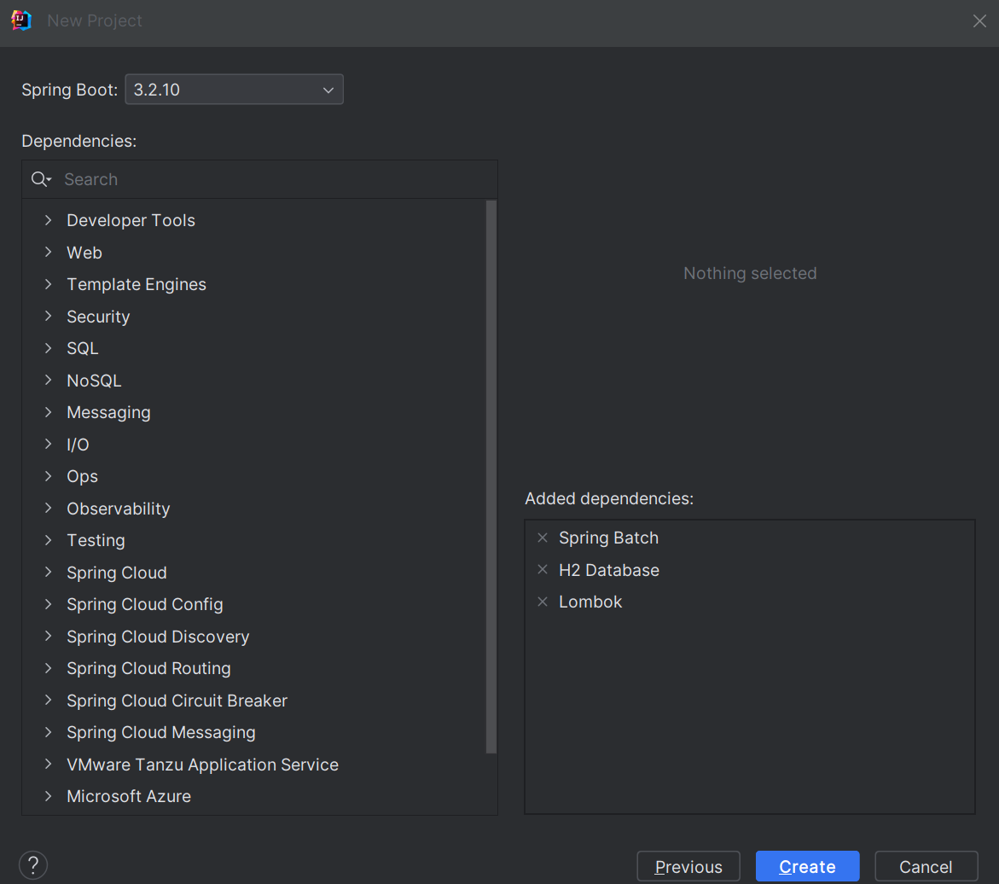
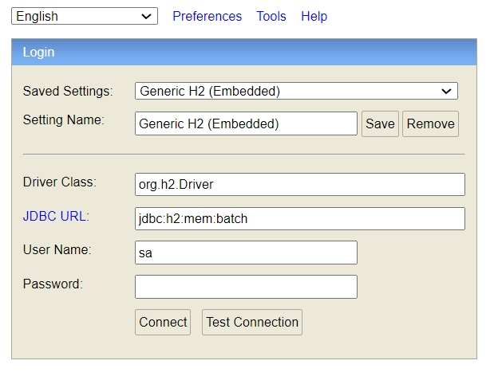
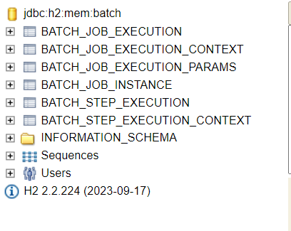
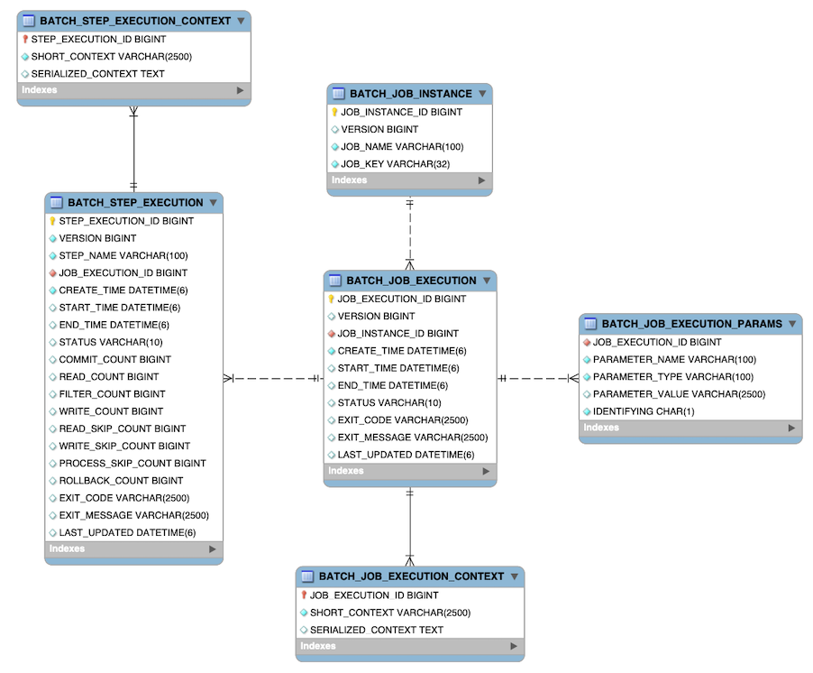

# Spring Batch
- 설치
  - 
- application.yml 설정
``` 
# H2 DataBase용
spring:
  application:
    name: spring-batch
  datasource:
    hikari:
      maximum-pool-size: 10
    url: jdbc:h2:mem:batch # db 접근 url
    driver-class-name: org.h2.Driver
    username: sa
    password:   # 테스트 DB이므로 password는 생략
  h2:
    console:
      enabled: true  # H2 Console을 사용 설정
      path: /h2-console  # H2 Console의 Path
  batch: 
    jdbc:
      initialize-schema: always # batch table 초기화
```
- `@EnableBatchProcessing` 설정
  - spring boot 3.0 이전 버전에서는 auto configuration을 enable을 하는데 사용됨
  - spring boot 3.0 이상 버전에서 auto configuration을 사용하기 위해서는 제거해야함
  - 해당 어노테이션을 제거하고 yaml파일의 `spring.batch.jdbc.initialize-schema: always` 설정
  - 관련 링크 : https://github.com/spring-projects/spring-boot/wiki/Spring-Boot-3.0-Migration-Guide#spring-batch-changes
- 테이블 자동 생성 결과
  - h2console이용하여 테이블 접근
    - http://localhost:8080/h2-console 접근
    - 
  - 생성된 테이블 확인
    - 
- 스키마 정보
  - 
  - BATCH_JOB_INSTANCE Table
    - 스키마 중 가장 기본이 되는 배치 Job 인스턴스 테이블
    - 배치가 수행되면 Job 생성
    - 해당 Job 인스턴스에 대한 최상위 테이블
```
CREATE TABLE BATCH_JOB_INSTANCE  (
  JOB_INSTANCE_ID BIGINT PRIMARY KEY,
  VERSION BIGINT,
  JOB_NAME VARCHAR(100) NOT NULL,
  JOB_KEY VARCHAR(32) NOT NULL
);
```
  - BATCH_JOB_EXECUTION Table
    - JobExecution과 관련된 모든 정보를 저장
    - Job이 매번 실행될 때, JobExecution 객체 생성
``` 
CREATE TABLE BATCH_JOB_EXECUTION  (
  JOB_EXECUTION_ID BIGINT PRIMARY KEY,
  VERSION BIGINT,
  JOB_INSTANCE_ID BIGINT NOT NULL,
  CREATE_TIME TIMESTAMP NOT NULL,
  START_TIME TIMESTAMP DEFAULT NULL,
  END_TIME TIMESTAMP DEFAULT NULL,
  STATUS VARCHAR(10),
  EXIT_CODE VARCHAR(20),
  EXIT_MESSAGE VARCHAR(2500),
  LAST_UPDATED TIMESTAMP,
  constraint JOB_INSTANCE_EXECUTION_FK foreign key (JOB_INSTANCE_ID)
  references BATCH_JOB_INSTANCE(JOB_INSTANCE_ID)
);
```
  - BATCH_JOB_EXECUTION_PARAMS Table
    - JobParameter에 대한 정보를 저장
    - 하나 이상의 key/value 쌍으로 Job에 전달되며, Job이 실행될 때 전달된 파라미터 정보를 저장
``` 
CREATE TABLE BATCH_JOB_EXECUTION_PARAMS  (
	JOB_EXECUTION_ID BIGINT NOT NULL ,
	PARAMETER_NAME VARCHAR(100) NOT NULL ,
	PARAMETER_TYPE VARCHAR(100) NOT NULL ,
	PARAMETER_VALUE VARCHAR(2500) ,
	IDENTIFYING CHAR(1) NOT NULL ,
	constraint JOB_EXEC_PARAMS_FK foreign key (JOB_EXECUTION_ID)
	references BATCH_JOB_EXECUTION(JOB_EXECUTION_ID)
);
```
  - BATCH_JOB_EXECUTION_CONTEXT Table
    - Job의 ExecutionContext에 대한 정보 저장
    - JobExecution마다 정확히 하나의 JobExecutionContext를 가짐
    - 특정 작업 실행에 필요한 모든 작업 수준 데이터 포함
    - 실행 실패 후 중단된 부분부터 시작될 수 있도록 실패 후 검색해야 하는 상태를 나타냄
  - BATCH_STEP_EXECUTION Table
    - StepExecution과 관련한 정보
    - JobExecution에 대한 단계당 하나 이상 존재함
```
CREATE TABLE BATCH_STEP_EXECUTION  (
  STEP_EXECUTION_ID BIGINT NOT NULL PRIMARY KEY ,
  VERSION BIGINT NOT NULL,
  STEP_NAME VARCHAR(100) NOT NULL,
  JOB_EXECUTION_ID BIGINT NOT NULL,
  CREATE_TIME TIMESTAMP NOT NULL,
  START_TIME TIMESTAMP DEFAULT NULL ,
  END_TIME TIMESTAMP DEFAULT NULL,
  STATUS VARCHAR(10),
  COMMIT_COUNT BIGINT ,
  READ_COUNT BIGINT ,
  FILTER_COUNT BIGINT ,
  WRITE_COUNT BIGINT ,
  READ_SKIP_COUNT BIGINT ,
  WRITE_SKIP_COUNT BIGINT ,
  PROCESS_SKIP_COUNT BIGINT ,
  ROLLBACK_COUNT BIGINT ,
  EXIT_CODE VARCHAR(20) ,
  EXIT_MESSAGE VARCHAR(2500) ,
  LAST_UPDATED TIMESTAMP,
  constraint JOB_EXECUTION_STEP_FK foreign key (JOB_EXECUTION_ID)
  references BATCH_JOB_EXECUTION(JOB_EXECUTION_ID)
);
```
  - BATCH_STEP_EXECUTION_CONTEXT Table
    - Step의 ExecutionContext와 관련된 정보를 나타냄
    - StepExecution 마다 하나의 ExecutionContext가 있음
    - JobInstance가 중단된 위치에서 시작할 수 있도록 실패후 검색해야 하는 상태를 나타냄
``` 
CREATE TABLE BATCH_STEP_EXECUTION_CONTEXT (
  STEP_EXECUTION_ID BIGINT PRIMARY KEY,
  SHORT_CONTEXT VARCHAR(2500) NOT NULL,
  SERIALIZED_CONTEXT CLOB,
  constraint STEP_EXEC_CTX_FK foreign key (STEP_EXECUTION_ID)
  references BATCH_STEP_EXECUTION(STEP_EXECUTION_ID)
);
```