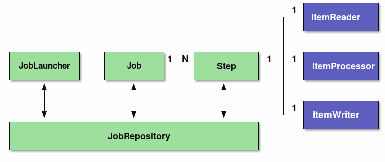
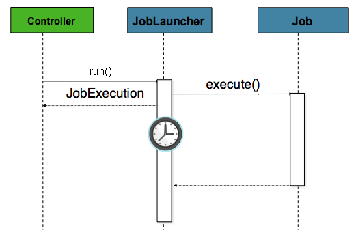

# Tasklet
## 전체 과정 요약
- Tasklet 구현체 생성
- 생성할 빈(Tasklet)을 스프링에 등록
- Job 생성하고 빈에 등록
- Step 생성하고 빈에 등록
## 과정 상세
### Tasklet 구현체 생성
```
public class GreetingTask implements Tasklet {
    @Override
    public RepeatStatus execute(
            StepContribution contribution,
            ChunkContext chunkContext
    ) throws Exception {
        log.info("------------------ Task Execute -----------------");
        log.info("GreetingTask: {}, {}", contribution, chunkContext);

        return RepeatStatus.FINISHED;
    }
}
```
- parameter : StepContribution, ChunkContext
```
GreetingTask: [
  StepContribution: read=0, written=0, filtered=0, readSkips=0, writeSkips=0, processSkips=0, exitStatus=EXECUTING
], 
ChunkContext: 
  attributes=[], 
  complete=false, 
  stepContext=SynchronizedAttributeAccessor: [], 
  stepExecutionContext={
    batch.version=5.1.2, 
    batch.taskletType=com.study.springbatch.jobs.GreetingTask, 
    batch.stepType=org.springframework.batch.core.step.tasklet.TaskletStep
  }, 
  jobExecutionContext={batch.version=5.1.2}, 
  jobParameters={run.id=1}
```
- return : RepeatStatus
  - FINISHED: Tasklet이 종료되었음을 나타냄
  - CONTINUABLE: 계속해서 Tasklet 수행
### 생성할 빈(Tasklet)을 스프링에 등록
``` 
@Configuration
public class BasicTaskJobConfiguration {
    @Bean
    public Tasklet greetingTasklet() {
        return new GreetingTask();
    }
}
```
### Job 생성하고 빈에 등록
``` 
@Configuration
public class BasicTaskJobConfiguration {
    @Autowired
    PlatformTransactionManager transactionManager;
 
    @Bean
    public Step myStep(JobRepository jobRepository, PlatformTransactionManager transactionManager) {
         log.info("------------------ Init myStep -----------------");
    
         return new StepBuilder("myStep", jobRepository)
                 .tasklet(greetingTasklet(), transactionManager)
                 .build();
    }
} 
```
- myStep() parameter : JobRepository, PlatformTransactionManager
- JobRepository
  - [api](https://docs.spring.io/spring-batch/docs/current/api/org/springframework/batch/core/repository/JobRepository.html) 
  - `Repository responsible for persistence of batch meta-data entities.` 
  - 별다른 설정이 없다면 application.yml에 설정된대로 생성되는것 같음
  - [문서](https://docs.spring.io/spring-batch/reference/job/configuring-repository.html) 를 참고하면 @configuration 안에서 정의도 가능함
- PlatformTransactionManager
  - Spring의 transaction manager
- Step 생성은 StepBuilder를 이용
  - Step 명과 jobRepository로 builder 객체 생성
  - tasklet에 구현한 tasklet과 transactionManager 등록
### Step 생성하고 빈에 등록
``` 
@Configuration
public class BasicTaskJobConfiguration {
    @Bean
    public Job myJob(Step step, JobRepository jobRepository) {
        log.info("------------------ Init myJob -----------------");
        return new JobBuilder("myJob", jobRepository)
                .incrementer(new RunIdIncrementer())
                .start(step)
                .build();
    }
} 
```
- myJob() parameter : Step, JobRepository
- Job 생성은 JobBuilder를 이용
  - Job 명과 jobRepository로 builder 객체 생성
  - incrementer에 RunIdIncrementer 객체 생성
  - start에 주입 받은(앞서 생성한) step 등록

# Spring Batch Architecture
## 스프링 배치 모델
- Tasklet model
  - 데이터 소스나 파일을 한번에 처리해야 하는 경우 사용
- Chunk model
  - 데이터량이 매우 큰 경우 사용
  - Reader/Processor/Writer 플로우 방식으로 처리
## 스프링 배치의 기본 아키텍처
- 
- Job
  - 단일 실행 단위
- Step
  - Job을 구성하는 처리 단위
  - 하나의 Job에 여러 Step 할당 가능
  - 하나의 Job에 여러 Step을 재사용, 병렬화, 조건분기 등을 수행할 수 있음
  - tasklet/chunk 모델의 구현체가 탑재되어 실행
- JobLauncher
  - Job을 수행하기 위한 인터페이스
  - 사용자에 의해서 직접 수행
- ItemReader
  - 청크 단위 모델에서 사용
  - 소스 데이터를 읽어 들이는 역할
- ItemProcessor
  - 읽어들인 청크 데이터를 처리
  - 데이터 변환/정제 수행
- ItermWriter
  - 실제 쓰기작업 담당
## 스프링 배치 흐름
### 흐름 도식
- 
### 처리흐름 관점
- JobScheduler 가 배치를 트리거링 하면 JobLauncher 를 실행
- JobLauncher 는 Job을 실행
  - JobExecution을 수행
  - Execution Context 정보 이용
- Job은 자신에게 정으된 Step을 실행
  - StepExecution 수행, 
  - Execution Context 정보가 전달되어 수행
- Step은 Tasklet과 Chunk모델로 구성
  - ItemReader를 통해서 소스 데이터를 읽어 들임
  - ItemProcessor를 통해서 읽어들인 청크단위 데이터를 처리, 처리는 데이터를 변환하거나 가공하는 역할
  - ItemWriter는 처리된 청크 데이터를 쓰기 작업 수행, 다양한 Writer를 통해 데이터베이스에 저장하거나, 파일로 쓰는 역할을 하게 됨
### Job 정보의 흐름 관점
- JobLauncher는 JobRepository를 통해서 JobInstance정보를 데이터베이스에 등록
- JobLauncher는 JobRepository를 통해서 JobExecution 을 통해 Job 수행하고 실행 정보를 데이터베이스에 저장
- JobStep은 JobRepository를 통해서 I/O 레코드와 상태정보를 저장
- Job이 완료되면 JobRepository를 통해서 데이터베이스에 완료 정보를 저장
### 스프링배치 저장 정보
- JobInstance
  - Job 이름과 전달 파라미터를 정의
  - Job이 중단되는 경우 다음 실행할때 중단 이후부터 실행하도록 지원
  - Job이 재실행을 지원하지 않는경우, 혹은 성공적으로 처리된 경우 배치를 재실행 한다면 중복 수행되지 않도록 종료
- JobExecution / ExecutionContext
  - JobExecution
    - Job의 물리적인 실행
    - JobInstance와 달리 동일한 Job이 여러번 수행될 수 있음
    - JobInstance 와 JobExecution은 1:N 관계가 됨
  - ExecutionContext
    - 각각의 JobExecution 에서 처리 단계와 같은 메타 정보들을 공유하는 영역
    - 스프링배치가 프레임워크 상태를 기록하는데 사용
    - 애플리케이션에서 ExecutionContext에 액세스 하는 수단도 제공
    - ExecutionContext에 저장되는 객체는 java.io.Serialized를 구현하는 클래스이어야 함
- StepExecution / ExecutionContext
  - StepExecution
    - Step을 물리적인 실행을 나타냄
    - Job은 여러 Step을 수행하므로 1:N 관계가 된다.
  - ExecutionContext
    - Step내부에 데이터를 공유해야하는 공유 영역
    - 여러 단계에 공유 할 필요가 있는 정보 - Job내 ExecutionContext를 이용
    - 여러 단계에 공유 할 필요가 없는 정보 - Step 단계 내의 ExecutionContext를 사용해야함
    - StepExecutionContext에 저장되는 데이터는 반드시 java.io.Serializable를 구현
- JobRepository
  - 배치 실행정보나 상태, 결과정보들이 데이터베이스에 저장하는 저장소
  - 저장된 정보를 활용하여 스프링배치는 배치 잡을 재실행 하거나, 정지된 상태 후부터 수행할 수 있는 수단을 제공
# 실행
- 아래 그림은 JobLauncher를 통해 Job이 실행되는 과정을 보여줌
- JobLauncher에 Executor를 설정하면 스레드를 사용하여 실행됨
- 