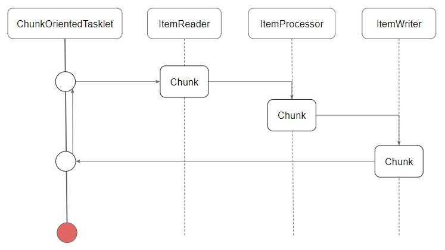

# Chunk Model, Tasklet Model
## Chunk Model 알아보기
- 처리할 데이터를 일정단위(청크)로 처리하는 방식
- ChunkOrientedTasklet
  - 청크 처리를 지원하는 Tasklet의 구현 클래스
  - 
  - ChunkOrientedTasklet은 ItemReader, ItemProcessor, ItemWriter를 사용하여 청크를 처리
  - 청크 단위에 따라 ItemReader, ItemProcessor, ItemWriter를 반복 실행
  - 청크 크기만큼 ItemReader가 데이터를 읽음
  - 청크 단위를 ItemProcessor로 전달하고, 데이터를 처리
  - 처리된 데이터를 ItemWriter로 전달하여 데이터 저장
- ItemReader
  - 데이터를 읽어들이는 역할
  - batch에는 다양한 ItemReader 구현체 제공
    - FlatFileItemReader
      - 플랫파일 읽어들임(CSV)
    - StaxEventItemReader
      - XML 파일 읽어들임
    - JdbcCursorItemReader/JdbcPagingItemReader
      - JDBC를 이용한 데이터베이스 조회
    - JpaPagingItemReader
      - JPA를 이용한 데이터베이스 조회
    - MyBatisCursorItemReader/MyBatisPagingItemReader
      - MyBatis를 이용한 데이터베이스 조회
    - AmqpItemReader/KafkaItemReader
      - 메시지 브로커를 통한 메시지 읽어들임
  - signature
    ```
    public interface ItemReader<T> {
        T read();
    }
    ```
- ItemProcessor
  - Reader로 읽어들인 청크 데이터들을 처리
  - 데이터를 변환하거나 외부 인터페이스 호출
  - ItemProcessor는 필수가 아님
  - signature
    ```
    public interface ItemProcessor<I, O> {
        O process(I item);
    }
    ```
- ItemWriter
  - Reader와 Processor로 처리된 데이터를 저장
  - batch에는 다양한 ItemWriter 구현체 제공
    - FlatFileItemWriter
      - 플랫파일 저장(CSV)
    - StaxEventItemWriter
      - XML 파일 저장
    - JdbcBatchItemWriter
      - JDBC를 이용한 데이터베이스 저장
    - JpaItemWriter
      - JPA를 이용한 데이터베이스 저장
    - MyBatisBatchItemWriter
      - MyBatis를 이용한 데이터베이스 저장
    - AmqpItemWriter/KafkaItemWriter
      - 메시지 브로커를 통한 메시지 저장
  - signature
    ```
    public interface ItemWriter<T> {
        void write(List<? extends T> items);
    }
    ```
## Tasklet Model 알아보기
- Chunk Model과 달리 청크 단위로 데이터를 처리하지 않음
- Tasklet
  - 단일 작업을 수행하는 인터페이스
  - Chunk Model에서 사용되는 ItemReader, ItemProcessor, ItemWriter를 사용하지 않음
  - Tasklet은 단일 작업을 수행하고, 성공/실패 여부를 반환
  - signature
    ```
    public interface Tasklet {
        RepeatStatus execute(StepContribution contribution, ChunkContext chunkContext);
    }
    ```
  - Tasklet 구현체
    - SystemCommandTasklet
      - 시스템 명령어를 비동기적으로 실행하는 Tasklet
    - MethodInvokingTaskletAdapter
      - POJO 클래스의 특정 메소드를 실행하기 위한 Tasklet

