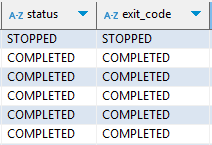
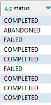

# 스프링 배치 플로우 컨트롤하기
## 개요
- 여러 Step을 정의하고 조건에 따라 실행하거나 스킵하는 기능
- FlowBuilder API를 사용하여 Flow를 정의
## Flow 컨트롤 방법
- next: 현재 Step이 성공적으로 종료되면 다음 Step 실행
- from: 특정 Step에서 현재 Step으로 이동
- on: 특정 ExitStatus에 따라 다음 Step 실행
- stop: 현재 Flow를 종료
- end: FlowBuilder를 종료
## Flow 컨트롤 샘플 코드
- next
  - Start 스텝이 수행하고 난 뒤, next 스탭으로 이동
  - next는 계속해서 추가 될 수 있음
  - start -> next -> next ... 순으로 진행
    ```
    @Bean
    public Job job() {
        return jobBuilderFactory.get("job")
            .start(step1())
            .next(step2())
            .end()
            .build();
    }
    
    @Bean
    public Step step1() {
        return stepBuilderFactory.get("step1")
            .tasklet(new Tasklet() {
                @Override
                public RepeatStatus execute(StepContribution contribution, ChunkContext chunkContext) throws Exception {
                    // ... 
                    return RepeatStatus.FINISHED;
                }
            })
            .build();
    }
    
    @Bean
    public Step step2() {
        return stepBuilderFactory.get("step2")
            .tasklet(new Tasklet() {
                @Override
                public RepeatStatus execute(StepContribution contribution, ChunkContext chunkContext) throws Exception {
                    // ... 
                    return RepeatStatus.FINISHED;
                }
            })
            .build();
    }
    ```
- on
  - 특정 스탭의 종료 조건에 따라 다음 스탭을 실행
  ``` 
  @Bean
  public Job job() {
      return jobBuilderFactory.get("job")
          .start(step1()).on("FAILED").to(step3())
          .from(step1()).on("COMPLETED").to(step2())
          .end()
          .build();
  }
  
  @Bean
  public Step step1() {
      return stepBuilderFactory.get("step1")
          .tasklet(new Tasklet() {
              @Override
              public RepeatStatus execute(StepContribution contribution, ChunkContext chunkContext) throws Exception {
                  // ... 
                  if (someCondition) {
                      return RepeatStatus.FINISHED;
                  } else {
                      throw new RuntimeException();
                  }
              }
          })
          .build();
  }
  
  @Bean
  public Step step2() {
      return stepBuilderFactory.get("step2")
          .tasklet(new Tasklet() {
              @Override
              public RepeatStatus execute(StepContribution contribution, ChunkContext chunkContext) throws Exception {
                  // ...
                  return RepeatStatus.FINISHED;
              }
          })
          .build();
  }
  
  @Bean
  public Step step3() {
      return stepBuilderFactory.get("step3")
          .tasklet(new Tasklet() {
              @Override
              public RepeatStatus execute(StepContribution contribution, ChunkContext chunkContext) throws Exception {
                  // ...
                  return RepeatStatus.FINISHED;
              }
          })
          .build();
  } 
  ```
- stop
  - 현재 Flow를 종료
  ```
  @Bean
  public Job job() {
      return jobBuilderFactory.get("job")
          .start(step1())
          .on("FAILED").stop()
          .end()
          .build();
  }
    
  @Bean
  public Step step1() {
      return stepBuilderFactory.get("step1")
          .tasklet(new Tasklet() { 
              @Override
              public RepeatStatus execute(StepContribution contribution, ChunkContext chunkContext) throws Exception {
                  // ...
                  throw new RuntimeException();
              }
          })
          .build();
  }
  ```
- job 결과
  - `stop` 되었을 경우에만 `STOPPED`로 표시 
  - 
- step 결과
  - `stop` 되었을 경우에는 FAILED로 표시
  - `on`으로 정의된 조건에 따라 다음 Step으로 이동시에는 `ABANDONED`로 표시
  - 
- [API 살펴보기](https://docs.spring.io/spring-batch/reference/step/controlling-flow.html)